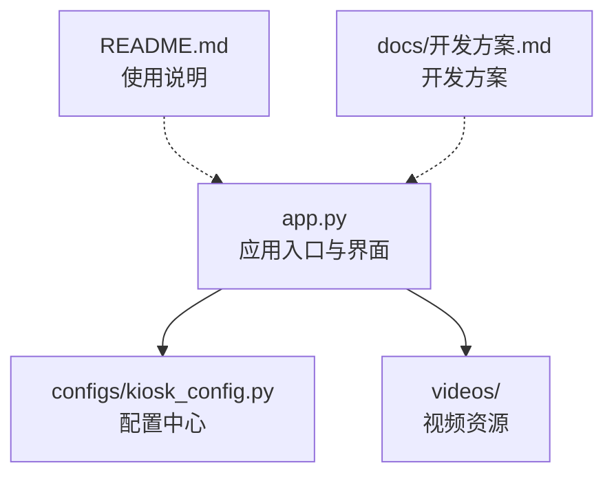
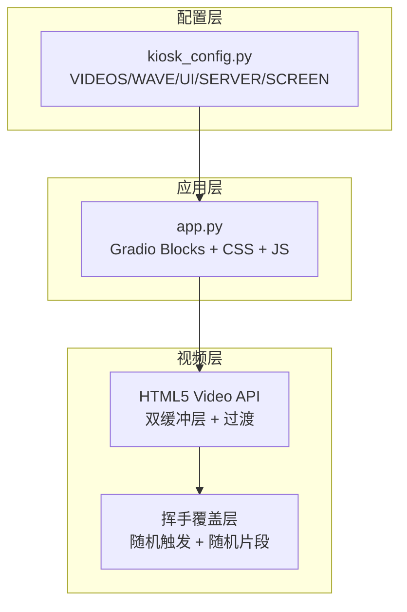
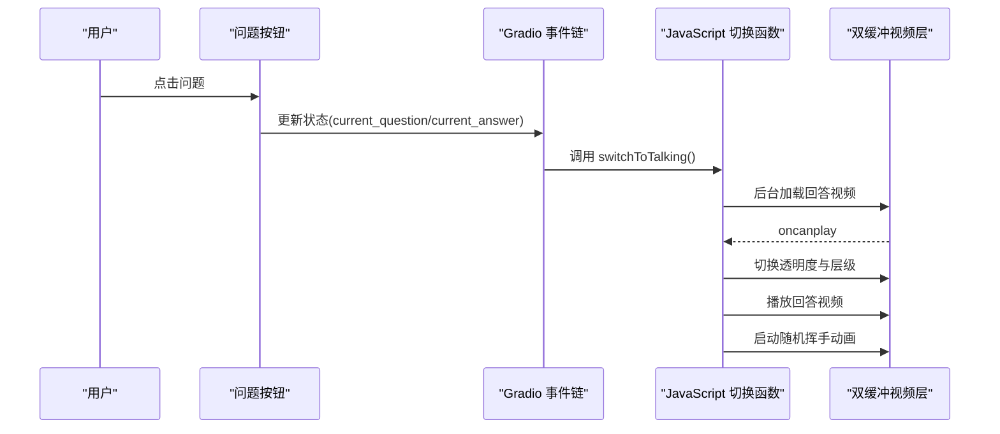
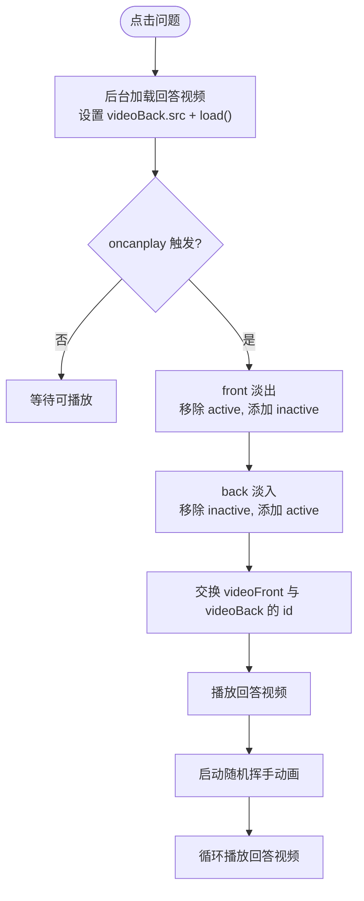
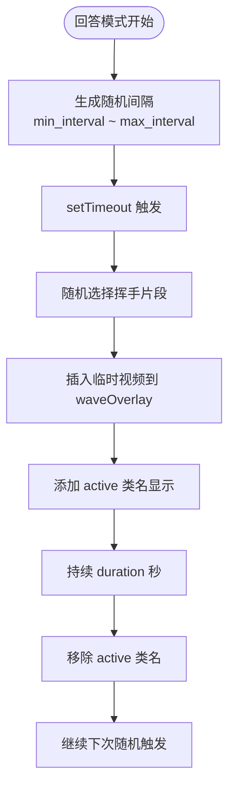
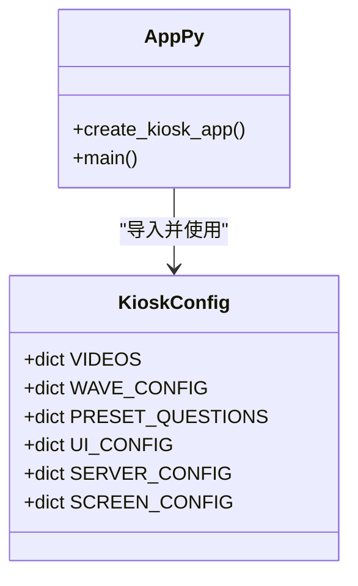
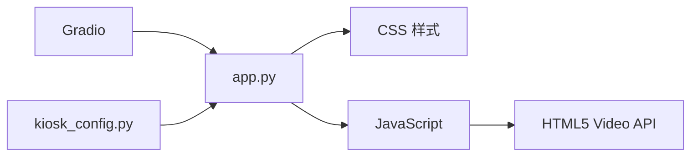

# 代码架构解析

<cite>
**本文引用的文件**
- [app.py](file://app.py)
- [kiosk_config.py](file://configs/kiosk_config.py)
- [README.md](file://README.md)
- [开发方案.md](file://docs/开发方案.md)
</cite>

## 目录
1. [简介](#简介)
2. [项目结构](#项目结构)
3. [核心组件](#核心组件)
4. [架构总览](#架构总览)
5. [详细组件分析](#详细组件分析)
6. [依赖关系分析](#依赖关系分析)
7. [性能考量](#性能考量)
8. [故障排查指南](#故障排查指南)
9. [结论](#结论)
10. [附录](#附录)

## 简介
本项目是一个面向 2160×3840 竖屏的数字人问答展示系统，用户通过点击左侧和右侧的预设问题，触发中间数字人视频区域播放对应的“回答”视频，并在回答过程中随机叠加“挥手”动画片段。系统采用 Gradio 构建前端界面，结合 HTML5 Video API、CSS 过渡与 JavaScript 事件处理实现双缓冲视频无缝切换与挥手动画的随机叠加。

## 项目结构
项目采用“配置驱动 + 轻量前端”的分层设计：
- 应用入口与界面：app.py
- 配置中心：configs/kiosk_config.py
- 文档与说明：README.md、docs/开发方案.md
- 视频资源：videos/（idle、talking、wave）

图表来源
- [app.py:1-480](file://app.py#L1-L480)
- [kiosk_config.py:1-113](file://configs/kiosk_config.py#L1-L113)
- [README.md:1-126](file://README.md#L1-L126)
- [开发方案.md:1-220](file://docs/开发方案.md#L1-L220)

章节来源
- [app.py:1-480](file://app.py#L1-L480)
- [kiosk_config.py:1-113](file://configs/kiosk_config.py#L1-L113)
- [README.md:12-29](file://README.md#L12-L29)
- [开发方案.md:100-117](file://docs/开发方案.md#L100-L117)

## 核心组件
- Gradio Blocks 界面：定义页面布局、主题、状态变量与交互事件。
- CSS 样式：定义渐变背景、毛玻璃、按钮悬停、双缓冲视频层过渡、挥手动画与加载遮罩等视觉效果。
- JavaScript 双缓冲视频切换：通过前后台视频层的透明度切换与层级交换实现无缝切换。
- 配置驱动：通过 kiosk_config.py 驱动视频路径、问题列表、UI 标题、服务器参数与屏幕布局。

章节来源
- [app.py:345-456](file://app.py#L345-L456)
- [app.py:17-219](file://app.py#L17-L219)
- [app.py:225-338](file://app.py#L225-L338)
- [kiosk_config.py:9-112](file://configs/kiosk_config.py#L9-L112)

## 架构总览
系统采用“配置驱动 + 前后端协同”的架构：
- 配置层：集中管理视频路径、问题、UI 标题、服务器参数与屏幕布局。
- 应用层：使用 Gradio 构建界面，注入 CSS 与内联 JS，绑定按钮点击事件。
- 视频层：HTML5 Video API 提供播放控制；双缓冲层实现无闪烁切换；CSS 过渡提供平滑动画；JS 控制随机挥手叠加。

图表来源
- [app.py:345-456](file://app.py#L345-L456)
- [app.py:17-219](file://app.py#L17-L219)
- [app.py:225-338](file://app.py#L225-L338)
- [kiosk_config.py:9-112](file://configs/kiosk_config.py#L9-L112)

## 详细组件分析

### 1) Gradio 界面与布局
- 页面结构：顶部标题、左右问题面板、中间视频区域、底部版权信息。
- 状态管理：current_question、current_answer 两个 gr.State 用于跨事件传递当前问题与答案。
- 事件绑定：问题按钮点击后先更新状态，再调用内联 JavaScript 执行视频切换与挥手控制。
- 视频信息显示：点击问题后同步更新“当前问题”和“回答” Markdown 区域。

图表来源
- [app.py:372-395](file://app.py#L372-L395)
- [app.py:391-447](file://app.py#L391-L447)
- [app.py:225-291](file://app.py#L225-L291)

章节来源
- [app.py:345-456](file://app.py#L345-L456)

### 2) CSS 样式体系
- 整体风格：深色渐变背景、毛玻璃面板、圆角边框、阴影与高对比度文字。
- 问题按钮：悬停渐变、位移与阴影增强交互反馈。
- 视频区域：双缓冲层（video-layer），通过 active/inactive 控制透明度与层级，配合 CSS transition 实现淡入淡出。
- 挥手覆盖层：绝对定位、z-index 高于视频层，初始隐藏，激活时执行缩放与透明度动画。
- 加载遮罩：全屏覆盖，居中旋转加载指示器，切换视频时短暂显示。

章节来源
- [app.py:17-219](file://app.py#L17-L219)

### 3) JavaScript 双缓冲视频切换机制
- 关键点：
  - 两路视频元素：videoFront（当前显示）、videoBack（后台加载）。
  - 切换流程：后台设置 videoBack.src 并 load()，oncanplay 时先让 front 失活（淡出），再让 back 激活（淡入），随后交换两者的 id，最后播放。
  - 切换时机：Gradio 事件链触发 switchToTalking() 或 switchToIdle()。
  - 加载遮罩：切换开始显示，oncanplay 后延时隐藏，避免闪烁。
  - 挥手控制：仅在回答模式下启动随机挥手，待机模式停止。

图表来源
- [app.py:225-291](file://app.py#L225-L291)

章节来源
- [app.py:225-338](file://app.py#L225-L338)

### 4) 随机挥手动画机制
- 触发策略：回答模式下，随机间隔（min_interval ~ max_interval 秒）后随机选择一个挥手片段叠加。
- 叠加方式：在 waveOverlay 内动态插入一个自动播放的视频元素，激活类名后显示，持续 duration 秒后移除。
- 停止策略：待机模式或页面离开时清除定时器并移除激活类名。

图表来源
- [app.py:293-331](file://app.py#L293-L331)
- [kiosk_config.py:14-25](file://configs/kiosk_config.py#L14-L25)

章节来源
- [app.py:293-331](file://app.py#L293-L331)
- [kiosk_config.py:14-25](file://configs/kiosk_config.py#L14-L25)

### 5) 配置驱动架构
- 视频资源：VIDEOS 字典统一管理 idle 与 talking 路径。
- 挥手配置：WAVE_CONFIG 控制开关、最小/最大间隔、持续时间与视频列表。
- 预设问题：PRESET_QUESTIONS 将左右面板的问题与答案集中配置。
- 界面配置：UI_CONFIG 控制标题、副标题、左右面板标题与是否显示回答文本。
- 服务器配置：SERVER_CONFIG 控制 host、port、分享参数。
- 屏幕适配：SCREEN_CONFIG 定义分辨率与左右中宽度比例。

图表来源
- [kiosk_config.py:9-112](file://configs/kiosk_config.py#L9-L112)
- [app.py:345-456](file://app.py#L345-L456)

章节来源
- [kiosk_config.py:9-112](file://configs/kiosk_config.py#L9-L112)
- [app.py:345-456](file://app.py#L345-L456)

## 依赖关系分析
- app.py 依赖：
  - Gradio：构建界面与事件链。
  - kiosk_config：读取所有运行时配置。
  - HTML5 Video API：播放与控制视频。
  - CSS：视觉样式与过渡动画。
  - JavaScript：双缓冲切换与挥手控制。
- 配置文件依赖：
  - VIDEOS 与 WAVE_CONFIG 决定视频路径与动画行为。
  - PRESET_QUESTIONS 决定界面按钮与信息显示。
  - UI_CONFIG/SCREEN_CONFIG 决定界面布局与标题文案。

图表来源
- [app.py:5-7](file://app.py#L5-L7)
- [app.py:345-456](file://app.py#L345-L456)
- [kiosk_config.py:9-112](file://configs/kiosk_config.py#L9-L112)

章节来源
- [app.py:5-7](file://app.py#L5-L7)
- [app.py:345-456](file://app.py#L345-L456)
- [kiosk_config.py:9-112](file://configs/kiosk_config.py#L9-L112)

## 性能考量
- 双缓冲切换：通过后台加载与前台播放的分离，避免首帧卡顿；oncanplay 时才进行切换，确保资源就绪。
- 过渡动画：CSS transition 与 opacity 控制，硬件加速友好，降低重排重绘成本。
- 加载遮罩：短暂显示，避免切换过程中的闪烁。
- 挥手动画：随机间隔与一次性展示，避免频繁 DOM 插入带来的抖动。
- 建议优化：
  - 预热：在应用启动时预加载 idle/talking，减少首次切换延迟。
  - 资源压缩：MP4/H.264，合理尺寸与码率，避免超大文件导致加载缓慢。
  - 浏览器兼容：确保 autoplay/muted/loop/playsinline 在目标浏览器可用。

## 故障排查指南
- 视频无法播放
  - 检查视频路径是否正确（VIDEOS 配置）。
  - 确认浏览器允许自动播放（muted 与 autoplay）。
  - 确认视频格式与编码符合要求（MP4/H.264）。
- 切换闪烁或黑屏
  - 确保 oncanplay 事件触发后再进行切换。
  - 检查 CSS 过渡与层级（active/inactive）是否正确应用。
- 挥手不出现
  - 确认 WAVE_CONFIG.enabled 为 True。
  - 检查 wave_overlay 的定位与 z-index。
  - 确认随机间隔与视频列表非空。
- 端口占用
  - 修改 SERVER_CONFIG.port 后重启服务。

章节来源
- [kiosk_config.py:9-98](file://configs/kiosk_config.py#L9-L98)
- [app.py:225-338](file://app.py#L225-L338)
- [README.md:57-103](file://README.md#L57-L103)

## 结论
本项目通过“配置驱动 + Gradio 界面 + HTML5 Video API + CSS 过渡 + JavaScript 事件”的组合，实现了数字人问答展示系统的稳定与美观。双缓冲视频切换与随机挥手叠加在保证用户体验的同时，也体现了前端交互的工程化与可维护性。通过将所有可变配置集中在 kiosk_config.py，系统具备良好的扩展性与定制能力。

## 附录
- 快速启动与访问：安装依赖后运行 python app.py，默认访问 http://localhost:6006。
- 视频资源准备：idle.mp4、talking.mp4 与至少一个 wave 片段。
- 自定义扩展：新增问题、调整布局、修改端口与标题均可通过配置文件完成。

章节来源
- [README.md:45-59](file://README.md#L45-L59)
- [开发方案.md:190-201](file://docs/开发方案.md#L190-L201)