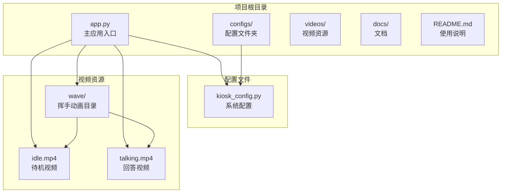
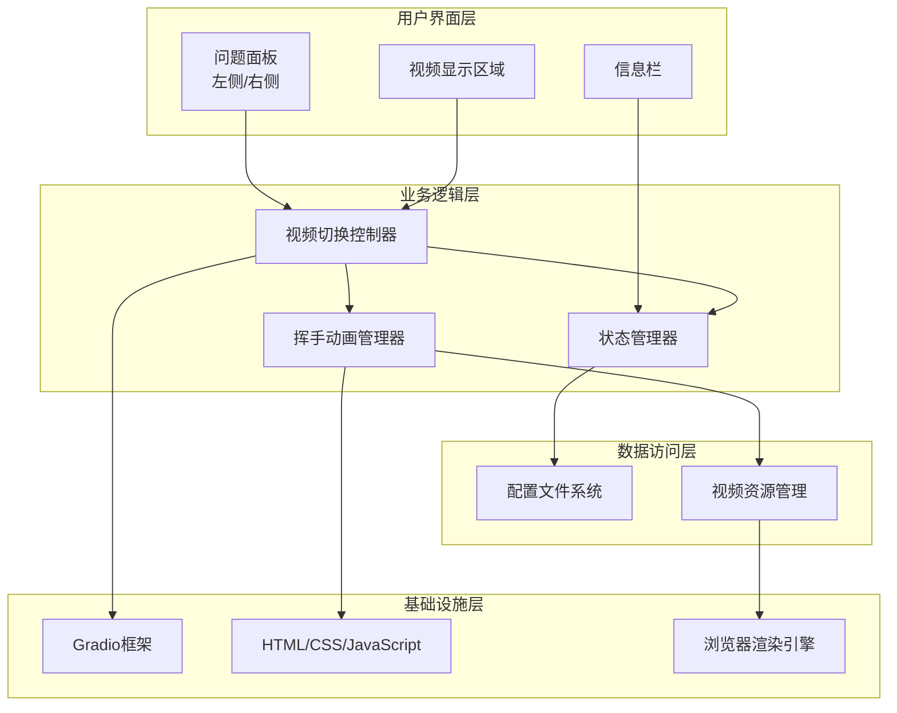
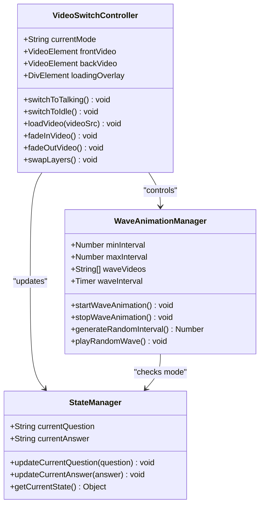
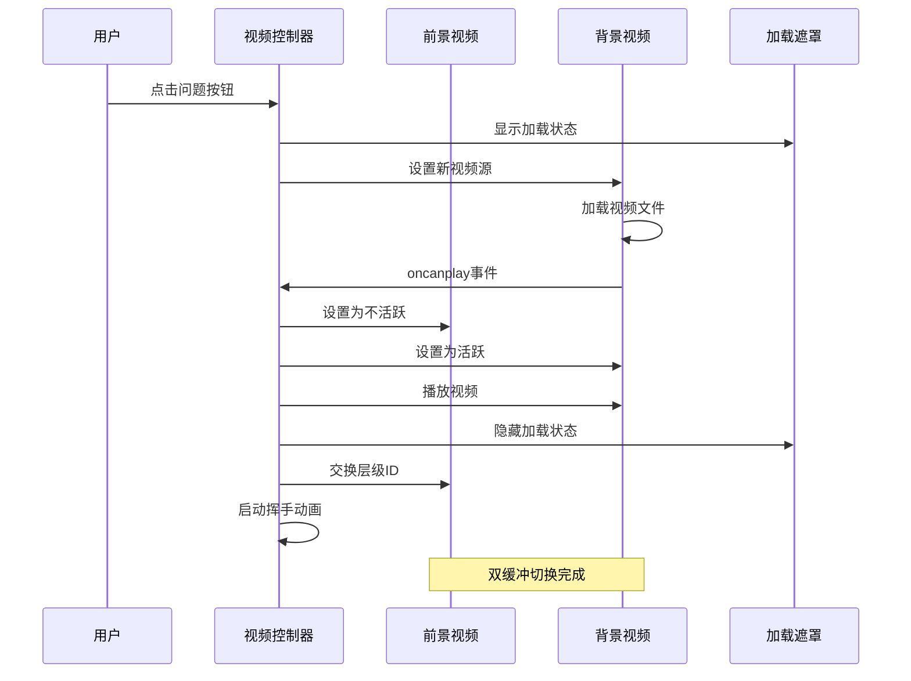
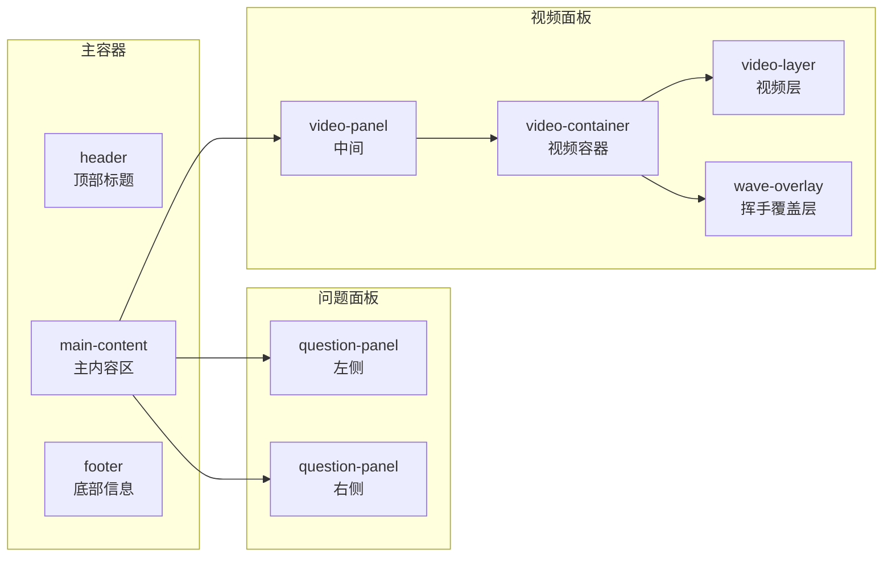
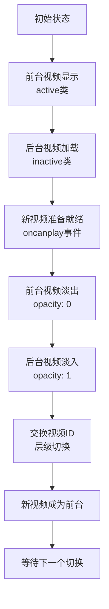
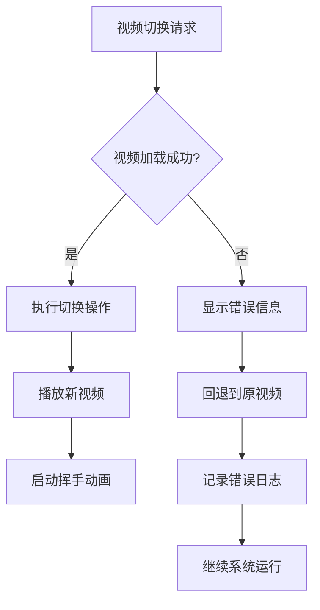
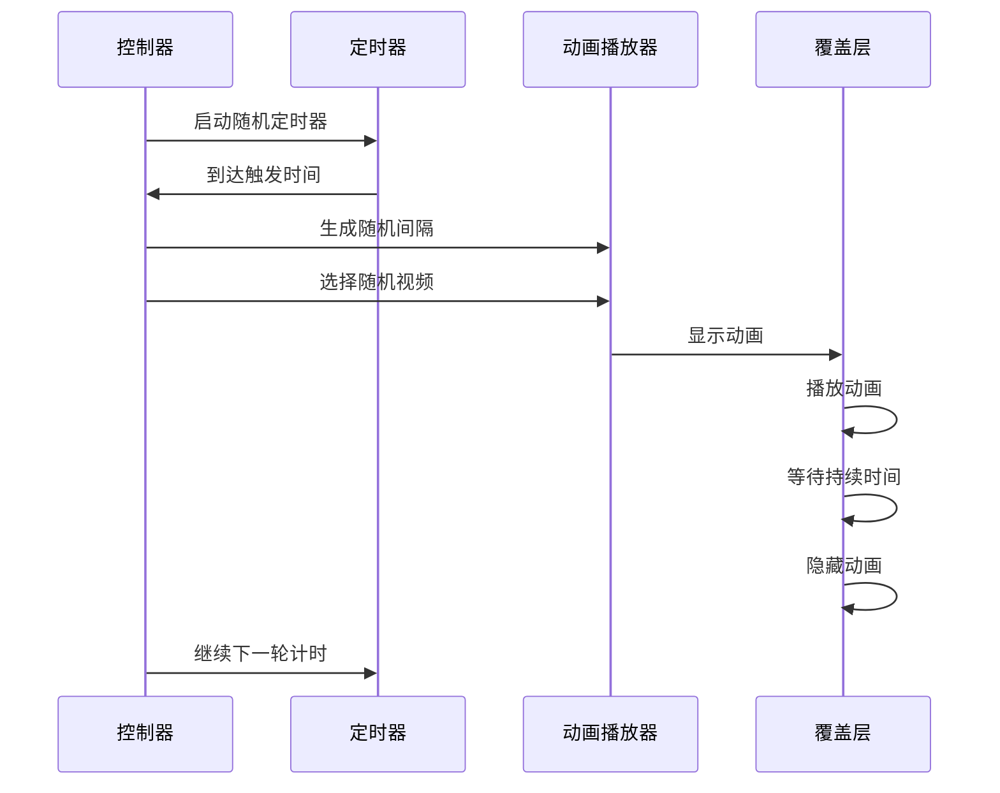

# 功能开发指南

<cite>
**本文档引用的文件**
- [app.py](file://app.py)
- [kiosk_config.py](file://configs/kiosk_config.py)
- [README.md](file://README.md)
- [开发方案.md](file://docs/开发方案.md)
</cite>

## 目录
1. [简介](#简介)
2. [项目结构](#项目结构)
3. [核心组件](#核心组件)
4. [架构概览](#架构概览)
5. [详细组件分析](#详细组件分析)
6. [双缓冲视频切换详解](#双缓冲视频切换详解)
7. [随机挥手动画定制化](#随机挥手动画定制化)
8. [功能扩展指南](#功能扩展指南)
9. [性能考虑](#性能考虑)
10. [故障排除指南](#故障排除指南)
11. [结论](#结论)

## 简介

数字人问答展示系统是一个专为2160×3840竖屏设计的交互式展示应用。该系统通过Gradio框架实现了双缓冲视频切换技术和随机挥手动画功能，为用户提供流畅的数字人问答体验。

系统的核心特性包括：
- **双缓冲视频无缝切换**：实现视频播放的无闪烁切换
- **随机挥手动画**：在回答过程中随机触发挥手效果
- **响应式界面设计**：支持高分辨率竖屏显示
- **灵活配置系统**：通过配置文件轻松定制内容

## 项目结构

项目采用模块化设计，主要包含以下核心文件：



**图表来源**
- [app.py:1-50](file://app.py#L1-L50)
- [kiosk_config.py:1-20](file://configs/kiosk_config.py#L1-L20)

**章节来源**
- [app.py:1-50](file://app.py#L1-L50)
- [README.md:12-29](file://README.md#L12-L29)

## 核心组件

系统由四个主要组件构成，每个组件都有明确的职责分工：

### 1. 视频管理系统
负责管理所有视频资源的加载、切换和播放控制。

### 2. 用户界面组件
提供美观的界面布局，包括问题面板、视频显示区域和信息栏。

### 3. 交互控制系统
处理用户点击事件，协调视频切换和动画播放。

### 4. 配置管理器
集中管理所有可配置参数，支持运行时修改。

**章节来源**
- [app.py:345-456](file://app.py#L345-L456)
- [kiosk_config.py:9-112](file://configs/kiosk_config.py#L9-L112)

## 架构概览

系统采用分层架构设计，确保各组件间的松耦合和高内聚：



**图表来源**
- [app.py:345-456](file://app.py#L345-L456)
- [kiosk_config.py:1-113](file://configs/kiosk_config.py#L1-L113)

## 详细组件分析

### 视频切换控制器

视频切换控制器是系统的核心组件，负责实现双缓冲视频切换机制：



**图表来源**
- [app.py:225-338](file://app.py#L225-L338)

#### 视频切换流程

系统采用双缓冲技术实现无缝视频切换：



**图表来源**
- [app.py:229-291](file://app.py#L229-L291)

**章节来源**
- [app.py:225-338](file://app.py#L225-L338)

### 用户界面组件

系统采用响应式设计，支持不同屏幕尺寸的适配：



**图表来源**
- [app.py:397-421](file://app.py#L397-L421)

**章节来源**
- [app.py:17-219](file://app.py#L17-L219)

## 双缓冲视频切换详解

### 技术原理

双缓冲视频切换是系统实现无缝视频切换的关键技术。其核心思想是使用两个视频元素，一个作为前台显示，另一个在后台加载新内容，当新内容准备就绪后进行快速切换。

### 实现细节

#### 视频层结构



**图表来源**
- [app.py:244-260](file://app.py#L244-L260)

#### 切换参数配置

切换过程涉及多个关键参数的配置：

| 参数名称 | 默认值 | 作用 | 配置位置 |
|---------|--------|------|---------|
| 切换延迟 | 500ms | 视频层交换延迟 | JavaScript代码 |
| 淡入时间 | 400ms | CSS过渡动画时间 | CSS样式 |
| 加载遮罩显示 | 300ms | 加载状态显示时间 | JavaScript代码 |
| 最大等待时间 | 5000ms | 视频加载超时时间 | JavaScript代码 |

**章节来源**
- [app.py:225-291](file://app.py#L225-L291)

### 扩展方法

#### 自定义切换效果

要修改视频切换效果，需要调整以下方面：

1. **CSS过渡动画**：修改`.video-layer`类中的`transition`属性
2. **JavaScript延迟参数**：调整定时器的延迟时间
3. **加载状态处理**：优化加载遮罩的显示逻辑

#### 错误处理机制

系统内置了完善的错误处理机制：



**图表来源**
- [app.py:244-250](file://app.py#L244-L250)

**章节来源**
- [app.py:225-291](file://app.py#L225-L291)

## 随机挥手动画定制化

### 动画机制分析

挥手动画采用随机触发机制，在回答模式下按随机间隔播放预设的动画片段。

### 配置参数详解

| 配置项 | 类型 | 默认值 | 说明 |
|-------|------|--------|------|
| enabled | Boolean | True | 是否启用挥手动画 |
| min_interval | Integer | 8 | 最小触发间隔（秒） |
| max_interval | Integer | 15 | 最大触发间隔（秒） |
| duration | Number | 1.5 | 单次动画持续时间（秒） |
| videos | Array | 3个视频文件 | 可选的动画视频列表 |

### 动画触发流程



**图表来源**
- [app.py:293-331](file://app.py#L293-L331)

**章节来源**
- [app.py:293-331](file://app.py#L293-L331)

### 新增动画视频

要添加新的动画视频，需要进行以下步骤：

1. **准备视频文件**：录制或制作符合要求的MP4格式视频
2. **放置视频文件**：将视频文件放入`videos/wave/`目录
3. **更新配置文件**：在`WAVE_CONFIG["videos"]`数组中添加新视频路径

### 调整触发参数

根据不同的展示需求，可以调整以下参数：

- **触发频率**：通过修改`min_interval`和`max_interval`调整动画触发的密集程度
- **动画时长**：通过修改`duration`调整单次动画的播放时长
- **动画位置**：通过修改CSS中的定位属性调整动画在画面中的位置

**章节来源**
- [kiosk_config.py:14-25](file://configs/kiosk_config.py#L14-L25)

## 功能扩展指南

### 添加新的预设问题

系统支持左右两侧的问题面板，可以轻松添加新的预设问题：

#### 扩展步骤

1. **编辑配置文件**：在`configs/kiosk_config.py`中找到`PRESET_QUESTIONS`配置
2. **添加问题条目**：在相应的面板数组中添加新的问题对象
3. **设置问题属性**：
   - `id`：唯一标识符
   - `question`：问题文本
   - `answer`：回答内容

#### 问题配置示例

```python
PRESET_QUESTIONS = {
    "left": [
        # 现有问题...
        {
            "id": "q09",                           # 新增问题ID
            "question": "新问题内容",              # 问题文本
            "answer": "新问题的回答内容"           # 回答内容
        }
    ],
    "right": [
        # 现有问题...
    ]
}
```

**章节来源**
- [kiosk_config.py:31-76](file://configs/kiosk_config.py#L31-L76)

### 自定义视频资源

系统支持完全自定义视频资源，包括待机视频、回答视频和挥手动画视频。

#### 视频资源要求

| 资源类型 | 文件要求 | 尺寸建议 | 编码格式 |
|---------|----------|----------|----------|
| 待机视频 | idle.mp4 | 2160×3840 | MP4/H.264 |
| 回答视频 | talking.mp4 | 2160×3840 | MP4/H.264 |
| 挥手视频 | wave_*.mp4 | 1080×1920 | MP4/H.264 |

#### 视频替换流程

1. **备份原始视频**：在替换前备份原始视频文件
2. **准备新视频**：确保新视频符合系统要求
3. **替换文件**：将新视频文件复制到相应目录
4. **测试播放**：启动应用验证视频播放正常

### 调整动画效果

系统提供了多种方式来调整动画效果：

#### CSS动画定制

可以通过修改CSS动画属性来改变动画效果：

- **波形动画**：修改`@keyframes waveAnim`中的变换属性
- **动画时长**：调整CSS中的`animation-duration`属性
- **缓动函数**：修改`ease-in-out`为其他缓动效果

#### JavaScript行为调整

通过修改JavaScript代码可以调整动画的行为：

- **触发逻辑**：修改随机间隔的生成算法
- **播放控制**：调整动画的播放和停止逻辑
- **事件绑定**：修改动画触发的时机和条件

**章节来源**
- [app.py:154-158](file://app.py#L154-L158)
- [app.py:293-331](file://app.py#L293-L331)

## 性能考虑

### 内存管理

系统采用了高效的内存管理策略：

- **视频资源复用**：通过双缓冲机制避免重复加载
- **DOM元素复用**：重用DOM元素而不是频繁创建销毁
- **定时器清理**：及时清理不再使用的定时器

### 加载优化

为了提升用户体验，系统实现了多种加载优化：

- **后台加载**：新视频在切换前就开始加载
- **渐进式显示**：通过淡入淡出实现平滑过渡
- **错误恢复**：网络异常时自动回退到备用视频

### 浏览器兼容性

系统针对现代浏览器进行了优化：

- **Web标准支持**：使用标准的HTML5视频API
- **降级处理**：在不支持的浏览器中提供基本功能
- **性能监控**：实时监控视频播放性能

## 故障排除指南

### 常见问题及解决方案

#### 视频无法播放

**问题症状**：点击问题后视频没有反应

**可能原因**：
1. 视频文件路径错误
2. 视频格式不支持
3. 浏览器权限问题

**解决步骤**：
1. 检查视频文件是否存在于正确路径
2. 验证视频格式是否为MP4/H.264
3. 确认浏览器允许自动播放

#### 挥手动画不显示

**问题症状**：回答视频播放但没有挥手效果

**可能原因**：
1. 挥手视频文件缺失
2. 配置参数错误
3. JavaScript执行错误

**解决步骤**：
1. 检查`videos/wave/`目录下的视频文件
2. 验证`WAVE_CONFIG`配置参数
3. 查看浏览器控制台错误信息

#### 切换卡顿

**问题症状**：视频切换时出现卡顿现象

**可能原因**：
1. 视频文件过大
2. 网络带宽不足
3. 浏览器性能问题

**解决步骤**：
1. 优化视频文件大小和质量
2. 检查网络连接稳定性
3. 关闭不必要的浏览器标签页

**章节来源**
- [docs/开发方案.md:205-211](file://docs/开发方案.md#L205-L211)

### 调试技巧

#### 开发者工具使用

1. **网络面板**：监控视频文件的加载情况
2. **性能面板**：分析视频播放的性能表现
3. **控制台**：查看JavaScript错误信息

#### 日志记录

系统会在关键节点输出调试信息：

- 视频切换开始和结束
- 动画触发和停止
- 错误发生时的详细信息

## 结论

数字人问答展示系统通过精心设计的双缓冲视频切换技术和灵活的随机挥手动画机制，为用户提供了流畅、自然的交互体验。系统采用模块化的架构设计，使得功能扩展变得简单直观。

### 主要优势

1. **技术先进**：采用双缓冲技术实现无缝切换
2. **易于扩展**：通过配置文件即可实现大部分定制需求
3. **性能优秀**：优化的加载和播放机制保证流畅体验
4. **维护友好**：清晰的代码结构便于后期维护

### 发展方向

随着技术的不断发展，系统可以在以下方面进一步完善：

1. **多数字人支持**：扩展支持多个不同形象的数字人
2. **语音交互**：集成语音识别和合成技术
3. **智能推荐**：根据用户历史行为推荐问题
4. **数据分析**：收集和分析用户交互数据

通过遵循本文档提供的开发指南，开发者可以快速实现功能扩展，满足不同场景下的展示需求。