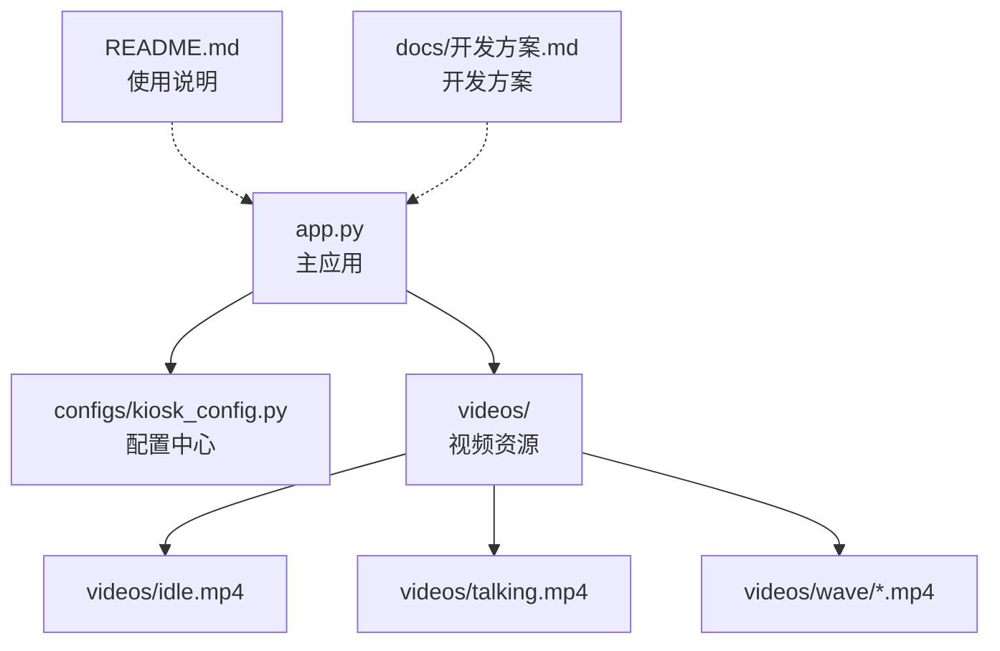
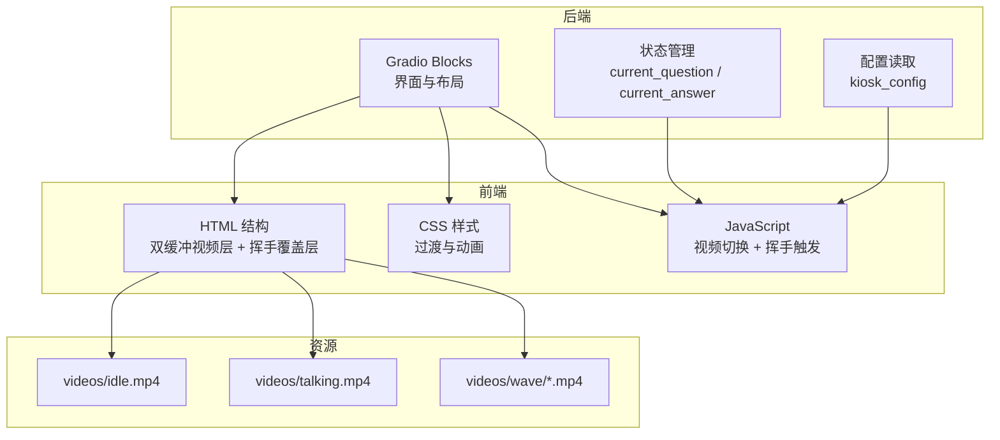
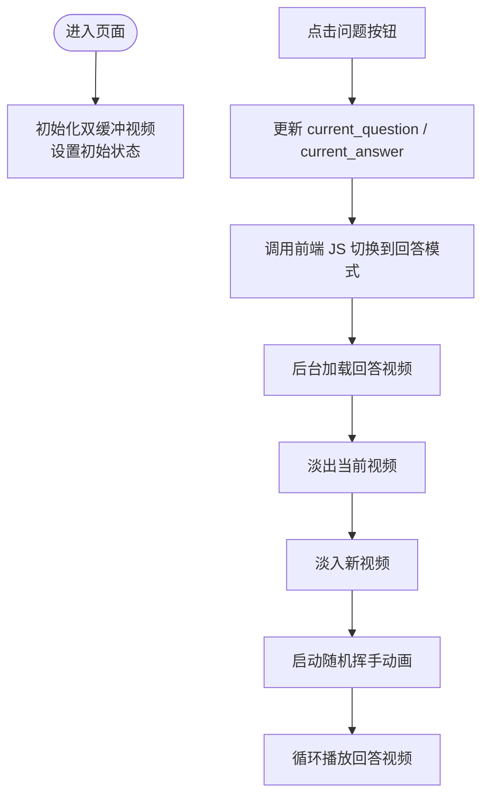
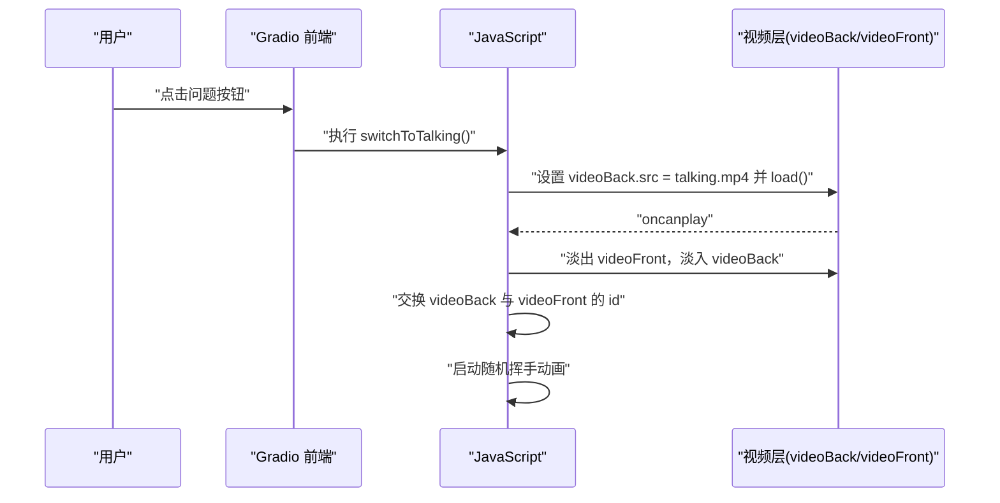
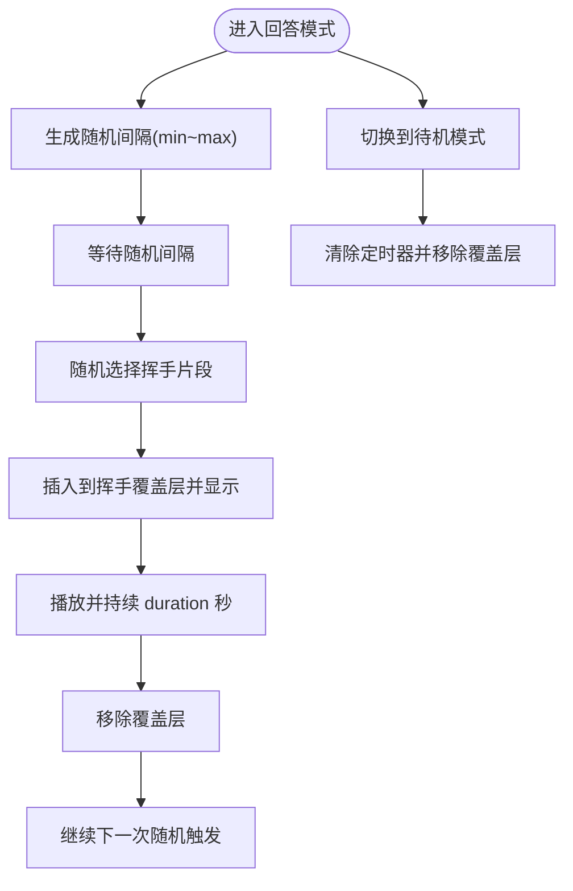
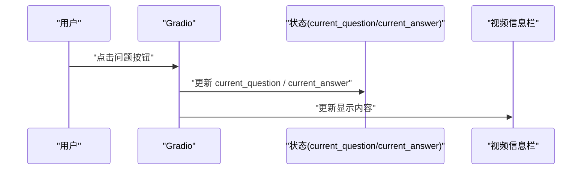
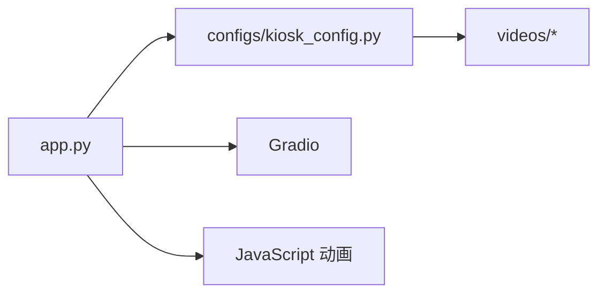

# 开发指南

<cite>
**本文引用的文件**
- [app.py](file://app.py)
- [kiosk_config.py](file://configs/kiosk_config.py)
- [README.md](file://README.md)
- [开发方案.md](file://docs/开发方案.md)
</cite>

## 目录
1. [简介](#简介)
2. [项目结构](#项目结构)
3. [核心组件](#核心组件)
4. [架构总览](#架构总览)
5. [详细组件分析](#详细组件分析)
6. [依赖分析](#依赖分析)
7. [性能考虑](#性能考虑)
8. [故障排查指南](#故障排查指南)
9. [结论](#结论)
10. [附录](#附录)

## 简介
本指南围绕数字人问答展示系统，聚焦于主应用文件 app.py 的代码结构与实现逻辑，涵盖以下主题：
- Gradio 界面构建与布局
- JavaScript 动画与双缓冲视频切换
- 状态管理（问题与回答）
- 挥手动画的触发机制与控制逻辑
- 架构设计与组件关系
- 扩展与定制化开发建议
- 开发环境搭建、调试技巧与性能优化

该系统面向 2160×3840 竖屏展示场景，通过点击左侧/右侧预设问题，触发中间数字人视频从“待机”无缝切换至“回答”，并在回答过程中随机叠加挥手动画，提升交互趣味性与真实感。

## 项目结构
项目采用“应用 + 配置 + 资源 + 文档”的分层组织：
- app.py：主应用入口，负责界面构建、状态管理与前端脚本注入
- configs/kiosk_config.py：集中式配置，包括视频资源、预设问题、界面与服务器参数
- videos/：视频资源目录，包含 idle.mp4、talking.mp4 以及 wave 子目录下的多段挥手片段
- docs/：开发方案与使用说明文档
- README.md：快速开始、安装与配置说明

图表来源
- [app.py:1-480](file://app.py#L1-L480)
- [kiosk_config.py:1-113](file://configs/kiosk_config.py#L1-L113)
- [README.md:1-126](file://README.md#L1-L126)
- [开发方案.md:1-220](file://docs/开发方案.md#L1-L220)

章节来源
- [app.py:1-480](file://app.py#L1-L480)
- [kiosk_config.py:1-113](file://configs/kiosk_config.py#L1-L113)
- [README.md:1-126](file://README.md#L1-L126)
- [开发方案.md:1-220](file://docs/开发方案.md#L1-L220)

## 核心组件
- Gradio Blocks 界面与布局
  - 顶部标题、左右问题面板、中间视频区域、底部信息
  - 使用列布局与行布局组合，配合 CSS 类名实现响应式与视觉风格统一
- 状态管理
  - 使用 gr.State 维护当前问题与回答文本，供界面与脚本共享
- CSS 样式
  - 包含渐变背景、毛玻璃效果、视频层叠与过渡动画
- JavaScript 动画与视频切换
  - 双缓冲视频层 + 透明度过渡，实现无缝切换
  - 随机间隔触发挥手动画，叠加在主视频之上
- 配置中心
  - 视频路径、挥手参数、预设问题、界面标题与服务器参数

章节来源
- [app.py:345-456](file://app.py#L345-L456)
- [app.py:17-219](file://app.py#L17-L219)
- [app.py:225-338](file://app.py#L225-L338)
- [kiosk_config.py:9-112](file://configs/kiosk_config.py#L9-L112)

## 架构总览
系统采用“前端脚本 + 后端状态”的协作模式：
- 前端：HTML/CSS/JavaScript 构建界面与动画，负责视频层叠、双缓冲切换与挥手叠加
- 后端：Gradio 提供界面与状态存储，通过 js 参数桥接前端脚本
- 配置：集中管理视频路径、动画参数与界面文案

图表来源
- [app.py:345-456](file://app.py#L345-L456)
- [app.py:225-338](file://app.py#L225-L338)
- [kiosk_config.py:9-25](file://configs/kiosk_config.py#L9-L25)

## 详细组件分析

### Gradio 界面与布局
- 顶部标题区域：居中标题，使用主题与渐变背景
- 左右问题面板：每个问题按钮绑定点击事件，更新状态并触发前端切换到“回答”模式
- 中间视频区域：双缓冲视频层 + 挥手覆盖层 + 加载遮罩；视频信息栏实时显示当前问题与回答
- 底部信息：版权与提示语

图表来源
- [app.py:345-456](file://app.py#L345-L456)
- [app.py:225-291](file://app.py#L225-L291)

章节来源
- [app.py:345-456](file://app.py#L345-L456)

### JavaScript 动画与双缓冲视频切换
- 双缓冲策略
  - videoBack 与 videoFront 两个视频元素，初始均指向 idle.mp4
  - 切换时先在后台加载 talking.mp4，oncanplay 后执行淡出/淡入与层级交换
  - 通过 CSS 类 active/inactive 控制透明度与层级，实现平滑过渡
- 加载遮罩
  - 在后台加载期间显示旋转加载图标，加载完成后隐藏
- 切换流程
  - 切换到“回答”：后台加载回答视频 → 淡出当前视频 → 淡入新视频 → 交换 ID → 启动挥手动画
  - 切换到“待机”：后台加载待机视频 → 淡出当前视频 → 淡入新视频 → 交换 ID

图表来源
- [app.py:225-291](file://app.py#L225-L291)

章节来源
- [app.py:225-291](file://app.py#L225-L291)

### 随机挥手动画触发机制与控制逻辑
- 触发条件
  - 仅在“回答”模式下生效；切换到“待机”会停止动画
- 触发时机
  - 随机间隔：min_interval ~ max_interval 秒之间随机生成
- 触发过程
  - 随机选择 wave 子目录中的一个片段
  - 将该片段作为内联视频插入到挥手覆盖层，显示并播放
  - 持续 duration 秒后自动移除
  - 递归继续下一次随机触发
- 停止逻辑
  - 清除定时器并移除激活类，确保不会在非回答模式下残留

图表来源
- [app.py:293-331](file://app.py#L293-L331)
- [kiosk_config.py:14-25](file://configs/kiosk_config.py#L14-L25)

章节来源
- [app.py:293-331](file://app.py#L293-L331)
- [kiosk_config.py:14-25](file://configs/kiosk_config.py#L14-L25)

### 状态管理
- current_question / current_answer
  - 通过 gr.State 维护当前选中问题与回答文本
  - 问题按钮点击事件更新状态，随后更新视频信息栏显示
- 与前端脚本的协作
  - 点击事件链路：按钮点击 → 更新状态 → 调用前端 JS → 切换视频与动画

图表来源
- [app.py:382-395](file://app.py#L382-L395)
- [app.py:435-447](file://app.py#L435-L447)

章节来源
- [app.py:354-357](file://app.py#L354-L357)
- [app.py:382-395](file://app.py#L382-L395)
- [app.py:435-447](file://app.py#L435-L447)

### CSS 样式与视觉设计
- 整体风格
  - 渐变背景、毛玻璃效果、阴影与过渡动画
  - 视频容器采用相对定位，双缓冲视频层绝对定位，z-index 控制前后顺序
- 动画要点
  - 视频层透明度过渡，配合 active/inactive 类实现淡入淡出
  - 挥手覆盖层默认隐藏，激活后通过关键帧动画缩放与透明度变化
  - 加载遮罩使用旋转动画提示加载中

章节来源
- [app.py:17-219](file://app.py#L17-L219)

### 配置中心与可定制化
- 视频资源
  - idle 与 talking 路径，wave 子目录中的多个片段
- 挥手配置
  - enabled、min_interval、max_interval、duration、videos 列表
- 预设问题
  - left/right 两组问题，每条包含 id、question、answer
- 界面配置
  - 标题、副标题、左右面板标题、是否显示回答文本
- 服务器配置
  - host、port、share
- 屏幕适配
  - 分辨率与布局比例（用于指导视频与界面适配）

章节来源
- [kiosk_config.py:9-112](file://configs/kiosk_config.py#L9-L112)

## 依赖分析
- 外部依赖
  - Gradio：界面构建与状态管理
- 内部依赖
  - app.py 依赖 configs.kiosk_config 提供的配置常量
  - app.py 注入的 JavaScript 依赖配置中的视频路径与挥手参数

图表来源
- [app.py:5-7](file://app.py#L5-L7)
- [kiosk_config.py:9-112](file://configs/kiosk_config.py#L9-L112)

章节来源
- [app.py:5-7](file://app.py#L5-L7)
- [kiosk_config.py:9-112](file://configs/kiosk_config.py#L9-L112)

## 性能考虑
- 视频加载与切换
  - 使用后台加载与 oncanplay 事件，避免阻塞主线程
  - 双缓冲 + 透明度过渡减少闪烁与卡顿
- 动画与渲染
  - CSS 过渡与 GPU 加速的关键帧动画，尽量避免频繁重排
  - 挥手覆盖层仅在需要时显示，降低额外渲染负担
- 资源与网络
  - 建议使用本地文件路径，避免网络延迟
  - 视频格式与编码遵循 README 要求，保证浏览器兼容与解码效率
- 交互响应
  - 加载遮罩提升感知速度，改善用户体验
  - 随机间隔避免过于频繁的动画，平衡趣味性与性能

## 故障排查指南
- 视频无法播放或切换失败
  - 检查 videos 目录下 idle.mp4、talking.mp4 与 wave 子目录是否存在且命名正确
  - 确认浏览器支持 MP4/H.264 编码
- 挥手动画不触发
  - 确认 WAVE_CONFIG.enabled 为 True
  - 检查 wave 子目录至少包含一个可用片段
  - 确保在回答模式下才会触发，切换到待机会停止动画
- 界面样式异常
  - 检查 CSS 类名与 HTML 结构是否匹配
  - 确认 Gradio 版本与主题配置无冲突
- 服务器访问问题
  - 检查 SERVER_CONFIG.host/port/share 设置
  - 确认端口未被占用，防火墙允许访问

章节来源
- [README.md:33-60](file://README.md#L33-L60)
- [kiosk_config.py:94-98](file://configs/kiosk_config.py#L94-L98)

## 结论
本系统通过 Gradio 与自定义 JavaScript 的结合，实现了“双缓冲视频无缝切换 + 随机挥手动画叠加”的交互体验。其模块化设计（配置中心、界面、动画脚本）便于扩展与维护。对于有经验的开发者，可在现有基础上增加多数字人形象、语音交互、后台管理与数据统计等功能，进一步提升系统的实用性与可扩展性。

## 附录

### 开发环境搭建
- 安装依赖
  - 使用 pip 安装 Gradio
- 启动应用
  - 运行 python app.py
  - 在浏览器访问 http://localhost:6006
- 视频准备
  - 在 videos 目录下放置 idle.mp4、talking.mp4 与至少一个 wave 子目录片段

章节来源
- [README.md:45-60](file://README.md#L45-L60)

### 调试技巧
- 使用浏览器开发者工具检查：
  - 视频层切换是否按预期发生
  - 挥手覆盖层是否在回答模式下出现
  - 加载遮罩是否在切换时短暂显示
- 逐步注释/启用配置项，定位问题范围
- 在 Gradio 中打印状态值，确认事件链路正常

### 性能优化建议
- 视频尺寸与比例尽量贴合 2160×3840 竖屏
- 使用较小体积的视频文件，减少加载时间
- 合理设置挥手间隔与持续时间，避免过度动画影响流畅度
- 对于复杂动画，优先使用 CSS 过渡与 GPU 加速的关键帧

### 扩展与定制化开发指南
- 新增问题
  - 在 PRESET_QUESTIONS 中添加新的问题条目
- 自定义挥手片段
  - 在 wave 子目录新增片段，并更新 WAVE_CONFIG.videos
- 调整动画参数
  - 修改 WAVE_CONFIG.min_interval、max_interval、duration
- 多数字人形象
  - 在配置中新增更多视频路径，前端根据状态切换不同形象
- 语音交互
  - 引入语音识别与合成服务，结合现有状态驱动视频播放
- 后台管理
  - 增加 Web 管理界面，动态修改问题与动画参数

章节来源
- [kiosk_config.py:31-76](file://configs/kiosk_config.py#L31-L76)
- [kiosk_config.py:14-25](file://configs/kiosk_config.py#L14-L25)
- [开发方案.md:214-220](file://docs/开发方案.md#L214-L220)