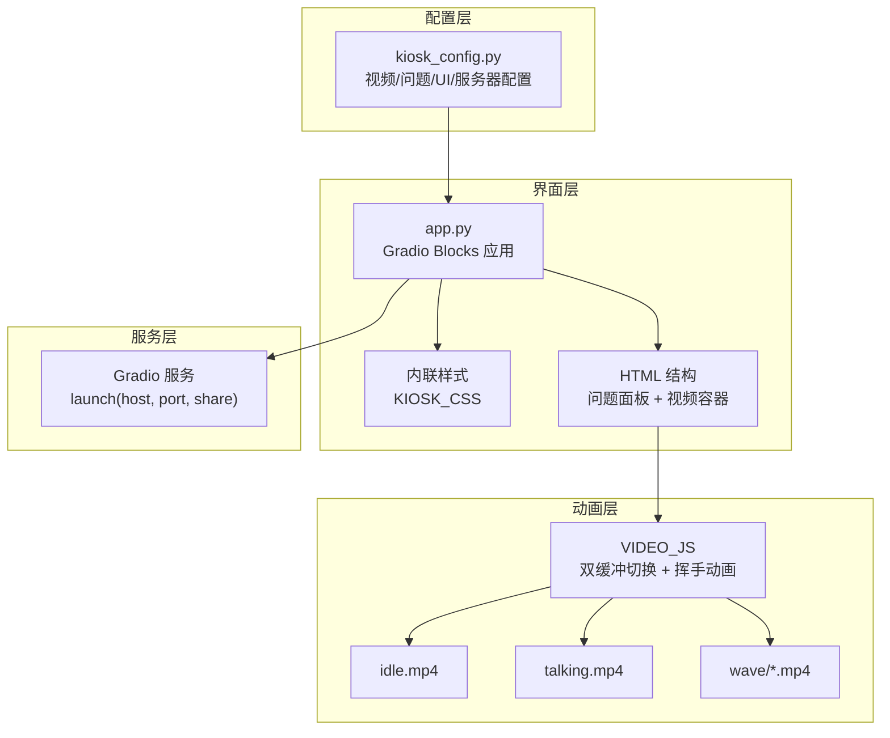
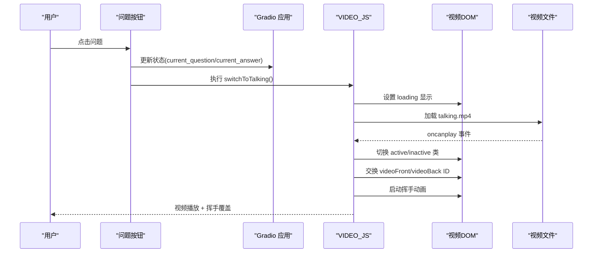
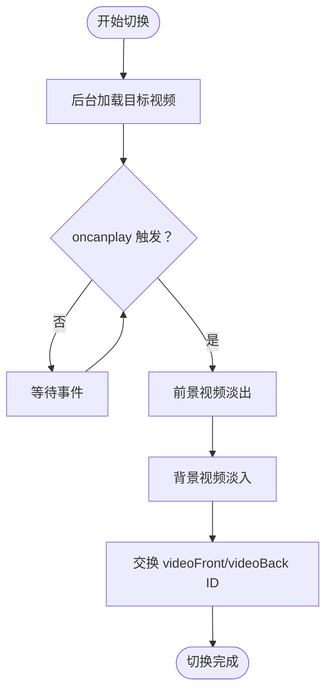
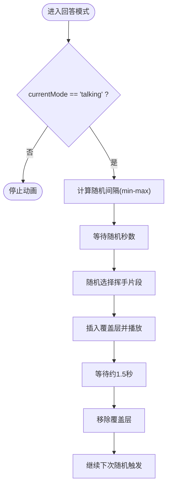
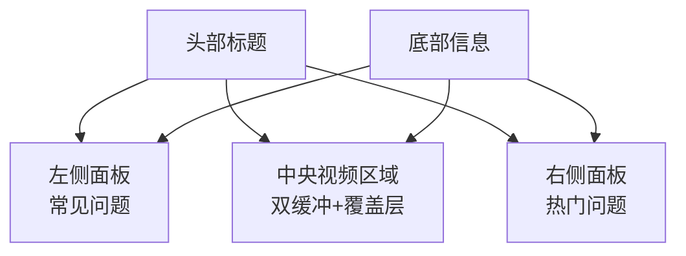
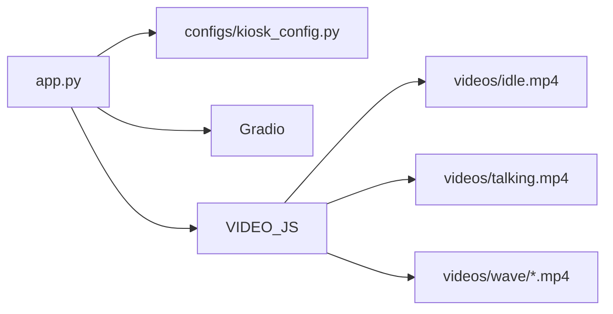

# 调试与优化

<cite>
**本文引用的文件**
- [app.py](file://app.py)
- [README.md](file://README.md)
- [configs/kiosk_config.py](file://configs/kiosk_config.py)
- [docs/开发方案.md](file://docs/开发方案.md)
</cite>

## 目录
1. [简介](#简介)
2. [项目结构](#项目结构)
3. [核心组件](#核心组件)
4. [架构总览](#架构总览)
5. [详细组件分析](#详细组件分析)
6. [依赖关系分析](#依赖关系分析)
7. [性能考虑](#性能考虑)
8. [故障排除指南](#故障排除指南)
9. [结论](#结论)

## 简介
本指南面向数字人问答展示系统的开发与运维团队，提供从浏览器端到服务端的完整调试流程与性能优化策略。系统采用 Gradio 构建前端界面，结合双缓冲视频切换与随机挥手动画，实现高帧率、低延迟的数字人演示体验。本文重点涵盖：
- 浏览器开发者工具使用与 JavaScript 控制台调试
- 视频播放问题排查与性能优化
- CSS 渲染性能与动画优化
- 运行时常见错误定位与修复
- 日志输出分析与错误监控最佳实践

## 项目结构
系统采用“配置驱动 + Gradio 界面 + 自定义 JS 动画”的分层设计：
- 配置层：集中管理视频路径、问题列表、界面参数与服务器设置
- 界面层：Gradio Blocks 构建响应式布局，包含左右问题面板与中央视频区域
- 动画层：双缓冲视频切换 + 随机挥手覆盖层，确保无缝播放体验
- 服务层：Python 启动 Gradio 服务，暴露本地文件系统供前端直接读取

图表来源
- [app.py:345-456](file://app.py#L345-L456)
- [configs/kiosk_config.py:9-98](file://configs/kiosk_config.py#L9-L98)

章节来源
- [app.py:17-219](file://app.py#L17-L219)
- [configs/kiosk_config.py:1-113](file://configs/kiosk_config.py#L1-L113)
- [README.md:12-29](file://README.md#L12-L29)

## 核心组件
- 视频资源管理：通过配置文件统一声明 idle、talking 与 wave 子目录下的视频路径，便于替换与扩展
- 双缓冲视频切换：前后两个 video 元素交替播放，避免切换卡顿与闪烁
- 随机挥手动画：在回答模式下按 8-15 秒随机间隔叠加挥手片段，增强交互性
- Gradio 响应式布局：左侧/中间/右侧三栏布局，适配 2160×3840 竖屏
- 内联样式与加载动画：统一的渐变背景、毛玻璃效果与加载指示器

章节来源
- [app.py:9-12](file://app.py#L9-L12)
- [app.py:225-338](file://app.py#L225-L338)
- [configs/kiosk_config.py:14-25](file://configs/kiosk_config.py#L14-L25)

## 架构总览
系统启动流程与数据流如下：
- 启动阶段：打印配置摘要，加载 CSS 与 HTML，注入 JavaScript
- 用户交互：点击问题按钮 → 更新状态变量 → 执行 JavaScript 切换视频 → 显示当前问题/回答
- 视频切换：后台加载目标视频 → oncanplay 时淡入新视频、淡出旧视频 → 交换层级元素 → 启动挥手动画
- 挥手动画：随机间隔触发 → 随机选择挥手片段 → 播放完成后移除覆盖层

图表来源
- [app.py:382-388](file://app.py#L382-L388)
- [app.py:229-265](file://app.py#L229-L265)
- [app.py:401-415](file://app.py#L401-L415)

## 详细组件分析

### 视频切换组件（双缓冲）
双缓冲机制通过两个 video 元素交替播放，确保切换时无黑屏或闪烁：
- 前景视频（videoFront）：当前正在播放的视频
- 背景视频（videoBack）：后台加载目标视频
- 切换时机：oncanplay 事件触发后，前景视频淡出，背景视频淡入
- 层级交换：切换完成后交换两者的 ID，保证后续切换逻辑一致

图表来源
- [app.py:229-265](file://app.py#L229-L265)

章节来源
- [app.py:117-136](file://app.py#L117-L136)
- [app.py:229-291](file://app.py#L229-L291)

### 挥手动画组件（随机触发）
随机挥手动画在回答模式下按 8-15 秒随机间隔触发，持续约 1.5 秒：
- 触发条件：currentMode 为 'talking'
- 随机间隔：根据配置的 min_interval/max_interval 计算
- 片段选择：从 wave_videos 中随机挑选
- 覆盖层：动态插入 video 并添加 active 类，播放结束后移除

图表来源
- [app.py:293-331](file://app.py#L293-L331)
- [configs/kiosk_config.py:14-25](file://configs/kiosk_config.py#L14-L25)

章节来源
- [app.py:138-158](file://app.py#L138-L158)
- [app.py:293-331](file://app.py#L293-L331)

### Gradio 界面组件
- 顶部标题：显示系统名称与副标题
- 左右问题面板：预设问题列表，支持图标装饰
- 中央视频区域：双缓冲视频容器 + 挥手覆盖层 + 加载指示器
- 底部信息：版权与提示信息

图表来源
- [app.py:358-454](file://app.py#L358-L454)

章节来源
- [app.py:345-456](file://app.py#L345-L456)

## 依赖关系分析
- 外部依赖：Gradio（版本 4.0+），用于构建 Web 界面与事件绑定
- 内部依赖：配置模块提供视频路径、问题列表与 UI 参数；JavaScript 依赖 DOM 元素与本地文件路径
- 资源依赖：videos 目录下的 idle.mp4、talking.mp4 与 wave/*.mp4

图表来源
- [app.py:5-7](file://app.py#L5-L7)
- [configs/kiosk_config.py:9-12](file://configs/kiosk_config.py#L9-L12)

章节来源
- [app.py:5-7](file://app.py#L5-L7)
- [configs/kiosk_config.py:1-113](file://configs/kiosk_config.py#L1-L113)

## 性能考虑
- 视频文件优化
  - 编码格式：H.264 MP4，确保浏览器兼容性与解码效率
  - 尺寸与比例：建议竖屏 9:16 或相近比例，分辨率 2160×3840
  - 文件大小：建议 10MB 以内，减少加载时间与内存占用
  - 编码参数：使用硬件加速编码，降低 CPU 占用；避免过高的比特率
- CSS 渲染性能
  - 使用 GPU 加速：object-fit: contain、opacity 过渡由合成线程处理
  - 避免强制同步布局：减少频繁读取 offsetWidth/scrollHeight
  - 毛玻璃效果：backdrop-filter 在部分设备上可能触发重绘，建议在低端设备关闭
- JavaScript 执行效率
  - 事件绑定：使用 Gradio 的 click.then 串联状态更新与 JS 执行，避免重复查询 DOM
  - 动画调度：setTimeout 与递归调用 startWaveAnimation，注意清理定时器防止内存泄漏
  - 加载指示：仅在切换视频时短暂显示，避免阻塞用户交互
- 服务器与网络
  - 本地文件直连：通过 file:// 协议读取本地视频，避免跨域与代理开销
  - 端口配置：默认 6006，确保防火墙放行与端口唯一性

章节来源
- [README.md:105-111](file://README.md#L105-L111)
- [app.py:17-219](file://app.py#L17-L219)
- [configs/kiosk_config.py:94-98](file://configs/kiosk_config.py#L94-L98)

## 故障排除指南

### 浏览器开发者工具使用
- 打开方式：F12 或右键检查元素
- 关键面板：
  - Console：查看 JavaScript 错误与警告，确认 VIDEO_JS 注入成功
  - Network：监控视频文件请求状态码与响应时间，验证 file:// 协议可用性
  - Elements：检查 videoFront/videoBack 的类名与 ID 是否正确交换
  - Performance：录制切换过程，观察帧率与主线程阻塞点
  - Memory：检测是否存在未清理的定时器或 DOM 引用

### JavaScript 控制台调试
- 常见问题与定位：
  - 视频无法播放：检查 oncanplay 是否触发；确认视频路径拼接是否正确
  - 切换无效：确认 switchToTalking/switchToIdle 的 DOM 查询是否返回元素
  - 挥手不出现：检查 currentMode 是否为 'talking'；确认 wave_videos 非空
- 调试技巧：
  - 在 VIDEO_JS 中添加临时 console.log 输出，验证函数执行顺序
  - 使用断点调试，逐步跟踪视频加载与类名切换
  - 检查 play() 返回的 Promise 是否抛错（已包含 catch）

章节来源
- [app.py:244-250](file://app.py#L244-L250)
- [app.py:277-282](file://app.py#L277-L282)
- [app.py:294-321](file://app.py#L294-L321)

### 视频播放问题排查
- 视频加载失败
  - 路径问题：确认配置中的 VIDEOS 字段与实际文件名一致
  - 权限问题：确保视频文件对运行用户可读
  - 编码问题：更换为 H.264 MP4，避免 Safari/Edge 解码差异
- 播放异常
  - 自动播放限制：确保页面处于活跃状态且静音播放（muted）
  - 帧率下降：降低视频分辨率或码率，检查 CPU/GPU 使用率
- 切换卡顿
  - 预加载不足：增加后台加载时间或提前触发 load
  - 过渡动画：适当缩短过渡时长，避免与播放进度冲突

章节来源
- [configs/kiosk_config.py:9-12](file://configs/kiosk_config.py#L9-L12)
- [app.py:403-408](file://app.py#L403-L408)
- [README.md:105-111](file://README.md#L105-L111)

### 动画异常与界面显示问题
- 挥手动画不触发
  - 检查 WAVE_CONFIG.enabled 是否为 True
  - 确认 min_interval/max_interval 合理范围（建议 8-15）
  - 验证 wave_videos 列表中所有文件存在且可访问
- 界面布局错位
  - 检查 CSS 类名是否被覆盖（如 .video-layer.active/.inactive）
  - 确认 Gradio 主容器高度与视口匹配（vh 单位）
- 加载指示不消失
  - 检查 loadingOverlay 的 hidden 类切换逻辑
  - 确认 oncanplay 事件回调是否正常执行

章节来源
- [configs/kiosk_config.py:14-25](file://configs/kiosk_config.py#L14-L25)
- [app.py:117-136](file://app.py#L117-L136)
- [app.py:189-219](file://app.py#L189-L219)

### 日志输出分析与错误监控
- 启动日志：程序启动时会打印视频路径、挥手开关与问题数量，便于快速核对配置
- 运行日志：Gradio launch 的 show_error=True 会在页面上显示错误详情
- 建议实践：
  - 在 VIDEO_JS 中增加关键步骤的日志输出，便于定位切换时序
  - 使用 Performance 面板记录典型操作的帧率曲线，识别瓶颈
  - 对于生产环境，建议集成浏览器性能监控 SDK，采集 FPS、首帧时间等指标

章节来源
- [app.py:459-475](file://app.py#L459-L475)
- [app.py:473-475](file://app.py#L473-L475)

## 结论
本指南提供了从浏览器端到服务端的全链路调试与优化方法。通过合理配置视频资源、优化 CSS 与 JavaScript 执行、利用开发者工具定位问题，以及建立日志与监控体系，可以显著提升数字人问答展示系统的稳定性与用户体验。建议在部署前完成性能基准测试，并针对目标设备（2160×3840 竖屏）进行专项优化。