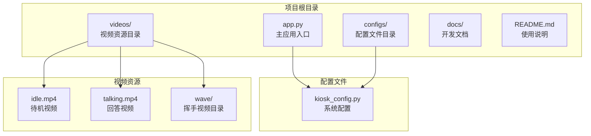

# 快速开始

<cite>
**本文档引用的文件**
- [README.md](file://README.md)
- [app.py](file://app.py)
- [configs/kiosk_config.py](file://configs/kiosk_config.py)
- [docs/开发方案.md](file://docs/开发方案.md)
</cite>

## 目录
1. [简介](#简介)
2. [项目结构](#项目结构)
3. [环境准备](#环境准备)
4. [视频资源准备](#视频资源准备)
5. [安装依赖](#安装依赖)
6. [启动应用](#启动应用)
7. [访问系统](#访问系统)
8. [配置说明](#配置说明)
9. [常见问题排查](#常见问题排查)
10. [性能优化建议](#性能优化建议)
11. [故障排除指南](#故障排除指南)
12. [总结](#总结)

## 简介

数字人问答展示系统是一个面向 2160×3840 竖屏的交互式数字人演示系统。用户通过点击预设问题触发数字人视频播放，系统支持双缓冲视频切换和随机挥手动画功能。该系统采用 Gradio 构建，提供美观的渐变背景和毛玻璃效果界面。

## 项目结构

系统采用模块化设计，主要包含以下核心组件：



**图表来源**
- [app.py:1-50](file://app.py#L1-L50)
- [configs/kiosk_config.py:1-30](file://configs/kiosk_config.py#L1-L30)

**章节来源**
- [README.md:12-29](file://README.md#L12-L29)
- [docs/开发方案.md:100-117](file://docs/开发方案.md#L100-L117)

## 环境准备

### Python 版本要求

系统需要 Python 3.8 或更高版本。请确保您的环境中已正确安装 Python：

```bash
python --version
# 预期输出: Python 3.x.x
```

### 系统要求

- **分辨率**: 2160×3840 像素（竖屏）
- **操作系统**: Windows 10/11
- **浏览器**: Chrome 或 Edge（推荐）
- **内存**: 至少 4GB RAM
- **存储**: 至少 1GB 可用空间

**章节来源**
- [README.md:112-121](file://README.md#L112-L121)
- [docs/开发方案.md:13-15](file://docs/开发方案.md#L13-L15)

## 视频资源准备

### 必需的视频文件

系统需要在 `videos` 目录下准备以下视频文件：

| 文件名 | 用途 | 必需性 | 备注 |
|--------|------|--------|------|
| `videos/idle.mp4` | 待机状态视频 | ✅ | 站着不动的循环播放 |
| `videos/talking.mp4` | 回答状态视频 | ✅ | 嘴巴动作为回答 |
| `videos/wave/wave_1.mp4` | 挥手片段1 | ✅ | 随机触发的挥手动画 |
| `videos/wave/wave_2.mp4` | 挥手片段2 | ✅ | 随机触发的挥手动画 |
| `videos/wave/wave_3.mp4` | 挥手片段3 | ✅ | 随机触发的挥手动画 |

### 视频规格要求

- **格式**: MP4 (H.264 编码)
- **比例**: 竖屏 9:16 或相近比例
- **大小**: 建议 10MB 以内
- **音频**: 主视频建议静音，挥手视频可以有音效

### 视频放置位置

确保视频文件按照以下目录结构放置：

```
videos/
├── idle.mp4           # 待机视频
├── talking.mp4        # 回答视频
└── wave/
    ├── wave_1.mp4
    ├── wave_2.mp4
    └── wave_3.mp4
```

**章节来源**
- [README.md:33-44](file://README.md#L33-L44)
- [README.md:105-111](file://README.md#L105-L111)
- [docs/开发方案.md:17-26](file://docs/开发方案.md#L17-L26)

## 安装依赖

### 安装 Gradio

系统使用 Gradio 4.0+ 作为前端框架。执行以下命令安装：

```bash
pip install gradio
```

### 验证安装

安装完成后，验证 Gradio 是否正确安装：

```bash
pip show gradio
```

预期输出包含版本信息，例如：
```
Name: gradio
Version: 4.x.x
...
```

**章节来源**
- [README.md:45-49](file://README.md#L45-L49)
- [docs/开发方案.md:192-194](file://docs/开发方案.md#L192-L194)

## 启动应用

### 基本启动

在项目根目录执行以下命令启动应用：

```bash
python app.py
```

### 启动过程输出

首次启动时，控制台会显示类似以下的初始化信息：

```
==================================================
🚀 数字人问答展示系统
📹 待机视频: videos/idle.mp4
📹 回答视频: videos/talking.mp4
👋 挥手动画: 启用
📋 问题数量: 8
==================================================

Launching with URL http://0.0.0.0:6006
```

### 启动参数说明

应用启动时会读取配置文件中的设置：
- **主机地址**: 默认监听所有网络接口
- **端口号**: 6006（可在配置中修改）
- **共享访问**: 默认禁用（可在配置中开启）

**章节来源**
- [app.py:459-480](file://app.py#L459-L480)
- [configs/kiosk_config.py:94-98](file://configs/kiosk_config.py#L94-L98)

## 访问系统

### 基本访问

启动成功后，在浏览器中访问：

```
http://localhost:6006
```

### 远程访问

如果需要从其他设备访问，可以使用共享链接：

```bash
python app.py
```

启动后会显示类似：
```
Running on local URL: http://localhost:6006
Running on public URL: https://xxxx.gradio.live
```

### 界面布局

系统界面分为三个区域：

1. **左侧问题面板** (20%宽度): 显示常见问题
2. **中间视频区域** (60%宽度): 显示数字人视频
3. **右侧问题面板** (20%宽度): 显示热门问题

**章节来源**
- [README.md:57-59](file://README.md#L57-L59)
- [docs/开发方案.md:40-58](file://docs/开发方案.md#L40-L58)

## 配置说明

### 修改问题内容

编辑 `configs/kiosk_config.py` 中的 `PRESET_QUESTIONS`：

```python
PRESET_QUESTIONS = {
    "left": [
        {
            "id": "q01",                           # 问题ID
            "question": "你的问题",                 # 显示的问题文本
            "answer": "回答内容"                   # 对应的回答内容
        },
    ],
    "right": [
        {
            "id": "q02",
            "question": "你的问题",
            "answer": "回答内容"
        },
    ]
}
```

### 挥手配置

编辑 `WAVE_CONFIG`：

```python
WAVE_CONFIG = {
    "enabled": True,                   # 是否启用挥手
    "min_interval": 8,                 # 最小触发间隔（秒）
    "max_interval": 15,               # 最大触发间隔（秒）
    "duration": 1.5,                  # 挥手持续时间（秒）
    "videos": [                       # 挥手视频列表
        "videos/wave/wave_1.mp4",
        "videos/wave/wave_2.mp4",
        "videos/wave/wave_3.mp4",
    ]
}
```

### 服务器配置

编辑 `SERVER_CONFIG`：

```python
SERVER_CONFIG = {
    "host": "0.0.0.0",                 # 监听地址
    "port": 6006,                     # 端口号
    "share": False,                   # 是否启用共享
}
```

**章节来源**
- [README.md:61-103](file://README.md#L61-L103)
- [configs/kiosk_config.py:14-98](file://configs/kiosk_config.py#L14-L98)

## 常见问题排查

### 视频无法播放

**问题**: 点击问题后视频不播放

**解决方案**:
1. 检查视频文件是否存在于正确路径
2. 验证视频格式是否为 MP4 (H.264)
3. 确认视频文件大小不超过限制
4. 检查浏览器是否允许自动播放

### 挥手动画不显示

**问题**: 回答视频播放但没有挥手效果

**解决方案**:
1. 确认 `WAVE_CONFIG["enabled"]` 设置为 `True`
2. 检查 `videos/wave/` 目录下至少有一个挥手视频文件
3. 验证挥手视频文件路径配置正确
4. 查看浏览器控制台是否有 JavaScript 错误

### 端口占用

**问题**: 启动时报端口被占用错误

**解决方案**:
1. 修改 `SERVER_CONFIG["port"]` 为其他端口
2. 关闭占用 6006 端口的其他程序
3. 使用管理员权限启动

### 浏览器兼容性

**问题**: 在某些浏览器中显示异常

**解决方案**:
1. 使用 Chrome 或 Edge 浏览器
2. 确保浏览器版本较新
3. 禁用可能影响视频播放的浏览器扩展

**章节来源**
- [README.md:105-111](file://README.md#L105-L111)
- [docs/开发方案.md:205-211](file://docs/开发方案.md#L205-L211)

## 性能优化建议

### 视频优化

1. **压缩视频大小**: 将视频文件压缩至 10MB 以内
2. **优化编码**: 使用 H.264 编码，确保播放流畅
3. **统一比例**: 保持视频比例与屏幕比例一致（9:16）

### 内存管理

1. **合理配置挥手间隔**: 8-15 秒的随机间隔避免频繁触发
2. **视频预加载**: 系统已实现后台视频预加载机制
3. **资源清理**: 确保播放结束后及时释放资源

### 网络优化

1. **本地部署**: 在本地网络中运行以减少延迟
2. **带宽预留**: 为视频播放预留足够带宽
3. **缓存策略**: 利用浏览器缓存机制

## 故障排除指南

### 启动失败

**症状**: 启动时出现 ImportError

**解决步骤**:
1. 确认 Python 版本满足要求
2. 重新安装 Gradio: `pip uninstall gradio && pip install gradio`
3. 检查防火墙设置
4. 以管理员权限运行命令提示符

**症状**: 端口被占用

**解决步骤**:
1. 修改配置文件中的端口号
2. 使用任务管理器结束占用进程
3. 重启网络服务

### 视频播放问题

**症状**: 视频加载缓慢

**解决步骤**:
1. 检查网络连接稳定性
2. 减小视频文件大小
3. 优化视频编码参数
4. 考虑使用本地存储而非网络传输

### 界面显示异常

**症状**: 页面布局错乱

**解决步骤**:
1. 清除浏览器缓存
2. 刷新页面强制重新加载
3. 检查浏览器开发者工具中的错误信息
4. 尝试不同的浏览器

**章节来源**
- [app.py:459-480](file://app.py#L459-L480)
- [configs/kiosk_config.py:94-98](file://configs/kiosk_config.py#L94-L98)

## 总结

通过以上步骤，您应该能够成功部署和运行数字人问答展示系统。系统的主要优势包括：

- **简单易用**: 一键启动，无需复杂配置
- **视觉效果**: 美观的渐变背景和毛玻璃效果
- **交互流畅**: 双缓冲视频切换实现无缝播放
- **可定制性强**: 支持自定义问题、视频和界面配置

### 下一步建议

1. **内容定制**: 根据实际需求修改问题内容和回答
2. **视频优化**: 制作高质量的数字人视频素材
3. **部署优化**: 根据实际硬件环境调整配置参数
4. **功能扩展**: 基于现有架构添加更多功能特性

祝您使用愉快！