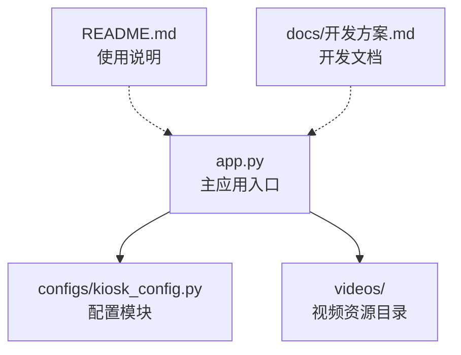
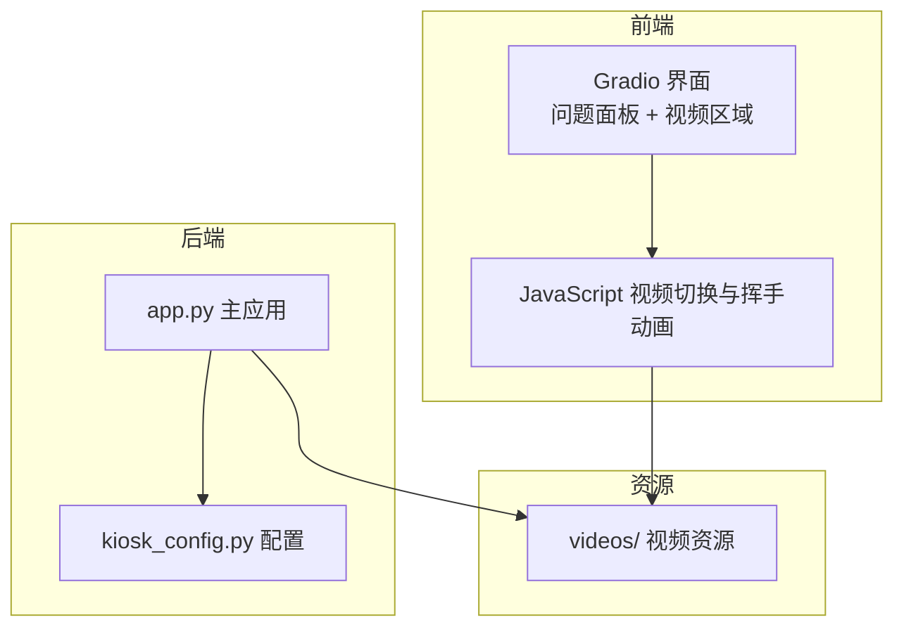
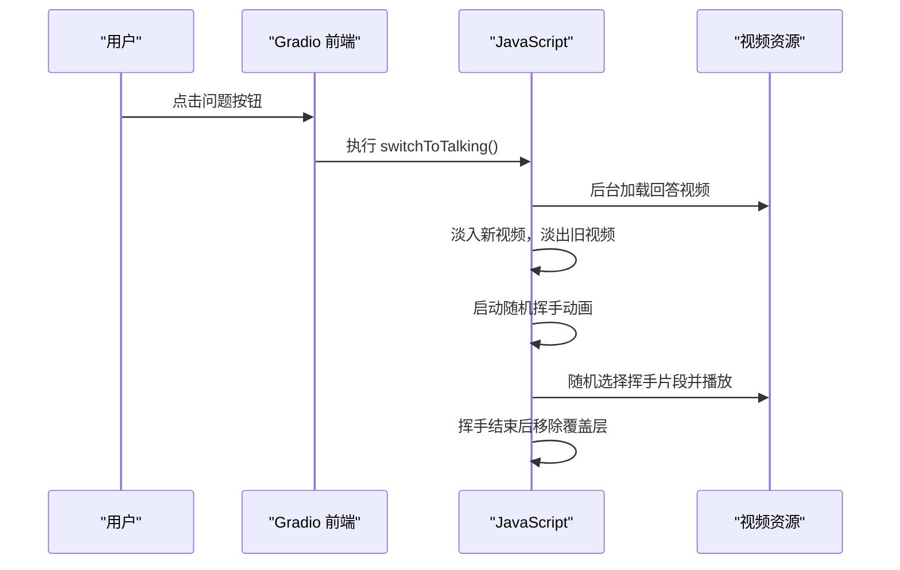
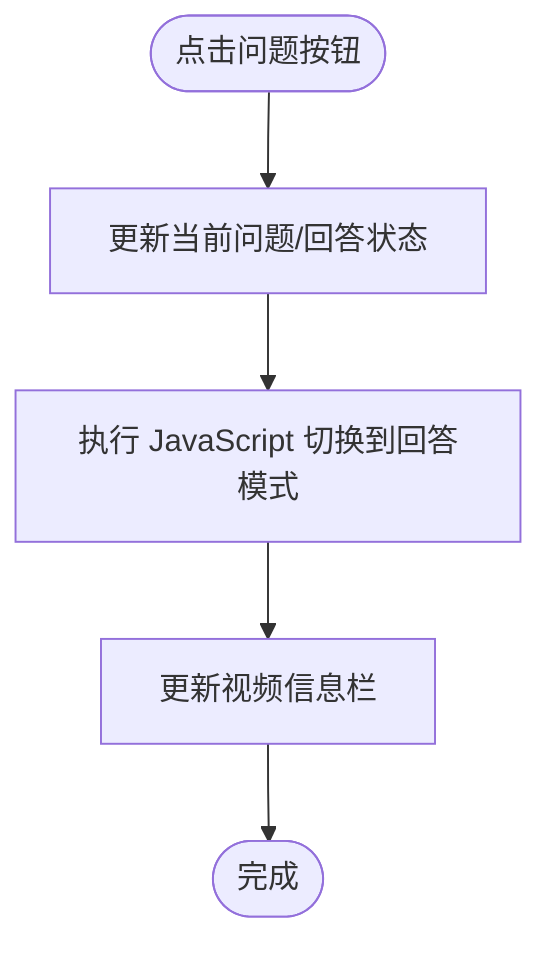
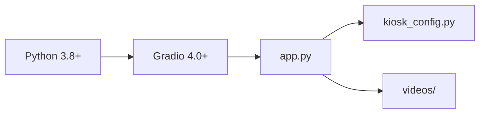

# 故障排除

<cite>
**本文引用的文件**
- [app.py](file://app.py)
- [kiosk_config.py](file://configs/kiosk_config.py)
- [README.md](file://README.md)
- [开发方案.md](file://docs/开发方案.md)
</cite>

## 目录
1. [简介](#简介)
2. [项目结构](#项目结构)
3. [核心组件](#核心组件)
4. [架构总览](#架构总览)
5. [详细组件分析](#详细组件分析)
6. [依赖关系分析](#依赖关系分析)
7. [性能考虑](#性能考虑)
8. [故障排除指南](#故障排除指南)
9. [结论](#结论)
10. [附录](#附录)

## 简介
本指南面向 Linly-Kiosk 数字人问答展示系统的使用者与维护者，提供系统化的故障诊断流程与解决方案，覆盖启动失败、视频播放异常、界面显示问题、性能优化、调试与日志分析、以及环境兼容性问题。目标是帮助用户快速定位并修复常见问题，降低对技术支持的依赖。

## 项目结构
项目采用“主应用 + 配置模块 + 资源目录”的分层组织，便于问题定位与排查：
- 主应用入口负责构建界面、绑定事件、启动服务
- 配置模块集中管理视频路径、问题列表、界面参数、服务器参数、屏幕布局等
- 资源目录存放视频文件与开发文档

图表来源
- [app.py:1-480](file://app.py#L1-L480)
- [kiosk_config.py:1-113](file://configs/kiosk_config.py#L1-L113)
- [README.md:1-126](file://README.md#L1-L126)
- [开发方案.md:1-220](file://docs/开发方案.md#L1-L220)

章节来源
- [app.py:1-480](file://app.py#L1-L480)
- [kiosk_config.py:1-113](file://configs/kiosk_config.py#L1-L113)
- [README.md:12-29](file://README.md#L12-L29)

## 核心组件
- 视频资源与路径
  - 待机视频、回答视频、挥手视频集合由配置模块统一管理，确保路径正确与资源齐全
- 界面与交互
  - 使用 Gradio Blocks 构建页面布局，左侧/右侧问题面板与中间视频区域；点击问题触发视频切换与信息更新
- JavaScript 视频切换与挥手动画
  - 采用双缓冲 + 透明度过渡实现无缝切换；回答模式下随机触发挥手覆盖层
- 服务器与运行参数
  - 通过配置模块设置监听地址、端口与分享参数，支持本地访问与公网分享

章节来源
- [app.py:345-456](file://app.py#L345-L456)
- [app.py:225-338](file://app.py#L225-L338)
- [kiosk_config.py:9-25](file://configs/kiosk_config.py#L9-L25)
- [kiosk_config.py:31-76](file://configs/kiosk_config.py#L31-L76)
- [kiosk_config.py:94-98](file://configs/kiosk_config.py#L94-L98)

## 架构总览
系统采用前端渲染 + 后端服务的轻量架构：Gradio 提供 Web 服务与界面渲染，HTML/CSS/JS 负责视频层与动画效果，Python 负责配置与启动流程。

图表来源
- [app.py:345-456](file://app.py#L345-L456)
- [app.py:225-338](file://app.py#L225-L338)
- [kiosk_config.py:9-25](file://configs/kiosk_config.py#L9-L25)

## 详细组件分析

### 视频切换与挥手动画组件
- 双缓冲视频层
  - 通过两个视频元素交替播放，配合类名切换与透明度过渡实现无缝切换
- 挥手覆盖层
  - 在回答模式下按随机间隔触发，随机选择挥手片段，叠加于主视频之上
- 加载遮罩
  - 切换视频时显示加载遮罩，提升用户体验并避免闪烁

图表来源
- [app.py:225-338](file://app.py#L225-L338)
- [kiosk_config.py:15-25](file://configs/kiosk_config.py#L15-L25)

章节来源
- [app.py:225-338](file://app.py#L225-L338)
- [kiosk_config.py:15-25](file://configs/kiosk_config.py#L15-L25)

### 问题面板与视频信息组件
- 问题按钮
  - 左右两侧各若干预设问题，点击后更新当前问题与回答文本，并触发视频切换
- 视频信息栏
  - 显示当前问题与回答，便于用户确认交互结果

图表来源
- [app.py:372-396](file://app.py#L372-L396)
- [app.py:427-447](file://app.py#L427-L447)

章节来源
- [app.py:372-396](file://app.py#L372-L396)
- [app.py:427-447](file://app.py#L427-L447)

## 依赖关系分析
- 运行时依赖
  - Python 3.8+ 与 Gradio 4.0+ 是系统运行的基础
- 资源依赖
  - 必须存在待机视频、回答视频与至少一个挥手视频，否则会出现播放异常或空白
- 配置依赖
  - 服务器参数决定访问地址与端口；界面参数影响布局与显示内容

图表来源
- [README.md:117-121](file://README.md#L117-L121)
- [app.py:5-7](file://app.py#L5-L7)
- [kiosk_config.py:94-98](file://configs/kiosk_config.py#L94-L98)

章节来源
- [README.md:117-121](file://README.md#L117-L121)
- [app.py:5-7](file://app.py#L5-L7)
- [kiosk_config.py:94-98](file://configs/kiosk_config.py#L94-L98)

## 性能考虑
- 视频格式与编码
  - 推荐使用 MP4/H.264，确保浏览器兼容与播放流畅
- 视频尺寸与比例
  - 建议与屏幕比例接近（9:16），避免缩放导致的性能损耗
- 挥手动画频率
  - 合理设置最小/最大间隔，避免过于频繁触发造成卡顿
- 服务器参数
  - 在高并发场景下可考虑调整共享参数与网络带宽

章节来源
- [README.md:105-111](file://README.md#L105-L111)
- [README.md:117-121](file://README.md#L117-L121)
- [kiosk_config.py:15-25](file://configs/kiosk_config.py#L15-L25)
- [kiosk_config.py:94-98](file://configs/kiosk_config.py#L94-L98)

## 故障排除指南

### 启动失败
- 症状
  - 控制台报错或无法访问页面
- 可能原因
  - 依赖未安装或版本不匹配
  - 端口被占用或权限不足
  - 配置参数错误（主机地址、端口）
- 处理步骤
  - 安装依赖并核对版本
  - 更改端口或关闭占用进程
  - 检查服务器配置参数是否合法
- 相关配置与入口
  - 服务器配置与启动调用
  - 依赖声明与版本要求

章节来源
- [app.py:459-479](file://app.py#L459-L479)
- [kiosk_config.py:94-98](file://configs/kiosk_config.py#L94-L98)
- [README.md:45-55](file://README.md#L45-L55)
- [README.md:117-121](file://README.md#L117-L121)

### 视频播放异常
- 症状
  - 点击问题无反应、视频不播放、播放卡顿
- 可能原因
  - 视频文件缺失或路径错误
  - 视频格式不被浏览器支持
  - 挥手视频列表为空或路径错误
- 处理步骤
  - 确认 videos 目录下存在 idle、talking 与至少一个 wave_* 视频
  - 将视频转换为 MP4/H.264 并调整分辨率
  - 检查挥手视频路径与配置项
- 相关配置
  - 视频路径与挥手配置

章节来源
- [kiosk_config.py:9-25](file://configs/kiosk_config.py#L9-L25)
- [README.md:33-44](file://README.md#L33-L44)
- [README.md:105-111](file://README.md#L105-L111)

### 界面显示问题
- 症状
  - 页面布局错乱、按钮不可点击、信息不更新
- 可能原因
  - CSS 样式冲突或未加载
  - JavaScript 执行异常
  - Gradio 版本与浏览器兼容性问题
- 处理步骤
  - 检查浏览器控制台是否存在脚本报错
  - 确认 Gradio 版本与文档要求一致
  - 临时禁用第三方样式或扩展
- 相关组件
  - CSS 注入与 JavaScript 视频切换逻辑

章节来源
- [app.py:17-219](file://app.py#L17-L219)
- [app.py:225-338](file://app.py#L225-L338)
- [README.md:117-121](file://README.md#L117-L121)

### 挥手动画不生效
- 症状
  - 回答视频播放但无挥手覆盖层
- 可能原因
  - 挥手功能被禁用
  - 挥手视频列表为空或路径错误
  - 浏览器阻止自动播放或静音策略
- 处理步骤
  - 检查挥手开关与间隔配置
  - 确认至少存在一个挥手视频
  - 在浏览器中允许自动播放或手动触发播放
- 相关配置
  - 挥手开关、间隔与视频列表

章节来源
- [kiosk_config.py:15-25](file://configs/kiosk_config.py#L15-L25)
- [app.py:293-331](file://app.py#L293-L331)

### 性能优化与最佳实践
- 视频优化
  - 使用 MP4/H.264，控制文件大小与分辨率
  - 避免在回答视频中加入音频，减少浏览器解码压力
- 动画优化
  - 合理设置挥手间隔，避免过于频繁触发
  - 使用硬件加速友好的 CSS 属性
- 服务器优化
  - 在高并发场景下考虑使用反向代理与静态资源缓存
  - 调整 Gradio 的并发与线程池参数（如适用）

章节来源
- [README.md:105-111](file://README.md#L105-L111)
- [kiosk_config.py:15-25](file://configs/kiosk_config.py#L15-L25)

### 调试工具与日志分析
- 浏览器开发者工具
  - Network 标签页检查视频资源加载状态与响应头
  - Console 标签页查看 JavaScript 错误与警告
  - Elements 标签页验证 DOM 结构与 CSS 类名
- 日志与输出
  - 关注应用启动时的打印信息，确认视频路径与配置参数
  - 如需更详细的错误堆栈，可在启动参数中开启详细日志（如适用）
- 常见问题定位
  - 若点击无效，优先检查按钮事件绑定与状态更新链路
  - 若视频不切换，检查 JavaScript 切换函数与视频层 DOM

章节来源
- [app.py:459-479](file://app.py#L459-L479)
- [app.py:372-396](file://app.py#L372-L396)
- [app.py:427-447](file://app.py#L427-L447)

### 环境兼容性问题
- 浏览器兼容性
  - 推荐使用 Chrome 或 Edge，避免 Safari 等对自动播放策略的限制
- 操作系统与分辨率
  - 项目针对 2160×3840 竖屏设计，建议在相同分辨率下测试
- 依赖版本
  - 确保 Python 3.8+ 与 Gradio 4.0+ 正确安装与升级

章节来源
- [README.md:117-121](file://README.md#L117-L121)
- [开发方案.md:13-15](file://docs/开发方案.md#L13-L15)

## 结论
通过本故障排除指南，用户可以系统地定位与解决 Linly-Kiosk 的常见问题，涵盖启动、播放、界面、性能与兼容性等方面。建议在部署前完成资源准备与依赖校验，在运行中利用浏览器开发者工具与日志进行快速诊断，并根据环境特性调整配置与优化策略。

## 附录
- 快速检查清单
  - 视频资源：idle、talking、至少一个 wave_* 存在且路径正确
  - 依赖版本：Python 3.8+、Gradio 4.0+
  - 服务器参数：host、port、share 合法
  - 浏览器：Chrome/Edge，允许自动播放
- 常用命令参考
  - 安装依赖：pip install gradio
  - 启动应用：python app.py
  - 访问地址：http://localhost:6006

章节来源
- [README.md:45-55](file://README.md#L45-L55)
- [README.md:57-59](file://README.md#L57-L59)
- [README.md:117-121](file://README.md#L117-L121)