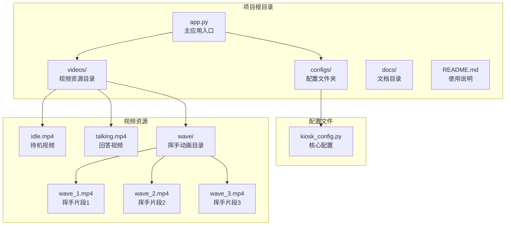
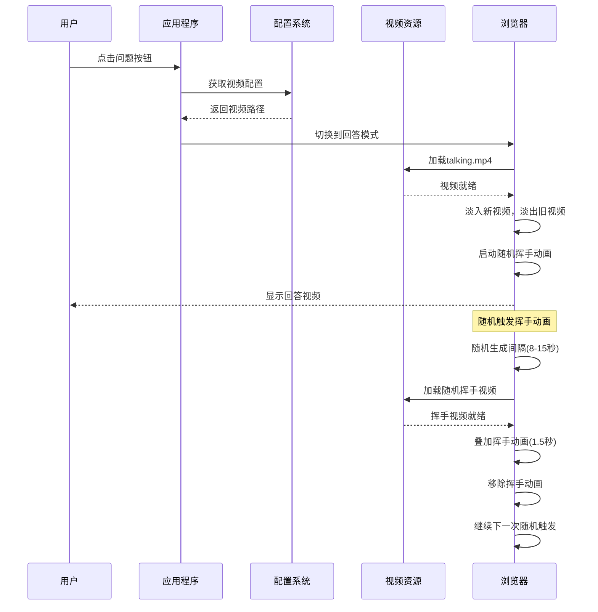
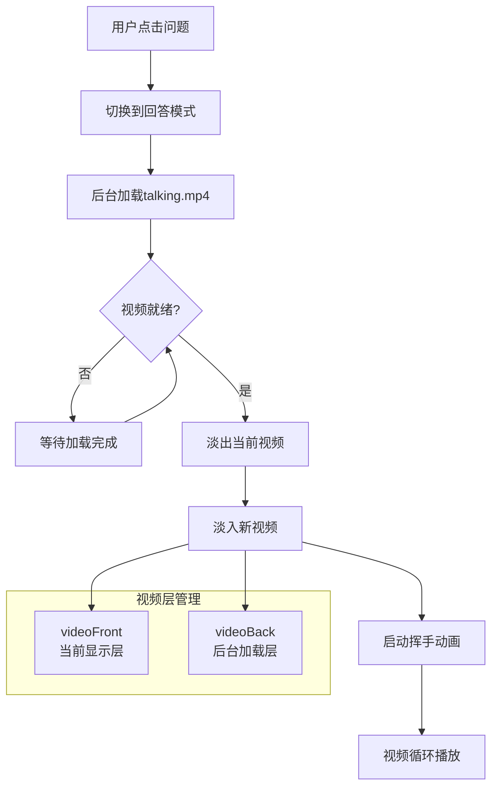
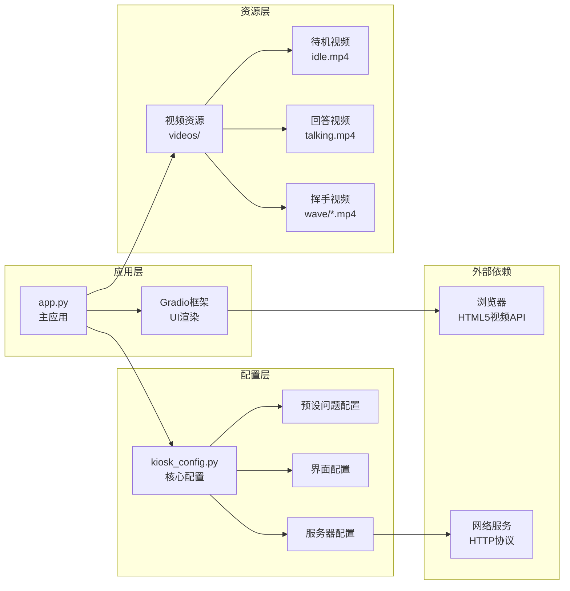

# 视频资源管理

<cite>
**本文引用的文件**
- [app.py](file://app.py)
- [kiosk_config.py](file://configs/kiosk_config.py)
- [README.md](file://README.md)
- [开发方案.md](file://docs/开发方案.md)
</cite>

## 目录
1. [简介](#简介)
2. [项目结构](#项目结构)
3. [核心组件](#核心组件)
4. [架构概览](#架构概览)
5. [详细组件分析](#详细组件分析)
6. [依赖关系分析](#依赖关系分析)
7. [性能考虑](#性能考虑)
8. [故障排除指南](#故障排除指南)
9. [结论](#结论)
10. [附录](#附录)

## 简介

数字人问答展示系统是一个面向2160×3840竖屏的交互式展示平台，用户通过点击预设问题触发数字人视频播放。该系统包含三种核心视频资源：待机视频、回答视频和挥手动画视频，每种资源都有特定的技术规格和使用场景。

## 项目结构

项目采用模块化设计，主要由应用入口、配置管理和视频资源三个核心部分组成：



**图表来源**
- [app.py:1-50](file://app.py#L1-L50)
- [kiosk_config.py:9-25](file://configs/kiosk_config.py#L9-L25)

**章节来源**
- [README.md:12-29](file://README.md#L12-L29)
- [开发方案.md:100-117](file://docs/开发方案.md#L100-L117)

## 核心组件

### 视频资源配置

系统通过配置文件统一管理所有视频资源，确保资源路径的一致性和可维护性。

| 组件类型 | 文件路径 | 用途 | 必需性 |
|---------|----------|------|--------|
| 待机视频 | `videos/idle.mp4` | 无人交互时循环播放 | ✅ 必需 |
| 回答视频 | `videos/talking.mp4` | 用户点击问题时播放 | ✅ 必需 |
| 挥手视频1 | `videos/wave/wave_1.mp4` | 随机叠加在回答视频上 | ✅ 至少1个 |
| 挥手视频2 | `videos/wave/wave_2.mp4` | 随机叠加在回答视频上 | 可选 |
| 挥手视频3 | `videos/wave/wave_3.mp4` | 随机叠加在回答视频上 | 可选 |

### 挥手动画配置参数

| 参数名称 | 默认值 | 单位 | 说明 |
|---------|--------|------|------|
| enabled | True | 布尔值 | 是否启用挥手动画 |
| min_interval | 8 | 秒 | 最小触发间隔 |
| max_interval | 15 | 秒 | 最大触发间隔 |
| duration | 1.5 | 秒 | 挥手持续时间 |

**章节来源**
- [kiosk_config.py:9-25](file://configs/kiosk_config.py#L9-L25)
- [README.md:35-44](file://README.md#L35-L44)

## 架构概览

系统采用双缓冲视频切换机制，确保视频播放的流畅性和用户体验：



**图表来源**
- [app.py:225-338](file://app.py#L225-L338)
- [kiosk_config.py:15-25](file://configs/kiosk_config.py#L15-L25)

## 详细组件分析

### 待机视频组件

待机视频是系统的基础视频资源，负责在无人交互时提供视觉反馈。

#### 技术规格要求

| 要求类别 | 具体标准 | 说明 |
|---------|----------|------|
| **格式** | MP4 | 标准视频格式，兼容性最佳 |
| **编码** | H.264 | 高效压缩，文件体积小 |
| **分辨率** | 2160×3840 | 完美匹配展示屏幕 |
| **比例** | 9:16 | 竖屏标准比例 |
| **帧率** | 30fps | 流畅播放体验 |
| **音频** | 无 | 静音设计，避免干扰 |
| **文件大小** | ≤10MB | 优化加载速度 |

#### 存储位置和访问路径

- **存储路径**: `videos/idle.mp4`
- **访问方式**: 直接文件路径引用
- **加载策略**: 自动循环播放，无需用户交互

### 回答视频组件

回答视频是用户交互的核心视频资源，承载着数字人的回答内容。

#### 技术规格要求

| 要求类别 | 具体标准 | 说明 |
|---------|----------|------|
| **格式** | MP4 | 标准视频格式，广泛支持 |
| **编码** | H.264 | 高效压缩算法 |
| **分辨率** | 2160×3840 | 完美适配屏幕尺寸 |
| **比例** | 9:16 | 竖屏设计，符合观看习惯 |
| **帧率** | 30fps | 保证流畅度 |
| **音频** | 无 | 静音设计，避免回音 |
| **文件大小** | ≤10MB | 优化响应速度 |

#### 双缓冲切换机制

系统采用先进的双缓冲技术实现无缝视频切换：



**图表来源**
- [app.py:229-291](file://app.py#L229-L291)
- [app.py:403-408](file://app.py#L403-L408)

### 挥手动画视频组件

挥手动画是系统的特色功能，通过随机触发增强互动体验。

#### 挥手动画配置详解

| 配置项 | 默认值 | 作用域 | 说明 |
|-------|--------|--------|------|
| enabled | True | 全局 | 控制挥手功能开关 |
| min_interval | 8 | 时间控制 | 最短触发间隔 |
| max_interval | 15 | 时间控制 | 最长触发间隔 |
| duration | 1.5 | 动画控制 | 挥手持续时间 |
| videos | 3个视频 | 资源管理 | 挥手视频列表 |

#### 挥手触发流程

```mermaid
flowchart TD
A[回答视频播放中] --> B{随机计时器到期?}
B --> |否| C[继续等待]
B --> |是| D[生成随机间隔(8-15秒)]
D --> E[随机选择挥手视频]
E --> F[加载挥手视频]
F --> G{视频加载成功?}
G --> |否| H[重新计算间隔]
G --> |是| I[显示挥手动画]
I --> J[播放1.5秒]
J --> K[移除动画]
K --> L[开始下一轮计时]
H --> D
subgraph "动画层"
M[waveOverlay<br/>覆盖层]
N[挥手视频元素]
end
I --> M
M --> N
```

**图表来源**
- [app.py:293-331](file://app.py#L293-L331)
- [kiosk_config.py:15-25](file://configs/kiosk_config.py#L15-L25)

**章节来源**
- [app.py:10-12](file://app.py#L10-L12)
- [app.py:225-338](file://app.py#L225-L338)

## 依赖关系分析

系统各组件之间的依赖关系清晰明确，遵循单一职责原则：



**图表来源**
- [app.py:5-7](file://app.py#L5-L7)
- [kiosk_config.py:9-98](file://configs/kiosk_config.py#L9-L98)

**章节来源**
- [app.py:345-456](file://app.py#L345-L456)
- [kiosk_config.py:1-113](file://configs/kiosk_config.py#L1-L113)

## 性能考虑

### 视频优化策略

1. **文件大小控制**
   - 建议单个视频文件不超过10MB
   - 采用H.264编码获得最佳压缩比
   - 避免高复杂度特效影响加载速度

2. **内存管理**
   - 双缓冲机制避免内存峰值
   - 视频切换时及时释放资源
   - 挥手动画采用临时加载策略

3. **网络传输优化**
   - 本地文件访问避免网络延迟
   - 合理的视频分辨率匹配屏幕
   - 预加载策略提升用户体验

### 性能监控指标

| 指标类型 | 目标值 | 监控方法 |
|---------|--------|----------|
| 视频加载时间 | <2秒 | 浏览器开发者工具 |
| 切换延迟 | <0.5秒 | 性能分析工具 |
| 内存占用 | <500MB | 系统监控 |
| CPU使用率 | <70% | 性能监控 |

## 故障排除指南

### 常见问题及解决方案

#### 视频无法播放

**问题症状**: 点击问题后视频不显示或播放失败

**可能原因**:
1. 视频文件路径错误
2. 视频格式不支持
3. 浏览器兼容性问题
4. 文件权限不足

**解决步骤**:
1. 检查视频文件是否存在于正确路径
2. 验证视频格式为MP4，编码为H.264
3. 确认浏览器支持HTML5视频播放
4. 检查文件读取权限

#### 挥手动画不触发

**问题症状**: 回答视频播放但没有挥手效果

**可能原因**:
1. 挥手功能被禁用
2. 挥手视频文件缺失
3. 配置参数设置错误
4. JavaScript执行异常

**解决步骤**:
1. 检查WAVE_CONFIG.enabled是否为True
2. 确认至少有一个挥手视频文件存在
3. 验证min_interval和max_interval设置合理
4. 查看浏览器控制台错误信息

#### 视频切换卡顿

**问题症状**: 点击问题后视频切换延迟明显

**可能原因**:
1. 视频文件过大
2. 编码格式不兼容
3. 网络带宽限制
4. 系统资源不足

**解决步骤**:
1. 优化视频文件大小至10MB以内
2. 确保使用H.264编码
3. 检查网络连接稳定性
4. 关闭不必要的应用程序释放资源

**章节来源**
- [README.md:205-211](file://README.md#L205-L211)
- [开发方案.md:205-211](file://docs/开发方案.md#L205-L211)

## 结论

数字人问答展示系统的视频资源管理方案设计合理，实现了功能完整性与技术可行性的平衡。通过标准化的视频格式、严格的配置管理和高效的双缓冲切换机制，系统能够在2160×3840竖屏环境下提供流畅的用户体验。

建议在实际部署中重点关注视频文件的质量控制和性能优化，确保系统在各种硬件环境下都能稳定运行。

## 附录

### 视频制作最佳实践

#### 待机视频制作要点
- 保持数字人静态姿态，避免频繁动作
- 确保背景简洁，突出数字人主体
- 采用30fps录制，保证流畅度
- 文件大小控制在5-8MB之间

#### 回答视频制作要点
- 数字人需要配合嘴部动作
- 背景保持相对静态
- 录制时注意光线均匀
- 音频建议静音，避免回音

#### 挥手动画制作要点
- 动作幅度适中，避免过大
- 持续时间控制在1-2秒
- 可以包含轻微音效增强体验
- 多角度拍摄不同手势

### 视频资源准备清单

#### 必需资源
- [ ] `videos/idle.mp4` - 待机视频
- [ ] `videos/talking.mp4` - 回答视频
- [ ] `videos/wave/wave_1.mp4` - 挥手视频1
- [ ] `videos/wave/wave_2.mp4` - 挥手视频2
- [ ] `videos/wave/wave_3.mp4` - 挥手视频3

#### 可选资源
- [ ] 更多挥手视频片段
- [ ] 不同风格的数字人形象
- [ ] 背景音乐素材

### 配置检查清单

#### 基础配置
- [ ] VIDEOS配置正确
- [ ] WAVE_CONFIG参数合理
- [ ] PRESET_QUESTIONS内容完整
- [ ] SERVER_CONFIG端口可用

#### 高级配置
- [ ] 屏幕适配参数正确
- [ ] UI样式配置生效
- [ ] 权限设置正确
- [ ] 日志配置开启