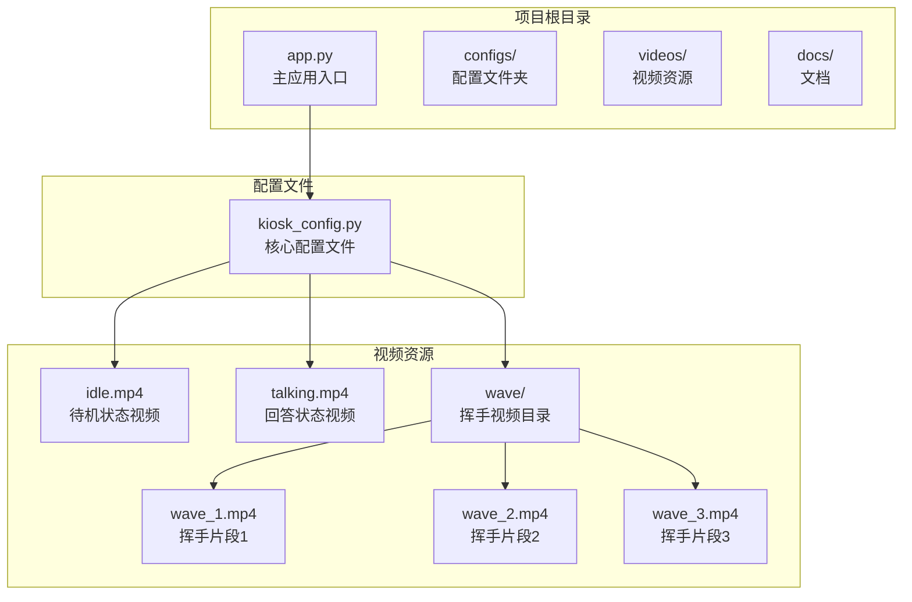
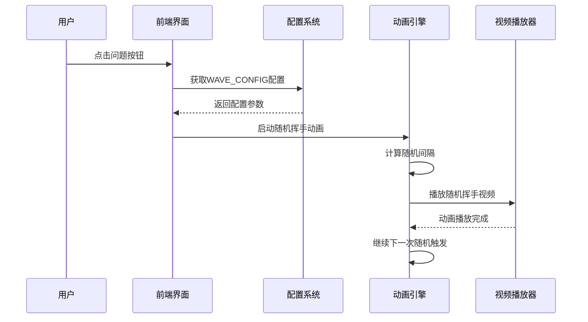
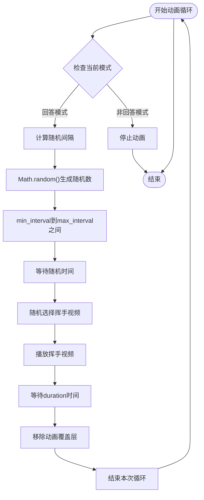
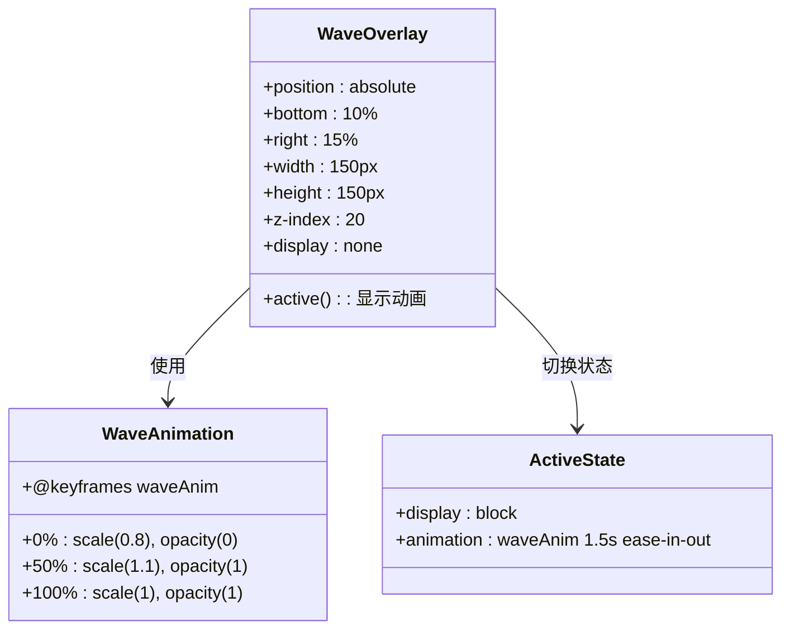
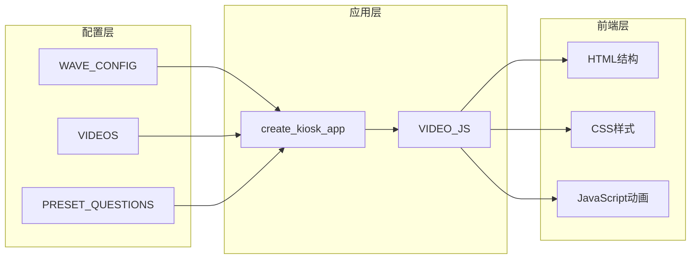

# 动画配置

<cite>
**本文档引用的文件**
- [kiosk_config.py](file://configs/kiosk_config.py)
- [app.py](file://app.py)
- [README.md](file://README.md)
- [开发方案.md](file://docs/开发方案.md)
</cite>

## 目录
1. [简介](#简介)
2. [项目结构](#项目结构)
3. [核心组件](#核心组件)
4. [架构概览](#架构概览)
5. [详细组件分析](#详细组件分析)
6. [依赖关系分析](#依赖关系分析)
7. [性能考虑](#性能考虑)
8. [故障排除指南](#故障排除指南)
9. [结论](#结论)

## 简介

本文件详细说明了Linly-Kiosk数字人问答展示系统中的动画配置模块，特别是WAVE_CONFIG字典的配置参数和工作机制。该系统实现了随机挥手动画功能，在用户点击问题触发数字人回答视频播放时，会在回答过程中随机触发挥手动画效果。

## 项目结构

Linly-Kiosk项目采用模块化设计，主要包含以下关键组件：

**图表来源**
- [app.py:1-50](file://app.py#L1-L50)
- [kiosk_config.py:9-25](file://configs/kiosk_config.py#L9-L25)

**章节来源**
- [app.py:1-50](file://app.py#L1-L50)
- [kiosk_config.py:1-113](file://configs/kiosk_config.py#L1-L113)

## 核心组件

### WAVE_CONFIG配置字典详解

WAVE_CONFIG是系统中最重要的动画配置组件，位于`configs/kiosk_config.py`文件中。该字典包含了所有与挥手动画相关的配置参数：

| 参数名称 | 数据类型 | 默认值 | 描述 | 单位 |
|---------|---------|--------|------|-----|
| enabled | boolean | True | 是否启用挥手动画功能 | - |
| min_interval | integer | 8 | 最小触发间隔 | 秒 |
| max_interval | integer | 15 | 最大触发间隔 | 秒 |
| duration | float | 1.5 | 挥手动画持续时间 | 秒 |
| videos | list | [wave_1.mp4, wave_2.mp4, wave_3.mp4] | 挥手视频文件列表 | 路径数组 |

### 关键实现细节

1. **动画启用控制**：通过`enabled`参数完全控制挥手动画功能的开关
2. **随机间隔机制**：`min_interval`和`max_interval`定义了随机触发的时间范围
3. **视频资源管理**：`videos`列表存储所有可用的挥手动画视频文件
4. **持续时间控制**：`duration`参数控制单次挥手动画的播放时长

**章节来源**
- [kiosk_config.py:14-25](file://configs/kiosk_config.py#L14-L25)

## 架构概览

系统采用前后端分离的架构设计，动画功能通过JavaScript实现，配置参数通过Python配置文件传递：

**图表来源**
- [app.py:293-331](file://app.py#L293-L331)
- [kiosk_config.py:14-25](file://configs/kiosk_config.py#L14-L25)

## 详细组件分析

### 随机动画触发机制

#### 核心算法流程

**图表来源**
- [app.py:293-331](file://app.py#L293-L331)

#### 实现原理分析

1. **时间间隔计算**：使用`Math.random()`函数生成指定范围内的随机整数
2. **视频选择策略**：通过`Math.floor(Math.random() * waveVideos.length)`随机选择视频
3. **动画生命周期**：从视频加载到播放完成的完整流程
4. **状态管理**：确保动画只在回答模式下运行

### CSS动画系统

系统使用CSS关键帧动画实现挥手效果：

**图表来源**
- [app.py:138-158](file://app.py#L138-L158)

**章节来源**
- [app.py:138-158](file://app.py#L138-L158)
- [app.py:293-331](file://app.py#L293-L331)

### 配置参数详细说明

#### 启用控制参数
- **enabled**: 控制整个动画功能的开关
- **作用**: 当设置为False时，系统不会启动任何动画逻辑

#### 时间控制参数
- **min_interval**: 最小触发间隔，影响动画频率
- **max_interval**: 最大触发间隔，提供随机性范围
- **duration**: 单次动画持续时间，影响用户体验

#### 资源管理参数
- **videos**: 存储所有可用的挥手动画视频文件路径
- **要求**: 所有视频文件必须存在于指定路径

**章节来源**
- [kiosk_config.py:14-25](file://configs/kiosk_config.py#L14-L25)

## 依赖关系分析

### 组件耦合度分析

**图表来源**
- [app.py:332-338](file://app.py#L332-L338)
- [kiosk_config.py:9-76](file://configs/kiosk_config.py#L9-L76)

### 外部依赖关系

1. **Gradio框架**: 提供Web界面和事件处理
2. **浏览器API**: 使用setTimeout和DOM操作实现动画
3. **视频编解码器**: 依赖浏览器内置的MP4/H.264支持

**章节来源**
- [app.py:5-7](file://app.py#L5-L7)
- [README.md:117-121](file://README.md#L117-L121)

## 性能考虑

### 内存管理
- **视频资源缓存**: 浏览器会自动缓存已加载的视频文件
- **DOM元素复用**: 动画覆盖层通过innerHTML动态更新，避免频繁创建DOM节点
- **定时器清理**: 在模式切换时及时清除定时器，防止内存泄漏

### 性能优化建议
1. **视频文件优化**: 建议使用10MB以内的视频文件
2. **编码格式**: 使用H.264编码确保浏览器兼容性
3. **分辨率匹配**: 视频分辨率应与屏幕比例一致

### 并发处理
- **双缓冲机制**: 主视频和备用视频同时存在，避免切换卡顿
- **异步加载**: 视频文件异步加载，不影响用户交互

## 故障排除指南

### 常见问题及解决方案

#### 动画不显示
1. **检查视频文件路径**：确认`videos/wave/`目录下存在指定的视频文件
2. **验证文件格式**：确保视频文件为MP4格式且编码为H.264
3. **检查enabled参数**：确认WAVE_CONFIG.enabled设置为True

#### 动画频率异常
1. **调整间隔参数**：根据需求修改min_interval和max_interval
2. **检查模式状态**：确认动画仅在回答模式下运行
3. **验证定时器清理**：确保模式切换时正确停止动画

#### 性能问题
1. **优化视频文件**：压缩视频文件大小
2. **减少视频数量**：适当减少挥手视频文件数量
3. **检查浏览器兼容性**：确保目标浏览器支持所需功能

**章节来源**
- [README.md:105-111](file://README.md#L105-L111)
- [app.py:267-291](file://app.py#L267-L291)

## 结论

Linly-Kiosk系统的动画配置模块通过精心设计的WAVE_CONFIG字典实现了灵活而高效的随机挥手动画功能。该模块具有以下特点：

1. **高度可配置性**：通过简单的参数调整即可改变动画行为
2. **良好的性能表现**：采用双缓冲技术和异步加载机制
3. **完善的错误处理**：包含完整的状态管理和资源清理机制
4. **易于扩展**：支持添加新的动画视频文件和自定义配置

通过合理配置WAVE_CONFIG参数，开发者可以根据具体需求定制动画效果，为用户提供更加生动和互动的数字人体验。