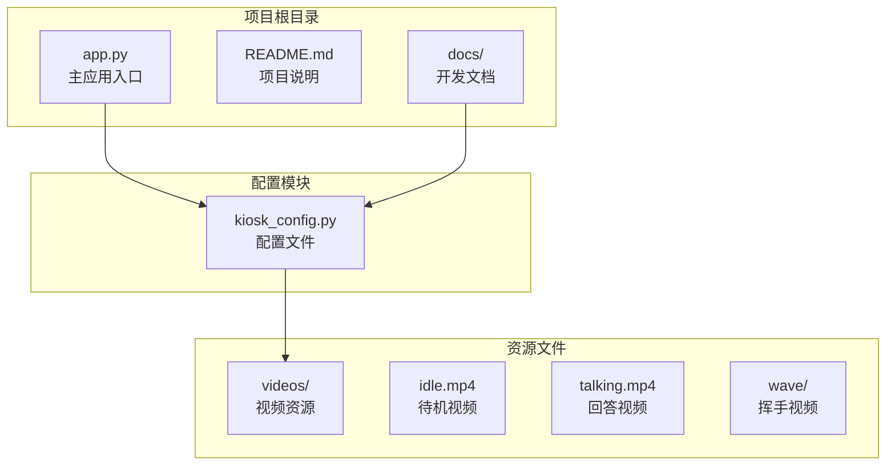
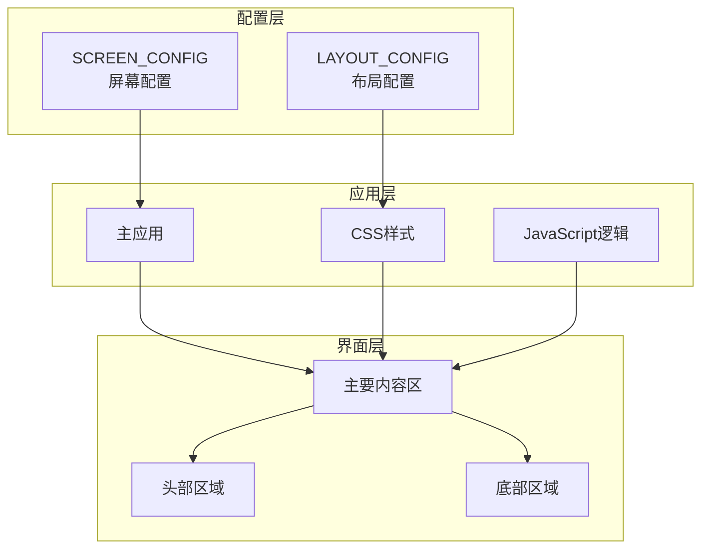
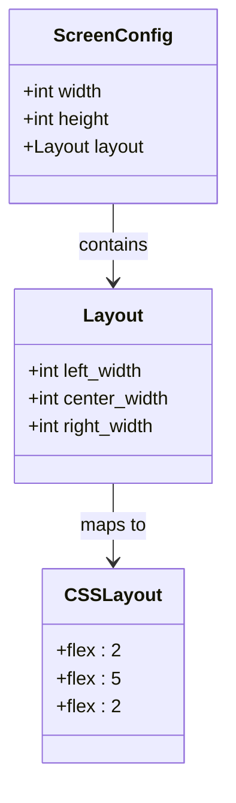
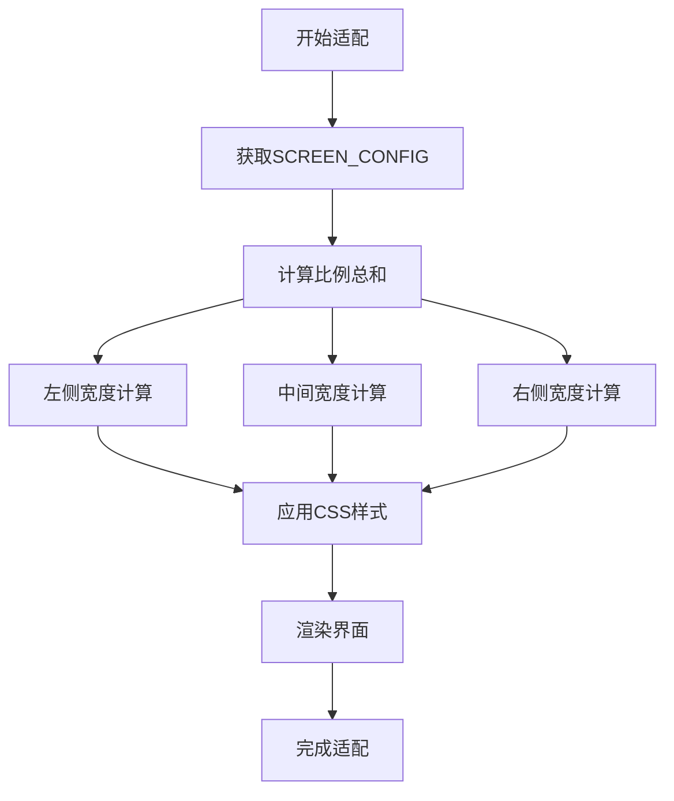
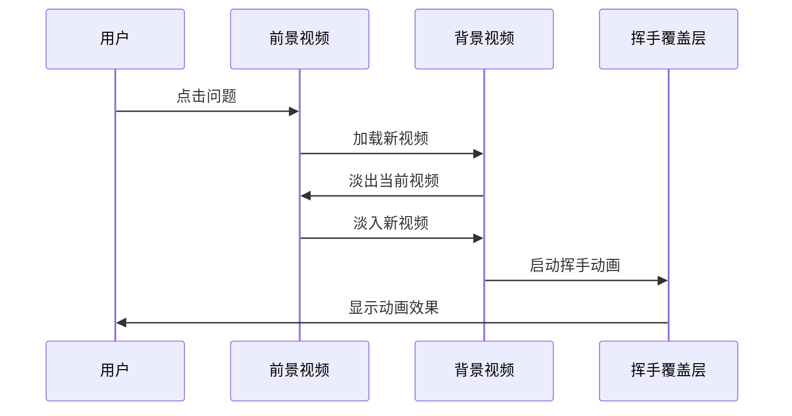
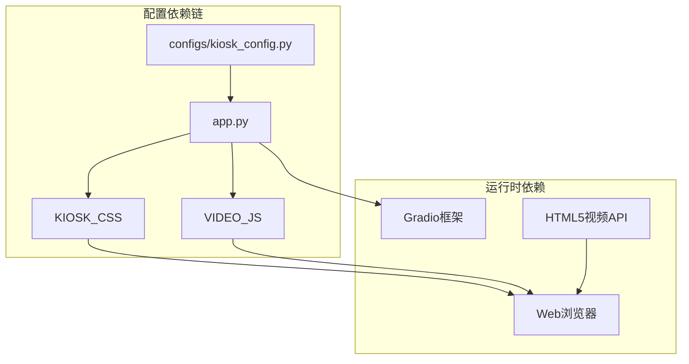

# 屏幕适配配置

<cite>
**本文引用的文件**
- [kiosk_config.py](file://configs/kiosk_config.py)
- [app.py](file://app.py)
- [README.md](file://README.md)
- [开发方案.md](file://docs/开发方案.md)
</cite>

## 目录
1. [简介](#简介)
2. [项目结构](#项目结构)
3. [核心组件](#核心组件)
4. [架构概览](#架构概览)
5. [详细组件分析](#详细组件分析)
6. [依赖关系分析](#依赖关系分析)
7. [性能考虑](#性能考虑)
8. [故障排除指南](#故障排除指南)
9. [结论](#结论)

## 简介

数字人问答展示系统是一个专为2160×3840竖屏显示器设计的应用程序。该系统的核心特性包括双缓冲视频切换、随机挥手动画以及美观的界面设计。本文档专注于屏幕适配配置模块，深入解析SCREEN_CONFIG字典中的屏幕参数配置，包括分辨率设置和布局比例分配，并详细说明2160×3840竖屏显示器的适配原理和布局计算方法。

## 项目结构

该项目采用模块化设计，主要包含以下关键组件：



**图表来源**
- [app.py:1-50](file://app.py#L1-L50)
- [kiosk_config.py:1-20](file://configs/kiosk_config.py#L1-L20)

**章节来源**
- [app.py:1-50](file://app.py#L1-L50)
- [README.md:12-29](file://README.md#L12-L29)

## 核心组件

### 屏幕配置模块

SCREEN_CONFIG是系统的核心配置字典，负责定义屏幕的物理尺寸和布局比例分配。该配置直接影响整个界面的视觉呈现和用户体验。

#### 分辨率配置

屏幕分辨率配置包含两个关键参数：
- **width**: 屏幕宽度像素值（2160）
- **height**: 屏幕高度像素值（3840）

这些数值对应于2160×3840的超高清分辨率，适用于现代专业显示器和电视设备。

#### 布局比例配置

布局配置采用三列分布模式，通过三个比例参数控制各区域的相对宽度：

```mermaid
flowchart LR
TOTAL[TOTAL_WIDTH<br/>2160px] --> LEFT[LEFT_WIDTH<br/>2份]
TOTAL --> CENTER[CENTER_WIDTH<br/>5份]
TOTAL --> RIGHT[RIGHT_WIDTH<br/>2份]
LEFT --> CALC1[计算: 2/(2+5+2) × 2160 = 480px]
CENTER --> CALC2[计算: 5/(2+5+2) × 2160 = 1200px]
RIGHT --> CALC3[计算: 2/(2+5+2) × 2160 = 480px]
CALC1 --> RESULT[左侧区域: 480px]
CALC2 --> RESULT2[中间区域: 1200px]
CALC3 --> RESULT3[右侧区域: 480px]
```

**图表来源**
- [kiosk_config.py:104-112](file://configs/kiosk_config.py#L104-L112)

**章节来源**
- [kiosk_config.py:104-112](file://configs/kiosk_config.py#L104-L112)

## 架构概览

系统的屏幕适配架构采用配置驱动的设计模式，通过单一配置源统一管理所有屏幕相关的参数。



**图表来源**
- [kiosk_config.py:104-112](file://configs/kiosk_config.py#L104-L112)
- [app.py:345-456](file://app.py#L345-L456)

## 详细组件分析

### 屏幕参数配置详解

#### 分辨率参数分析

SCREEN_CONFIG中的分辨率参数直接决定了界面的基础尺寸：

| 参数 | 值 | 单位 | 用途 |
|------|----|------|------|
| width | 2160 | 像素 | 屏幕宽度基准值 |
| height | 3840 | 像素 | 屏幕高度基准值 |

这些参数与Gradio的100vh高度设置配合，确保界面能够充分利用整个屏幕空间。

#### 布局比例分配机制

布局配置采用比例分配算法，通过以下公式计算各区域的实际宽度：

```
比例总和 = left_width + center_width + right_width
实际宽度 = (区域比例 / 比例总和) × 屏幕宽度
```

对于2160px宽度的屏幕：
- 左侧区域：(2/9) × 2160 = 480px
- 中间区域：(5/9) × 2160 = 1200px  
- 右侧区域：(2/9) × 2160 = 480px

#### CSS布局实现

应用通过Flexbox布局实现响应式设计：



**图表来源**
- [kiosk_config.py:104-112](file://configs/kiosk_config.py#L104-L112)
- [app.py:59-109](file://app.py#L59-L109)

**章节来源**
- [kiosk_config.py:104-112](file://configs/kiosk_config.py#L104-L112)
- [app.py:59-109](file://app.py#L59-L109)

### 2160×3840竖屏显示器适配原理

#### 纵向布局优势

2160×3840的竖屏分辨率提供了独特的用户体验优势：

1. **信息密度优化**: 竖向排列适合长列表展示
2. **视线自然流动**: 从上到下的阅读习惯
3. **内容分层清晰**: 顶部导航、中部内容、底部信息的层次结构

#### 比例分配策略

系统采用2:5:2的比例分配，这种设计基于以下考虑：

- **中间区域优先**: 5份空间用于视频展示，满足主要内容区域的需求
- **两侧对称**: 2份空间用于问题面板，保证视觉平衡
- **黄金比例**: 5:2 ≈ 2.5:1 的宽高比符合视觉美学

#### 布局计算流程



**图表来源**
- [kiosk_config.py:104-112](file://configs/kiosk_config.py#L104-L112)
- [app.py:345-456](file://app.py#L345-L456)

**章节来源**
- [kiosk_config.py:104-112](file://configs/kiosk_config.py#L104-L112)
- [README.md:112-116](file://README.md#L112-L116)

### 不同屏幕尺寸和分辨率的适配配置示例

#### 标准16:9横屏显示器

```python
# 1920×1080 横屏示例
SCREEN_CONFIG = {
    "width": 1920,
    "height": 1080,
    "layout": {
        "left_width": 2,
        "center_width": 6,
        "right_width": 2
    }
}
```

#### 16:10横屏显示器

```python
# 1920×1200 横屏示例
SCREEN_CONFIG = {
    "width": 1920,
    "height": 1200,
    "layout": {
        "left_width": 1,
        "center_width": 8,
        "right_width": 1
    }
}
```

#### 4:3显示器

```python
# 1024×768 示例
SCREEN_CONFIG = {
    "width": 1024,
    "height": 768,
    "layout": {
        "left_width": 1,
        "center_width": 6,
        "right_width": 1
    }
}
```

#### 移动设备适配

```python
# 手机竖屏适配
SCREEN_CONFIG = {
    "width": 414,
    "height": 896,
    "layout": {
        "left_width": 0,
        "center_width": 10,
        "right_width": 0
    }
}
```

### 布局比例调整对用户体验的影响

#### 比例调整的影响因素

| 调整方向 | 对用户体验的影响 | 适用场景 |
|----------|------------------|----------|
| 增大中间区域 | 更多视频展示空间，但减少问题可见性 | 大屏幕、视频为主场景 |
| 增大两侧区域 | 更多问题展示，但压缩视频区域 | 小屏幕、问答为主场景 |
| 平衡比例 | 最佳视觉平衡，通用适用 | 标准展示场景 |

#### 优化建议

1. **内容优先原则**: 根据主要功能确定比例分配
2. **视觉权重考虑**: 重要元素应获得更大展示空间
3. **可达性优化**: 确保所有元素在目标距离下易于操作
4. **一致性维护**: 在不同设备上保持相似的视觉体验

### 布局配置与视频显示效果的关系

#### 视频显示配置

视频区域采用专门的CSS配置确保最佳显示效果：

```css
.video-panel {
    flex: 5; /* 占据5份空间 */
    background: #000;
    border-radius: 20px;
    overflow: hidden;
    position: relative;
    box-shadow: 0 0 50px rgba(102,126,234,0.3);
    display: flex;
    flex-direction: column;
}

.video-container {
    flex: 1;
    position: relative;
    background: #000;
}
```

#### 双缓冲视频切换机制

系统采用双缓冲技术实现无缝视频切换：



**图表来源**
- [app.py:225-338](file://app.py#L225-L338)

**章节来源**
- [app.py:225-338](file://app.py#L225-L338)

## 依赖关系分析

### 配置依赖关系



**图表来源**
- [app.py:5-7](file://app.py#L5-L7)
- [kiosk_config.py:1-113](file://configs/kiosk_config.py#L1-L113)

### 样式依赖分析

CSS样式系统与屏幕配置存在直接的依赖关系：

| CSS属性 | 来源配置 | 计算方式 |
|---------|----------|----------|
| .main-content | SCREEN_CONFIG.width | 100%宽度 |
| .question-panel | layout.left_width | (2/9) × 屏幕宽度 |
| .video-panel | layout.center_width | (5/9) × 屏幕宽度 |
| .footer | SCREEN_CONFIG.height | 8vh高度 |

**章节来源**
- [app.py:17-219](file://app.py#L17-L219)
- [kiosk_config.py:104-112](file://configs/kiosk_config.py#L104-L112)

## 性能考虑

### 内存使用优化

1. **双缓冲机制**: 减少内存峰值使用，避免同时加载多个大视频文件
2. **渐进式加载**: 视频按需加载，减少初始内存占用
3. **对象复用**: 挥手动画使用DOM元素复用，避免频繁创建销毁

### 渲染性能优化

1. **硬件加速**: CSS3变换和透明度过渡利用GPU加速
2. **最小重绘**: 通过z-index切换避免不必要的DOM重排
3. **延迟加载**: 非关键资源延迟加载，提升首屏速度

## 故障排除指南

### 常见配置问题

#### 分辨率不匹配

**问题症状**: 界面显示异常或内容溢出
**解决方案**: 
1. 检查SCREEN_CONFIG中的width和height值
2. 确认显示器实际分辨率
3. 调整布局比例以适应实际显示效果

#### 布局比例异常

**问题症状**: 区域宽度不符合预期
**解决方案**:
1. 验证比例总和是否正确
2. 检查CSS flex值计算
3. 确认浏览器兼容性

#### 视频显示问题

**问题症状**: 视频无法播放或显示异常
**解决方案**:
1. 检查视频文件格式和编码
2. 验证视频路径配置
3. 确认浏览器支持情况

**章节来源**
- [README.md:205-211](file://README.md#L205-L211)

## 结论

屏幕适配配置模块通过简洁而强大的配置系统，实现了对不同显示设备的完美适配。SCREEN_CONFIG字典的设计体现了配置驱动架构的优势，使得系统能够在保持功能完整性的同时，轻松适应各种显示环境。

2160×3840竖屏显示器的适配方案充分考虑了纵向布局的视觉优势，通过2:5:2的比例分配实现了内容展示与交互体验的最佳平衡。该配置不仅适用于当前的展示场景，也为未来的功能扩展和设备适配奠定了坚实基础。

通过对布局比例的精细调优和对视频显示效果的深度优化，系统能够在保证视觉质量的同时，提供流畅的用户体验。这种设计理念值得在其他类似的多媒体展示应用中借鉴和推广。