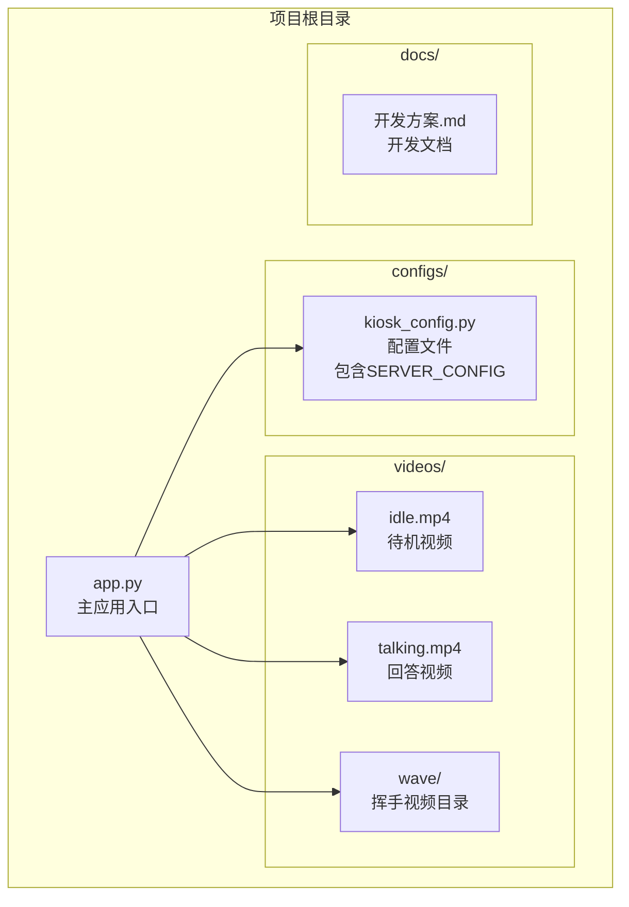
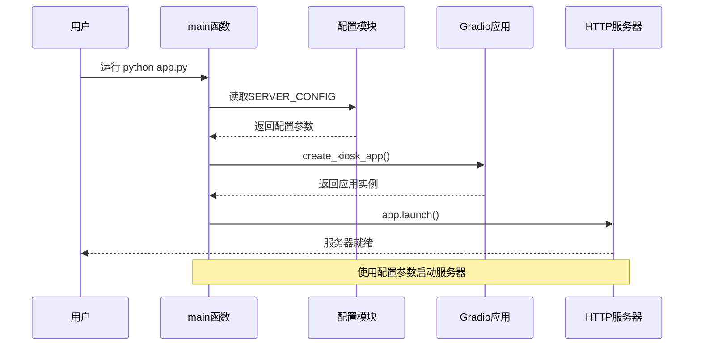
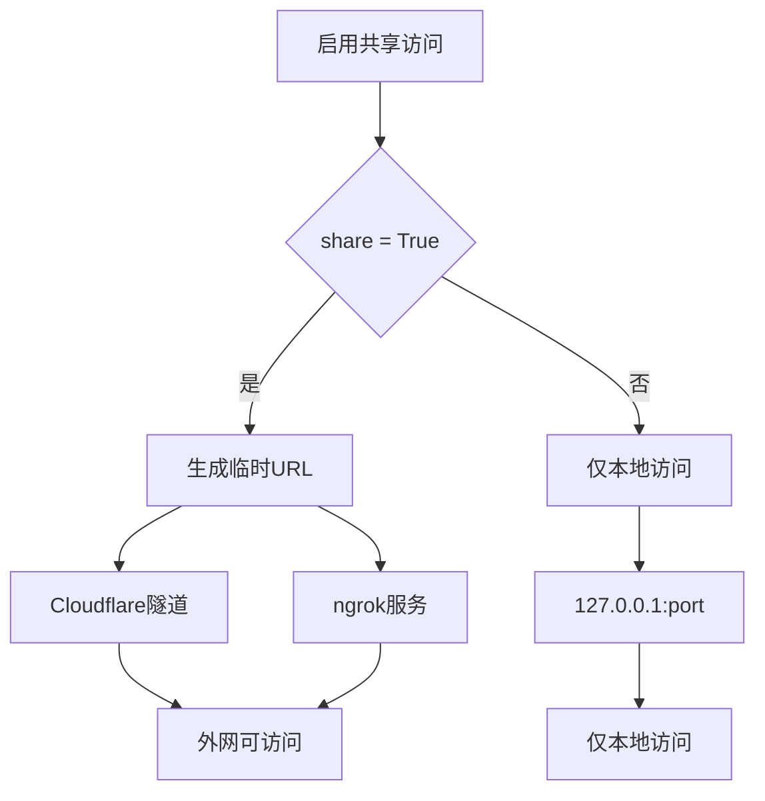
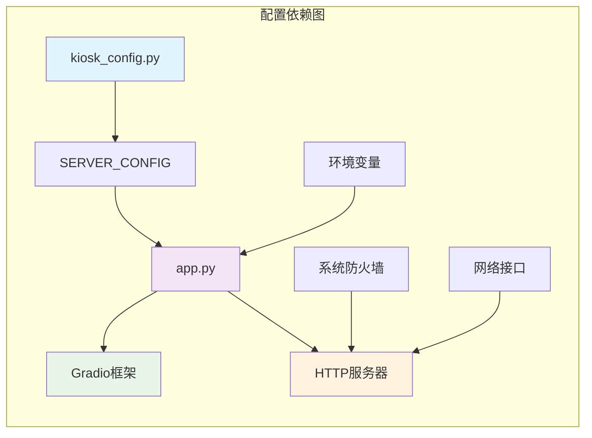
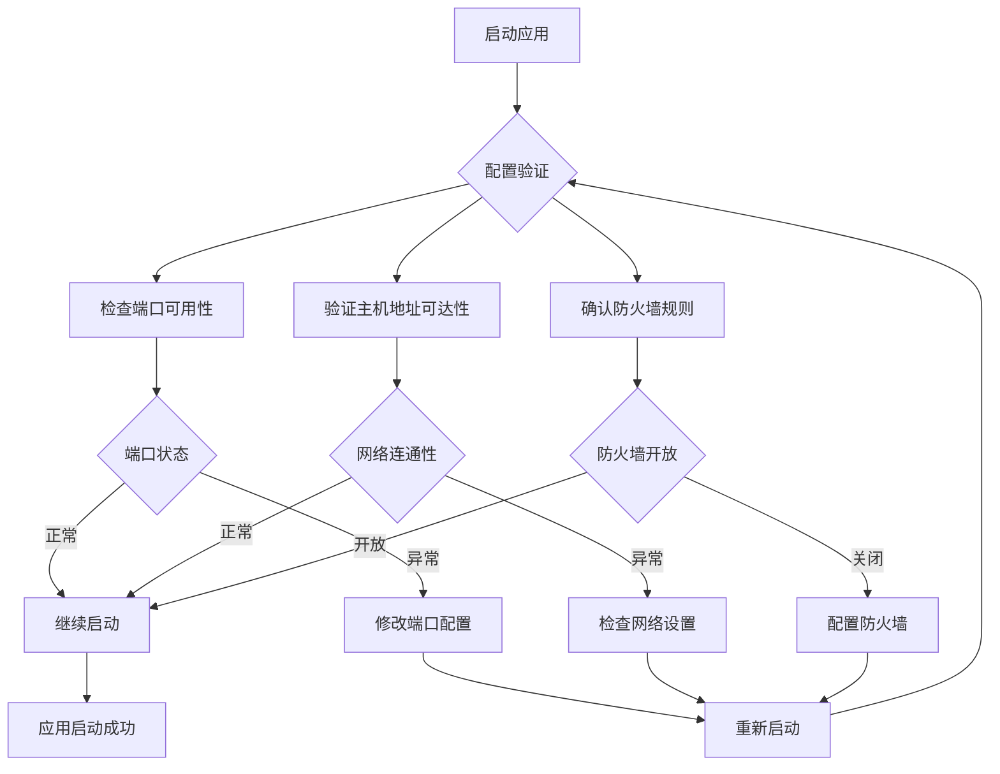

# 服务器配置

<cite>
**本文档引用的文件**
- [kiosk_config.py](file://configs/kiosk_config.py)
- [app.py](file://app.py)
- [README.md](file://README.md)
</cite>

## 目录
1. [简介](#简介)
2. [项目结构](#项目结构)
3. [核心组件](#核心组件)
4. [架构概览](#架构概览)
5. [详细组件分析](#详细组件分析)
6. [依赖关系分析](#依赖关系分析)
7. [性能考虑](#性能考虑)
8. [故障排除指南](#故障排除指南)
9. [结论](#结论)

## 简介

数字人问答展示系统的服务器配置模块负责管理应用程序的网络服务设置。该系统基于Gradio框架构建，提供了一个面向2160×3840竖屏分辨率的数字人问答展示平台。服务器配置主要通过`SERVER_CONFIG`字典实现，支持主机地址绑定、端口号设置和共享访问配置等功能。

## 项目结构

该项目采用模块化设计，服务器配置位于独立的配置文件中，便于维护和修改：



**图表来源**
- [app.py:1-50](file://app.py#L1-L50)
- [kiosk_config.py:1-20](file://configs/kiosk_config.py#L1-L20)

**章节来源**
- [app.py:1-50](file://app.py#L1-L50)
- [kiosk_config.py:1-20](file://configs/kiosk_config.py#L1-L20)

## 核心组件

### SERVER_CONFIG 字典详解

`SERVER_CONFIG`是服务器配置的核心组件，包含以下关键参数：

| 参数名称 | 数据类型 | 默认值 | 描述 | 安全性影响 |
|---------|---------|--------|------|-----------|
| host | 字符串 | "0.0.0.0" | 服务器监听的主机地址 | 🔒 控制访问范围 |
| port | 整数 | 6006 | 服务器监听的端口号 | 🔒 端口安全 |
| share | 布尔值 | False | 是否启用共享访问功能 | 🔒 外网访问控制 |

**章节来源**
- [kiosk_config.py:94-98](file://configs/kiosk_config.py#L94-L98)
- [app.py:470-475](file://app.py#L470-L475)

## 架构概览

服务器配置模块在整个系统架构中的位置和作用：

```mermaid
graph TD
subgraph "客户端层"
A[Web浏览器<br/>用户界面]
end
subgraph "应用层"
B[Gradio应用实例<br/>create_kiosk_app()]
C[主应用入口<br/>main()]
end
subgraph "配置层"
D[SERVER_CONFIG<br/>服务器配置]
E[其他配置<br/>UI_CONFIG, WAVE_CONFIG]
end
subgraph "网络层"
F[HTTP服务器<br/>Gradio内置]
G[网络接口<br/>TCP/IP]
end
subgraph "系统层"
H[操作系统<br/>Windows/Linux]
I[防火墙<br/>系统安全]
end
A --> B
C --> B
B --> D
D --> F
F --> G
G --> H
H --> I
```

**图表来源**
- [app.py:459-480](file://app.py#L459-L480)
- [kiosk_config.py:94-98](file://configs/kiosk_config.py#L94-L98)

## 详细组件分析

### 服务器启动流程

服务器启动过程涉及配置读取和应用初始化：



**图表来源**
- [app.py:459-480](file://app.py#L459-L480)
- [app.py:469-475](file://app.py#L469-L475)

### 配置参数详细说明

#### 主机地址绑定 (`host`)

主机地址决定了服务器的网络访问范围：

| 地址值 | 访问范围 | 使用场景 | 安全性 |
|-------|----------|----------|--------|
| "0.0.0.0" | 所有网络接口 | 内网/公网部署 | ⚠️ 需要防火墙保护 |
| "127.0.0.1" | 仅本地回环 | 本地开发测试 | ✅ 安全性最高 |
| "localhost" | 仅本地主机 | 本地开发 | ✅ 安全性高 |
| 具体IP | 指定网络接口 | 特定网络部署 | ⚠️ 需要网络规划 |

**章节来源**
- [kiosk_config.py:95](file://configs/kiosk_config.py#L95)
- [app.py:471](file://app.py#L471)

#### 端口号设置 (`port`)

端口号配置需要考虑系统资源和防火墙规则：

| 端口范围 | 类别 | 推荐用途 | 安全考虑 |
|---------|------|----------|----------|
| 1-1023 | 系统端口 | 需要管理员权限 | ❌ 不推荐使用 |
| 1024-49151 | 注册端口 | 常规应用 | ✅ 推荐使用 |
| 49152-65535 | 动态/私有端口 | 测试应用 | ⚠️ 需要防火墙保护 |
| 6006 | 当前默认值 | 数字人系统 | ✅ 已优化配置 |

**章节来源**
- [kiosk_config.py:96](file://configs/kiosk_config.py#L96)
- [app.py:472](file://app.py#L472)

#### 共享访问配置 (`share`)

共享访问功能允许通过临时URL分享应用：



**图表来源**
- [kiosk_config.py:97](file://configs/kiosk_config.py#L97)
- [app.py:473](file://app.py#L473)

**章节来源**
- [kiosk_config.py:97](file://configs/kiosk_config.py#L97)
- [app.py:473](file://app.py#L473)

## 依赖关系分析

服务器配置模块与其他组件的依赖关系：



**图表来源**
- [app.py:7](file://app.py#L7)
- [app.py:469](file://app.py#L469)

**章节来源**
- [app.py:7](file://app.py#L7)
- [app.py:469](file://app.py#L469)

## 性能考虑

### 并发连接数配置

虽然当前配置未直接暴露并发参数，但可以通过以下方式优化：

1. **Gradio内置优化**
   - 自动处理并发请求
   - 内存管理优化
   - 资源池管理

2. **系统级优化建议**
   ```python
   # 示例：自定义Gradio参数（概念性）
   app.launch(
       server_name=config.SERVER_CONFIG["host"],
       server_port=config.SERVER_CONFIG["port"],
       share=config.SERVER_CONFIG["share"],
       # 并发相关参数
       concurrency_limit=100,  # 并发限制
       queue=True,           # 请求队列
       show_error=True
   )
   ```

3. **硬件资源考虑**
   - CPU：多核处理器提升并发能力
   - 内存：充足内存支持多用户同时访问
   - 存储：快速存储设备减少视频加载延迟

### 网络性能优化

| 优化策略 | 实现方式 | 性能收益 |
|---------|----------|----------|
| CDN加速 | 使用CDN缓存静态资源 | 减少带宽消耗 |
| 压缩传输 | 启用Gzip压缩 | 提升传输速度 |
| 连接复用 | HTTP/2连接复用 | 减少连接建立开销 |
| 缓存策略 | 浏览器缓存视频资源 | 降低服务器负载 |

## 故障排除指南

### 常见配置问题

#### 端口占用问题

**问题症状**：启动时提示端口被占用
**解决方案**：
1. 更改端口号到未使用的端口
2. 查找占用进程并终止
3. 使用系统防火墙检查端口状态

#### 权限不足问题

**问题症状**：无法绑定低权限端口
**解决方案**：
1. 使用1024以上的端口号
2. 在Linux/Mac上使用sudo权限
3. 配置系统防火墙规则

#### 网络访问问题

**问题症状**：外部无法访问服务器
**解决方案**：
1. 检查防火墙设置
2. 验证主机地址配置
3. 确认网络路由配置

### 配置验证方法



**图表来源**
- [app.py:459-480](file://app.py#L459-L480)

**章节来源**
- [app.py:459-480](file://app.py#L459-L480)

## 结论

服务器配置模块为数字人问答展示系统提供了灵活而安全的网络服务基础。通过合理的配置参数设置，可以在不同部署环境中实现最优的性能表现和安全性保障。

### 关键要点总结

1. **安全性优先**：合理配置主机地址和防火墙规则
2. **灵活性设计**：支持多种部署场景的配置选项
3. **性能优化**：通过合理的端口选择和系统配置提升性能
4. **易于维护**：模块化的配置设计便于后续维护和扩展

### 最佳实践建议

- **开发环境**：使用本地回环地址和专用端口
- **内网部署**：配置特定IP地址，开启必要的防火墙规则
- **公网部署**：谨慎使用共享访问功能，加强安全防护
- **生产环境**：结合反向代理和负载均衡提升可靠性