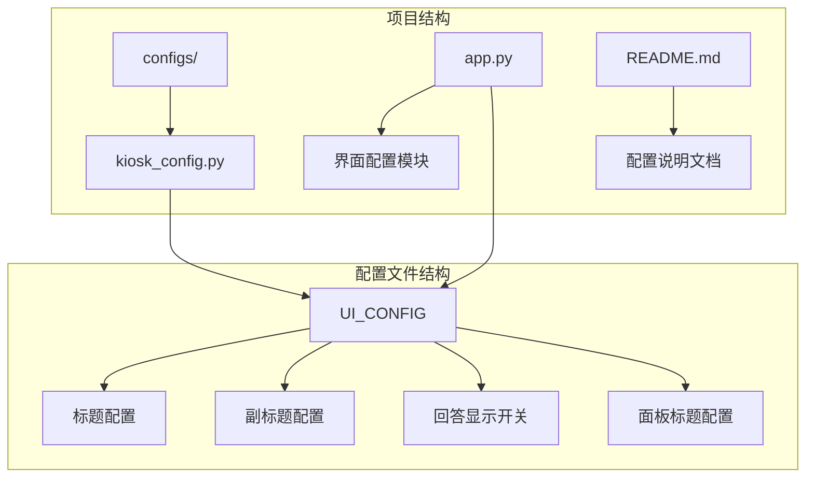
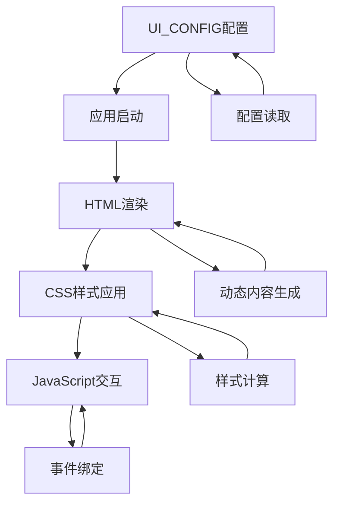
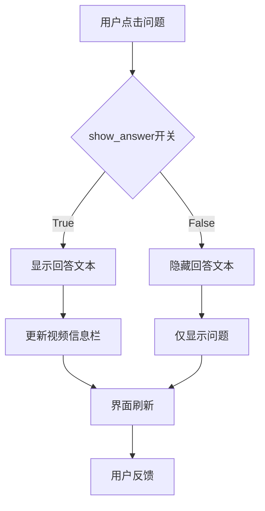
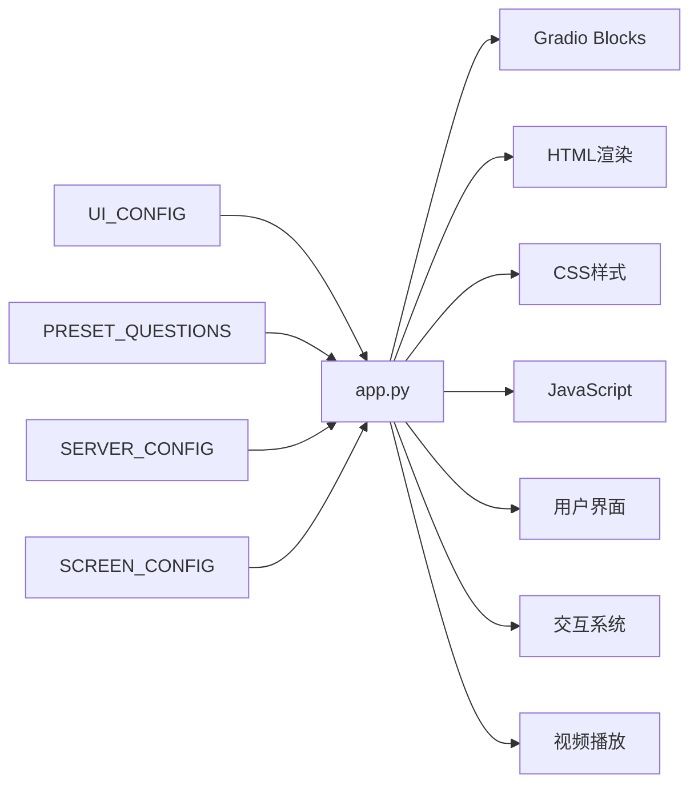

# 界面配置

<cite>
**本文档引用的文件**
- [kiosk_config.py](file://configs/kiosk_config.py)
- [app.py](file://app.py)
- [README.md](file://README.md)
</cite>

## 目录
1. [简介](#简介)
2. [项目结构](#项目结构)
3. [核心组件](#核心组件)
4. [架构概览](#架构概览)
5. [详细组件分析](#详细组件分析)
6. [依赖关系分析](#依赖关系分析)
7. [性能考虑](#性能考虑)
8. [故障排除指南](#故障排除指南)
9. [结论](#结论)

## 简介

界面配置模块是数字人问答展示系统的核心组成部分，负责管理用户界面的所有视觉元素和交互行为。该模块通过UI_CONFIG字典集中管理界面元素配置，包括标题文本、副标题文本、回答显示开关和面板标题配置等功能。

本系统采用Gradio框架构建，支持双缓冲视频切换、随机挥手动画等高级功能，专为2160×3840竖屏显示器优化设计。界面配置模块确保了系统的高度可定制性和良好的用户体验。

## 项目结构

数字人问答展示系统的界面配置模块位于configs目录下的kiosk_config.py文件中，与主应用程序app.py紧密集成：



**图表来源**
- [kiosk_config.py:82-88](file://configs/kiosk_config.py#L82-L88)
- [app.py:345-456](file://app.py#L345-L456)

**章节来源**
- [kiosk_config.py:1-113](file://configs/kiosk_config.py#L1-L113)
- [app.py:1-480](file://app.py#L1-L480)

## 核心组件

界面配置模块的核心是UI_CONFIG字典，它包含了所有界面元素的配置参数：

### UI_CONFIG字典结构

UI_CONFIG字典包含四个主要配置项：

| 配置项 | 类型 | 默认值 | 描述 |
|--------|------|--------|------|
| title | 字符串 | "🤖 智能数字人问答系统" | 顶部主标题文本 |
| subtitle | 字符串 | "💡 点击下方问题开始体验" | 底部副标题文本 |
| show_answer | 布尔值 | True | 控制是否显示回答文本 |
| left_title | 字符串 | "💬 常见问题" | 左侧问题面板标题 |
| right_title | 字符串 | "🔥 热门问题" | 右侧问题面板标题 |

### 配置项详细说明

每个配置项都有其特定的作用和影响范围：

**标题配置 (title)**
- 影响范围：顶部导航栏主标题
- 样式特性：居中显示，使用渐变背景和阴影效果
- 文本格式：支持表情符号和中文字符

**副标题配置 (subtitle)**
- 影响范围：底部状态栏文本
- 显示位置：与版权信息一起显示
- 用户提示：指导用户操作行为

**回答显示开关 (show_answer)**
- 功能作用：控制回答文本的显示/隐藏
- 实现机制：通过CSS类控制元素可见性
- 用户体验：允许根据需要隐藏或显示详细回答

**面板标题配置 (left_title, right_title)**
- 影响范围：左右两侧问题面板的标题区域
- 样式特性：使用加粗字体和分隔线
- 内容组织：区分不同类型的问题集合

**章节来源**
- [kiosk_config.py:82-88](file://configs/kiosk_config.py#L82-L88)
- [app.py:359-454](file://app.py#L359-L454)

## 架构概览

界面配置模块采用配置驱动的设计模式，通过分离关注点实现了高度的灵活性：



**图表来源**
- [app.py:345-456](file://app.py#L345-L456)
- [kiosk_config.py:82-88](file://configs/kiosk_config.py#L82-L88)

### 配置加载流程

界面配置的加载和应用遵循以下流程：

1. **配置文件读取**：应用启动时读取kiosk_config.py中的UI_CONFIG
2. **HTML模板生成**：使用配置值动态生成HTML内容
3. **CSS样式应用**：根据配置调整样式属性
4. **JavaScript初始化**：传递配置参数给前端脚本

**章节来源**
- [app.py:345-456](file://app.py#L345-L456)
- [kiosk_config.py:82-88](file://configs/kiosk_config.py#L82-L88)

## 详细组件分析

### 标题系统组件

标题系统由顶部主标题和底部副标题组成，采用统一的设计语言：

```mermaid
classDiagram
class TitleSystem {
+string title
+string subtitle
+renderHeader() void
+renderFooter() void
+updateTitle(newTitle) void
+updateSubtitle(newSubtitle) void
}
class Header {
+HTMLElement element
+string content
+applyGradient() void
+addShadow() void
}
class Footer {
+HTMLElement element
+string content
+applyBackground() void
+addCopyright() void
}
TitleSystem --> Header : "管理"
TitleSystem --> Footer : "管理"
Header --> "CSS样式" : "使用"
Footer --> "CSS样式" : "使用"
```

**图表来源**
- [app.py:359-454](file://app.py#L359-L454)
- [kiosk_config.py:82-88](file://configs/kiosk_config.py#L82-L88)

#### 标题显示逻辑

标题的显示逻辑遵循以下规则：

1. **顶部标题**：始终显示，使用渐变背景和阴影效果
2. **底部副标题**：与版权信息一起显示，提供用户指导
3. **动态更新**：支持运行时修改标题内容

#### 样式影响分析

标题样式对整体界面的影响：

- **颜色方案**：使用渐变色营造科技感
- **字体设置**：采用无衬线字体提升可读性
- **布局定位**：固定高度确保界面层次清晰

**章节来源**
- [app.py:359-454](file://app.py#L359-L454)
- [kiosk_config.py:82-88](file://configs/kiosk_config.py#L82-L88)

### 回答显示控制系统

回答显示控制是界面配置的核心功能之一，通过show_answer开关实现：



**图表来源**
- [app.py:382-395](file://app.py#L382-L395)
- [app.py:435-447](file://app.py#L435-L447)

#### 显示逻辑实现

回答显示的实现逻辑：

1. **状态管理**：通过Gradio State组件维护显示状态
2. **条件渲染**：根据show_answer值决定内容显示
3. **实时更新**：用户交互时即时反映到界面

#### 样式影响

回答显示对界面布局的影响：

- **空间分配**：影响视频信息栏的高度和内容
- **视觉层次**：控制信息密度和重要性
- **响应速度**：隐藏回答可提升界面响应速度

**章节来源**
- [app.py:382-395](file://app.py#L382-L395)
- [app.py:435-447](file://app.py#L435-L447)

### 面板标题组件

面板标题系统管理左右两侧问题面板的标题显示：

```mermaid
classDiagram
class PanelTitle {
+string left_title
+string right_title
+renderLeftPanel() void
+renderRightPanel() void
+updateLeftTitle(newTitle) void
+updateRightTitle(newTitle) void
}
class LeftPanel {
+HTMLElement element
+string title
+applyStyles() void
+addIcon() void
}
class RightPanel {
+HTMLElement element
+string title
+applyStyles() void
+addIcon() void
}
PanelTitle --> LeftPanel : "管理"
PanelTitle --> RightPanel : "管理"
LeftPanel --> "CSS样式" : "使用"
RightPanel --> "CSS样式" : "使用"
```

**图表来源**
- [app.py:369-370](file://app.py#L369-L370)
- [app.py:423-424](file://app.py#L423-L424)
- [kiosk_config.py:86-87](file://configs/kiosk_config.py#L86-L87)

#### 标题配置选项

面板标题的配置选项：

- **左侧标题**：默认"💬 常见问题"
- **右侧标题**：默认"🔥 热门问题"
- **图标支持**：自动添加对应的表情符号
- **样式统一**：保持一致的视觉设计

#### 内容组织策略

标题系统的内容组织策略：

1. **分类标识**：通过不同表情符号区分问题类型
2. **视觉引导**：使用不同的颜色和样式突出重点
3. **用户预期**：符合用户的认知习惯和期望

**章节来源**
- [app.py:369-370](file://app.py#L369-L370)
- [app.py:423-424](file://app.py#L423-L424)
- [kiosk_config.py:86-87](file://configs/kiosk_config.py#L86-L87)

### 界面定制化配置示例

以下是几种常见的界面定制化配置场景：

#### 场景一：企业级定制

```python
# 企业版界面配置
UI_CONFIG = {
    "title": "🏢 企业智能助手",
    "subtitle": "📞 请咨询相关业务部门",
    "show_answer": True,
    "left_title": "📋 常见业务流程",
    "right_title": "📊 业务数据查询"
}
```

#### 场景二：教育机构定制

```python
# 教育版界面配置
UI_CONFIG = {
    "title": "🎓 在线学习助手",
    "subtitle": "📘 选择课程开始学习",
    "show_answer": True,
    "left_title": "📖 课程导航",
    "right_title": "🎓 学习资源"
}
```

#### 场景三：简化版本

```python
# 简化版界面配置
UI_CONFIG = {
    "title": "🤖 AI助手",
    "subtitle": "💬 直接提问开始",
    "show_answer": False,
    "left_title": "❓ 问题",
    "right_title": "❓ 问题"
}
```

**章节来源**
- [kiosk_config.py:82-88](file://configs/kiosk_config.py#L82-L88)

## 依赖关系分析

界面配置模块与其他系统组件的依赖关系：



**图表来源**
- [app.py:345-456](file://app.py#L345-L456)
- [kiosk_config.py:82-88](file://configs/kiosk_config.py#L82-L88)

### 配置依赖关系

界面配置模块的依赖关系：

1. **直接依赖**：app.py中的create_kiosk_app函数
2. **间接依赖**：CSS样式、JavaScript脚本
3. **运行时依赖**：Gradio框架提供的组件

### 耦合度分析

配置模块的耦合度评估：

- **低耦合**：配置项相互独立，修改不影响其他功能
- **高内聚**：所有界面相关的配置集中在单一文件
- **易维护性**：配置变更不需要修改代码逻辑

**章节来源**
- [app.py:345-456](file://app.py#L345-L456)
- [kiosk_config.py:82-88](file://configs/kiosk_config.py#L82-L88)

## 性能考虑

界面配置模块在性能方面的考虑：

### 渲染性能

1. **静态内容缓存**：标题和面板标题作为静态内容缓存
2. **条件渲染优化**：回答显示开关避免不必要的DOM操作
3. **CSS样式复用**：统一的样式类减少重复计算

### 内存使用

1. **配置对象**：UI_CONFIG作为全局对象避免重复创建
2. **事件绑定**：使用事件委托减少内存占用
3. **资源管理**：视频资源按需加载和释放

### 响应速度

1. **异步加载**：回答内容异步更新不影响界面响应
2. **防抖处理**：频繁操作时的性能保护
3. **懒加载**：非关键资源延迟加载

## 故障排除指南

### 常见配置问题

**问题1：标题不显示**
- 检查UI_CONFIG中的title配置
- 确认CSS样式未被覆盖
- 验证HTML渲染逻辑

**问题2：回答文本不显示**
- 检查show_answer开关设置
- 确认CSS类名正确应用
- 验证JavaScript事件绑定

**问题3：面板标题异常**
- 检查left_title和right_title配置
- 确认Markdown渲染正常
- 验证样式类应用

### 调试方法

1. **配置验证**：打印UI_CONFIG内容确认配置正确
2. **界面检查**：使用浏览器开发者工具检查DOM结构
3. **样式调试**：验证CSS类名和样式应用
4. **事件跟踪**：监控JavaScript事件执行情况

**章节来源**
- [app.py:359-454](file://app.py#L359-L454)
- [kiosk_config.py:82-88](file://configs/kiosk_config.py#L82-L88)

## 结论

界面配置模块通过UI_CONFIG字典提供了强大而灵活的界面定制能力。该模块的设计体现了以下优势：

1. **配置驱动**：通过外部配置文件实现功能定制
2. **低耦合设计**：配置项相互独立，易于维护
3. **高性能实现**：优化的渲染和内存使用策略
4. **用户友好**：直观的配置接口和丰富的定制选项

界面配置模块的成功实施为数字人问答展示系统提供了坚实的基础，使得系统能够适应不同的使用场景和用户需求。通过合理的配置管理，系统能够在保持一致性的同时提供个性化的用户体验。