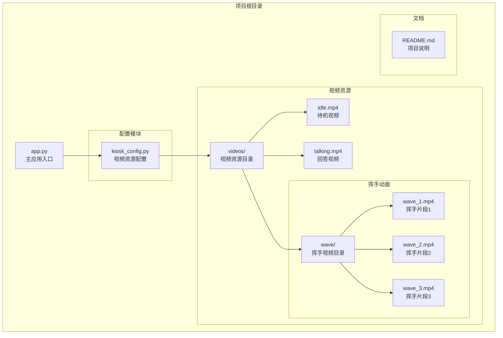
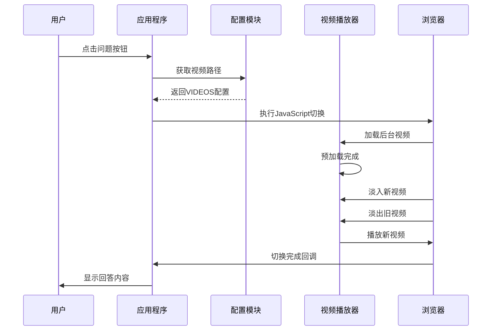
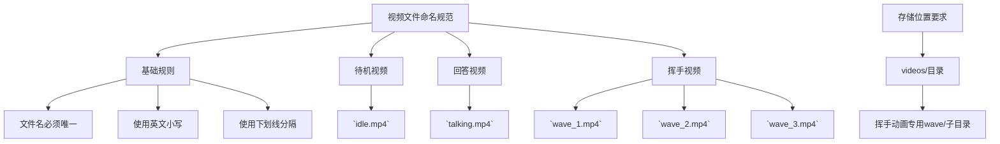
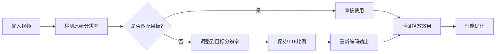
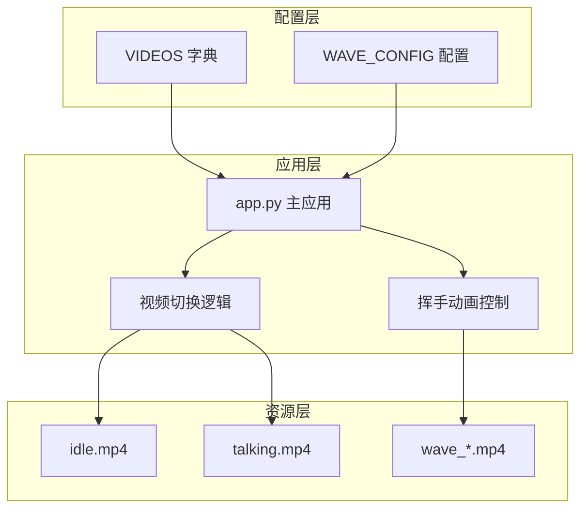
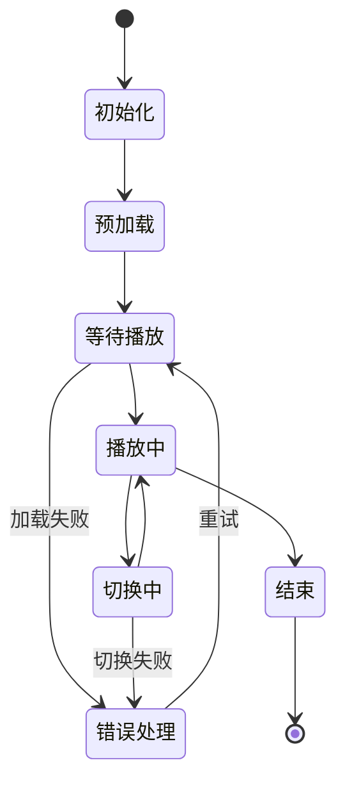

# 视频资源配置

<cite>
**本文档引用的文件**
- [kiosk_config.py](file://configs/kiosk_config.py)
- [app.py](file://app.py)
- [README.md](file://README.md)
</cite>

## 目录
1. [简介](#简介)
2. [项目结构](#项目结构)
3. [核心组件](#核心组件)
4. [架构概览](#架构概览)
5. [详细组件分析](#详细组件分析)
6. [依赖关系分析](#依赖关系分析)
7. [性能考虑](#性能考虑)
8. [故障排除指南](#故障排除指南)
9. [结论](#结论)

## 简介

数字人问答展示系统的视频资源配置模块负责管理所有视频资源的加载、切换和播放。该模块采用双缓冲技术实现无缝视频切换，支持待机状态和回答状态两种视频模式，并集成了随机挥手动画功能。系统通过配置文件集中管理所有视频资源路径，确保了良好的可维护性和可扩展性。

## 项目结构

项目采用模块化设计，视频资源配置位于独立的配置文件中，便于管理和修改：

**图表来源**
- [kiosk_config.py:9-25](file://configs/kiosk_config.py#L9-L25)
- [app.py:9-11](file://app.py#L9-L11)

**章节来源**
- [README.md:12-29](file://README.md#L12-L29)
- [kiosk_config.py:1-113](file://configs/kiosk_config.py#L1-L113)

## 核心组件

### VIDEOS 字典配置

VIDEOS 字典是视频资源配置的核心，定义了系统运行所需的两个主要视频资源：

| 键名 | 路径 | 描述 | 默认值 |
|------|------|------|--------|
| `idle` | `videos/idle.mp4` | 待机状态视频，数字人站立不动 | `videos/idle.mp4` |
| `talking` | `videos/talking.mp4` | 回答状态视频，数字人嘴部动作 | `videos/talking.mp4` |

### WAVE_CONFIG 配置

挥手动画配置提供了灵活的动画控制选项：

| 参数名 | 类型 | 默认值 | 描述 |
|--------|------|--------|------|
| `enabled` | 布尔值 | `True` | 是否启用挥手动画 |
| `min_interval` | 整数 | `8` | 最小触发间隔（秒） |
| `max_interval` | 整数 | `15` | 最大触发间隔（秒） |
| `duration` | 浮点数 | `1.5` | 挥手持续时间（秒） |
| `videos` | 列表 | `[...]` | 挥手视频列表（随机选择） |

**章节来源**
- [kiosk_config.py:9-25](file://configs/kiosk_config.py#L9-L25)
- [app.py:332-338](file://app.py#L332-L338)

## 架构概览

系统采用双缓冲视频切换架构，确保视频切换过程的流畅性和无闪烁效果：

**图表来源**
- [app.py:225-291](file://app.py#L225-L291)
- [kiosk_config.py:9-12](file://configs/kiosk_config.py#L9-L12)

## 详细组件分析

### 视频文件路径配置

#### 待机视频配置 (`VIDEOS["idle"]`)
- **路径格式**: `videos/idle.mp4`
- **用途**: 系统空闲时显示的静态视频
- **加载机制**: 应用启动时自动加载，作为初始显示内容
- **播放属性**: 循环播放，静音模式

#### 回答视频配置 (`VIDEOS["talking"]`)
- **路径格式**: `videos/talking.mp4`
- **用途**: 用户点击问题时播放的动态视频
- **切换机制**: 采用双缓冲技术实现无缝切换
- **播放属性**: 自动播放，循环播放

### 视频文件命名规范

系统严格遵循统一的命名约定：

**图表来源**
- [README.md:35-44](file://README.md#L35-L44)
- [kiosk_config.py:10-11](file://configs/kiosk_config.py#L10-L11)

### 视频格式要求和质量标准

#### 编码格式要求
- **容器格式**: MP4
- **视频编码**: H.264
- **音频编码**: AAC（如有音频）

#### 分辨率和比例要求
- **目标分辨率**: 2160×3840（竖屏）
- **宽高比**: 9:16 或相近比例
- **适应性**: 支持不同分辨率的自适应缩放

#### 文件大小限制
- **建议大小**: 10MB 以内
- **最大限制**: 50MB（根据实际需求调整）
- **压缩策略**: 使用适当的压缩参数平衡质量与体积

### 视频文件替换最佳实践

#### 文件格式兼容性
1. **优先选择 MP4 + H.264 编码**
2. **确保浏览器兼容性**
3. **测试不同设备的播放效果**

#### 分辨率匹配策略

#### 性能优化建议
1. **预加载策略**: 提前加载下一个可能使用的视频
2. **内存管理**: 及时释放不再使用的视频资源
3. **缓存机制**: 利用浏览器缓存减少重复加载
4. **网络优化**: 使用 CDN 加速视频资源加载

**章节来源**
- [README.md:105-111](file://README.md#L105-L111)
- [app.py:240-264](file://app.py#L240-L264)

## 依赖关系分析

### 组件耦合度分析

**图表来源**
- [kiosk_config.py:9-25](file://configs/kiosk_config.py#L9-L25)
- [app.py:9-11](file://app.py#L9-L11)

### 外部依赖关系

系统对外部依赖主要包括：
- **Gradio 框架**: 提供 Web 界面和视频播放能力
- **HTML5 Video API**: 实现视频播放和控制
- **JavaScript 异步处理**: 管理视频加载和切换流程

**章节来源**
- [app.py:5-7](file://app.py#L5-L7)
- [README.md:117-121](file://README.md#L117-L121)

## 性能考虑

### 视频加载优化

1. **预加载策略**
   - 在应用启动时预加载待机视频
   - 使用后台标签页预加载回答视频
   - 实现智能缓存机制

2. **内存管理**
   - 及时释放不再使用的视频资源
   - 监控内存使用情况
   - 实现资源池管理

3. **网络传输优化**
   - 使用 HTTP/2 协议
   - 实现视频分片加载
   - 配置适当的缓存头

### 播放性能监控

## 故障排除指南

### 常见问题及解决方案

#### 视频无法加载
1. **检查文件路径**: 确认视频文件存在于指定路径
2. **验证文件格式**: 确保使用正确的 MP4 + H.264 编码
3. **检查权限设置**: 确认应用程序具有读取权限

#### 视频播放异常
1. **浏览器兼容性**: 测试不同浏览器的播放效果
2. **网络连接**: 检查网络稳定性
3. **内存不足**: 监控系统内存使用情况

#### 切换效果不流畅
1. **优化视频编码**: 调整编码参数提高效率
2. **检查硬件性能**: 确认设备满足播放要求
3. **调整预加载策略**: 优化资源加载时机

### 验证方法

#### 功能验证清单
- [ ] 视频文件存在且可访问
- [ ] 视频格式符合要求
- [ ] 分辨率匹配目标规格
- [ ] 视频播放流畅无卡顿
- [ ] 双缓冲切换无闪烁
- [ ] 挥手动画正常触发

#### 性能测试指标
- [ ] 视频加载时间 < 2 秒
- [ ] 切换延迟 < 100 毫秒
- [ ] 内存使用稳定
- [ ] CPU 占用合理

**章节来源**
- [README.md:31-56](file://README.md#L31-L56)
- [app.py:459-476](file://app.py#L459-L476)

## 结论

视频资源配置模块通过精心设计的架构实现了高效、稳定的视频播放系统。其核心优势包括：

1. **模块化设计**: 将视频配置与业务逻辑分离，提高了系统的可维护性
2. **双缓冲技术**: 实现了无缝的视频切换体验
3. **灵活配置**: 支持动态修改视频资源而无需重启应用
4. **性能优化**: 通过预加载和缓存机制提升了用户体验

该模块为数字人问答展示系统提供了坚实的技术基础，通过合理的配置和优化，可以满足各种应用场景的需求。建议在实际部署时重点关注视频文件的质量控制和性能优化，以确保最佳的用户体验。