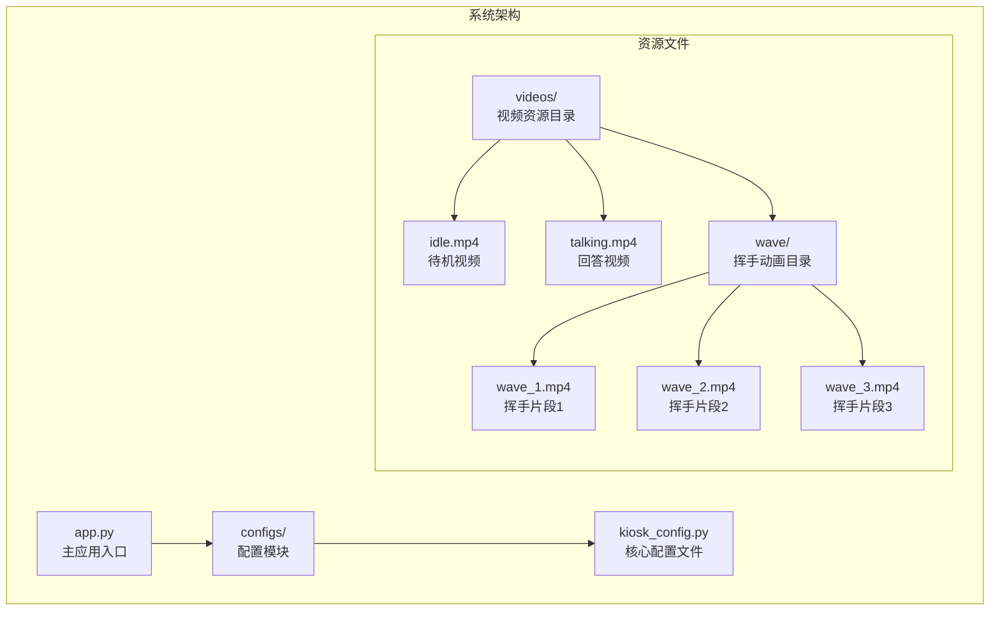
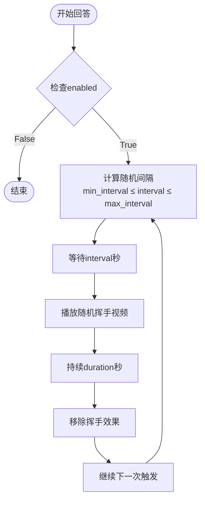
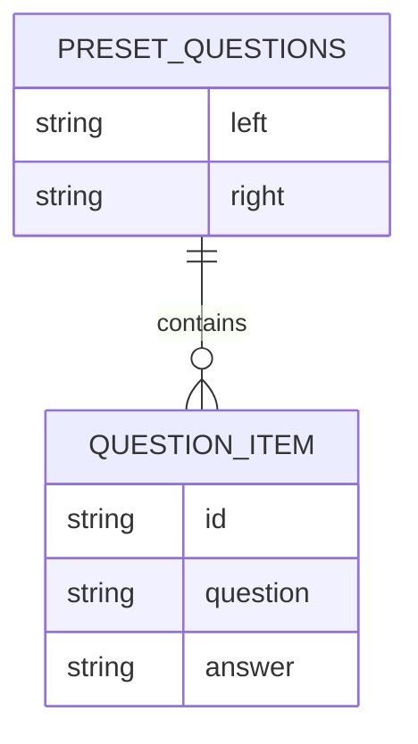
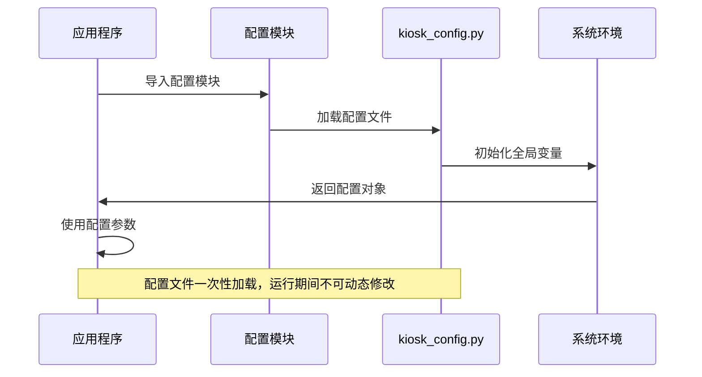

# 配置指南

<cite>
**本文档引用的文件**
- [kiosk_config.py](file://configs/kiosk_config.py)
- [app.py](file://app.py)
- [README.md](file://README.md)
- [开发方案.md](file://docs/开发方案.md)
</cite>

## 目录
1. [简介](#简介)
2. [项目结构](#项目结构)
3. [核心配置组件](#核心配置组件)
4. [配置详解](#配置详解)
5. [配置最佳实践](#配置最佳实践)
6. [使用场景示例](#使用场景示例)
7. [配置加载机制](#配置加载机制)
8. [故障排除指南](#故障排除指南)
9. [总结](#总结)

## 简介

数字人问答展示系统是一个面向2160×3840竖屏的交互式展示系统。该系统通过点击预设问题触发数字人视频播放，包含随机挥手动画效果，为用户提供沉浸式的数字人交互体验。

系统采用模块化的配置管理方式，所有可定制化参数都集中在配置文件中，便于用户根据不同的使用场景进行灵活调整。

## 项目结构

系统采用简洁的分层架构，主要由以下组件构成：



**图表来源**
- [app.py:1-50](file://app.py#L1-L50)
- [kiosk_config.py:1-113](file://configs/kiosk_config.py#L1-L113)

**章节来源**
- [app.py:1-50](file://app.py#L1-L50)
- [README.md:12-29](file://README.md#L12-L29)

## 核心配置组件

系统配置主要分为以下几个核心组件：

| 组件名称 | 负责内容 | 默认值 | 关键参数 |
|---------|---------|--------|----------|
| VIDEOS | 视频资源配置 | idle: videos/idle.mp4<br/>talking: videos/talking.mp4 | 视频路径映射 |
| WAVE_CONFIG | 挥手动画配置 | enabled: True<br/>min_interval: 8<br/>max_interval: 15 | 动画开关、间隔时间 |
| PRESET_QUESTIONS | 预设问题配置 | 左右各4个预设问题 | 问题内容、答案、标识符 |
| UI_CONFIG | 界面配置 | title: 智能数字人问答系统<br/>show_answer: True | 标题、显示选项 |
| SERVER_CONFIG | 服务器配置 | host: 0.0.0.0<br/>port: 6006<br/>share: False | 网络服务设置 |
| SCREEN_CONFIG | 屏幕适配配置 | width: 2160<br/>height: 3840<br/>layout: 2:5:2 | 分辨率、布局比例 |

**章节来源**
- [kiosk_config.py:9-112](file://configs/kiosk_config.py#L9-L112)

## 配置详解

### 视频资源配置 (VIDEOS)

视频资源配置决定了系统使用的媒体文件路径映射关系。

**配置参数说明：**

| 参数名 | 类型 | 默认值 | 作用描述 | 取值范围 |
|-------|------|--------|----------|----------|
| idle | 字符串 | "videos/idle.mp4" | 待机状态视频路径 | 有效的MP4文件路径 |
| talking | 字符串 | "videos/talking.mp4" | 回答状态视频路径 | 有效的MP4文件路径 |

**使用注意事项：**
- 路径必须相对于项目根目录
- 视频格式推荐MP4，编码H.264
- 建议使用竖屏9:16比例，分辨率2160×3840
- 文件大小建议控制在10MB以内

**章节来源**
- [kiosk_config.py:9-12](file://configs/kiosk_config.py#L9-L12)

### 挥手动画配置 (WAVE_CONFIG)

挥手动画配置控制着随机挥手效果的行为参数。

**配置参数说明：**

| 参数名 | 类型 | 默认值 | 作用描述 | 取值范围 | 单位 |
|-------|------|--------|----------|----------|------|
| enabled | 布尔值 | True | 是否启用挥手动画 | True/False | - |
| min_interval | 整数 | 8 | 最小触发间隔 | ≥1 | 秒 |
| max_interval | 整数 | 15 | 最大触发间隔 | ≥min_interval | 秒 |
| duration | 浮点数 | 1.5 | 挥手持续时间 | >0 | 秒 |
| videos | 列表 | 3个挥手视频 | 挥手视频文件列表 | 至少1个有效路径 | - |

**算法逻辑：**


**图表来源**
- [kiosk_config.py:15-25](file://configs/kiosk_config.py#L15-L25)
- [app.py:293-331](file://app.py#L293-L331)

**章节来源**
- [kiosk_config.py:15-25](file://configs/kiosk_config.py#L15-L25)
- [app.py:293-331](file://app.py#L293-L331)

### 预设问题配置 (PRESET_QUESTIONS)

预设问题配置定义了左右两侧的问题列表及其对应的回答内容。

**数据结构：**


**图表来源**
- [kiosk_config.py:31-76](file://configs/kiosk_config.py#L31-L76)

**配置参数说明：**

| 参数名 | 类型 | 默认值 | 作用描述 | 取值范围 |
|-------|------|--------|----------|----------|
| id | 字符串 | "q01","q02"... | 问题唯一标识符 | 任意字符串 |
| question | 字符串 | "你好，请介绍一下你自己" | 问题文本内容 | 任意文本 |
| answer | 字符串 | "您好！我是..." | 对应的回答内容 | 任意文本 |

**使用建议：**
- 每个问题的id必须唯一
- 问题内容建议简洁明了，便于用户快速理解
- 回答内容应与问题相关且具有教育意义
- 左右两侧问题数量可根据实际需要调整

**章节来源**
- [kiosk_config.py:31-76](file://configs/kiosk_config.py#L31-L76)

### 界面配置 (UI_CONFIG)

界面配置控制着系统的外观和用户界面元素。

**配置参数说明：**

| 参数名 | 类型 | 默认值 | 作用描述 | 取值范围 |
|-------|------|--------|----------|----------|
| title | 字符串 | "🤖 智能数字人问答系统" | 页面主标题 | 任意字符串 |
| subtitle | 字符串 | "💡 点击下方问题开始体验" | 页面副标题 | 任意字符串 |
| show_answer | 布尔值 | True | 是否在界面显示回答文本 | True/False |
| left_title | 字符串 | "💬 常见问题" | 左侧问题面板标题 | 任意字符串 |
| right_title | 字符串 | "🔥 热门问题" | 右侧问题面板标题 | 任意字符串 |

**章节来源**
- [kiosk_config.py:82-88](file://configs/kiosk_config.py#L82-L88)

### 服务器配置 (SERVER_CONFIG)

服务器配置定义了Web服务的网络参数。

**配置参数说明：**

| 参数名 | 类型 | 默认值 | 作用描述 | 取值范围 |
|-------|------|--------|----------|----------|
| host | 字符串 | "0.0.0.0" | 服务器监听地址 | IP地址或域名 |
| port | 整数 | 6006 | 服务器端口号 | 1-65535 |
| share | 布尔值 | False | 是否启用公网分享 | True/False |

**网络配置说明：**
- `host: "0.0.0.0"` 表示监听所有网络接口
- `port: 6006` 是Gradio的默认端口
- `share: False` 表示仅本地访问

**章节来源**
- [kiosk_config.py:94-98](file://configs/kiosk_config.py#L94-L98)

### 屏幕适配配置 (SCREEN_CONFIG)

屏幕适配配置用于定义显示分辨率和布局比例。

**配置参数说明：**

| 参数名 | 类型 | 默认值 | 作用描述 | 取值范围 |
|-------|------|--------|----------|----------|
| width | 整数 | 2160 | 屏幕宽度像素 | >0 |
| height | 整数 | 3840 | 屏幕高度像素 | >0 |
| layout.left_width | 整数 | 2 | 左侧区域比例权重 | >0 |
| layout.center_width | 整数 | 5 | 中央区域比例权重 | >0 |
| layout.right_width | 整数 | 2 | 右侧区域比例权重 | >0 |

**布局计算：**
- 总权重 = 2 + 5 + 2 = 9
- 左侧区域占比 = 2/9 ≈ 22.2%
- 中央区域占比 = 5/9 ≈ 55.6%
- 右侧区域占比 = 2/9 ≈ 22.2%

**章节来源**
- [kiosk_config.py:104-112](file://configs/kiosk_config.py#L104-L112)

## 配置最佳实践

### 性能优化建议

1. **视频文件优化**
   - 使用MP4格式，H.264编码
   - 控制文件大小在10MB以内
   - 确保视频比例为9:16或相近
   - 建议使用2160×3840分辨率

2. **挥手动画调优**
   - 合理设置min_interval和max_interval
   - 建议范围：8-15秒
   - duration建议1.5秒，确保动画流畅
   - 挥手视频数量建议3-5个

3. **问题内容设计**
   - 左右两侧问题数量平衡
   - 问题长度控制在20-30字符内
   - 回答内容简洁明了，突出重点

### 安全性考虑

1. **文件路径安全**
   - 确保视频文件路径正确
   - 避免使用相对路径导致的安全问题
   - 定期检查文件权限

2. **网络配置安全**
   - 生产环境中建议绑定特定IP
   - 不要随意开启公网分享功能
   - 使用防火墙限制访问

### 可维护性建议

1. **配置文件组织**
   - 保持配置文件结构清晰
   - 添加必要的注释说明
   - 定期备份配置文件

2. **版本管理**
   - 将配置文件纳入版本控制
   - 记录重要的配置变更
   - 建立配置变更审批流程

## 使用场景示例

### 企业展厅场景

针对企业展厅的配置示例：

```python
# 企业展厅专用配置
PRESET_QUESTIONS = {
    "left": [
        {
            "id": "q01",
            "question": "公司介绍",
            "answer": "我们是一家专注于人工智能技术的创新型企业，致力于为客户提供智能化解决方案。"
        },
        {
            "id": "q02", 
            "question": "产品服务",
            "answer": "我们的核心产品包括智能客服机器人、数据分析平台和自动化办公系统。"
        }
    ],
    "right": [
        {
            "id": "q03",
            "question": "技术支持",
            "answer": "我们提供7×24小时技术支持服务，确保客户业务连续性。"
        },
        {
            "id": "q04",
            "question": "联系方式",
            "answer": "电话：400-xxx-xxxx\n邮箱：info@company.com\n地址：xx市xx区xx路xx号"
        }
    ]
}

WAVE_CONFIG = {
    "enabled": True,
    "min_interval": 10,
    "max_interval": 20,
    "duration": 1.2,
    "videos": [
        "videos/wave/wave_1.mp4",
        "videos/wave/wave_2.mp4"
    ]
}

UI_CONFIG = {
    "title": "🏢 企业数字人展示系统",
    "subtitle": "欢迎了解我们的智能解决方案",
    "show_answer": True,
    "left_title": "📊 公司概况",
    "right_title": "📞 联系我们"
}
```

### 教育机构场景

针对教育机构的配置示例：

```python
# 教育机构专用配置
PRESET_QUESTIONS = {
    "left": [
        {
            "id": "q01",
            "question": "专业介绍",
            "answer": "我们提供计算机科学、人工智能、数据科学等热门专业，培养未来科技人才。"
        },
        {
            "id": "q02",
            "question": "课程安排",
            "answer": "课程涵盖理论学习与实践操作，包括实验课、实习实训等多种教学形式。"
        }
    ],
    "right": [
        {
            "id": "q03",
            "question": "校园生活",
            "answer": "学校提供丰富的社团活动、体育设施和餐饮服务，营造良好的学习生活环境。"
        },
        {
            "id": "q04",
            "question": "就业前景",
            "answer": "毕业生可在IT企业、互联网公司、金融机构等领域找到理想工作。"
        }
    ]
}

WAVE_CONFIG = {
    "enabled": True,
    "min_interval": 8,
    "max_interval": 12,
    "duration": 1.5,
    "videos": [
        "videos/wave/wave_1.mp4",
        "videos/wave/wave_2.mp4",
        "videos/wave/wave_3.mp4"
    ]
}

UI_CONFIG = {
    "title": "🎓 数字人教育助手",
    "subtitle": "探索知识的海洋",
    "show_answer": True,
    "left_title": "📚 学术咨询",
    "right_title": "🏫 校园导航"
}
```

### 展览馆场景

针对展览馆的配置示例：

```python
# 展览馆专用配置
PRESET_QUESTIONS = {
    "left": [
        {
            "id": "q01",
            "question": "展览主题",
            "answer": "本次展览聚焦人工智能发展历程，展示从早期概念到现代应用的重要里程碑。"
        },
        {
            "id": "q02",
            "question": "互动体验",
            "answer": "现场设有VR体验区、机器人互动区等，让观众亲身体验科技魅力。"
        }
    ],
    "right": [
        {
            "id": "q03",
            "question": "参观须知",
            "answer": "请遵守展馆规定，不要触摸展品，保持安静有序的参观环境。"
        },
        {
            "id": "q04",
            "question": "导览服务",
            "answer": "提供多语种导览服务，可通过扫描二维码获取详细讲解。"
        }
    ]
}

WAVE_CONFIG = {
    "enabled": False,
    "min_interval": 8,
    "max_interval": 15,
    "duration": 1.5,
    "videos": []
}

UI_CONFIG = {
    "title": "🤖 AI科技展",
    "subtitle": "感受科技改变生活的力量",
    "show_answer": True,
    "left_title": "🏛️ 展览介绍",
    "right_title": "🎫 服务指南"
}
```

## 配置加载机制

系统采用模块导入的方式加载配置文件，整个过程如下：



**图表来源**
- [app.py:7](file://app.py#L7)
- [kiosk_config.py:1-113](file://configs/kiosk_config.py#L1-L113)

**加载流程说明：**

1. **模块导入阶段**
   - 应用启动时导入配置模块
   - Python解释器执行配置文件中的所有代码
   - 创建全局变量和数据结构

2. **配置初始化阶段**
   - 所有配置项被解析为相应的数据类型
   - 字符串路径被转换为可用的文件路径
   - 列表和字典结构被构建完成

3. **应用使用阶段**
   - 主应用程序通过模块导入使用配置
   - 配置参数在运行时保持不变
   - 所有组件共享同一份配置实例

**配置优先级规则：**

由于系统采用单一配置文件的设计，不存在复杂的优先级冲突。配置的"优先级"体现在以下方面：

1. **文件级别优先级**
   - 配置文件中的设置具有最高优先级
   - 运行时无法动态修改已加载的配置

2. **参数级别优先级**
   - 每个配置项独立生效，无相互依赖
   - 参数有效性在应用启动时验证

3. **环境级别优先级**
   - 通过命令行参数或环境变量的配置修改需要重新启动应用

**章节来源**
- [app.py:7](file://app.py#L7)
- [kiosk_config.py:1-113](file://configs/kiosk_config.py#L1-L113)

## 故障排除指南

### 常见配置错误及解决方法

**问题1：视频文件无法加载**
- **症状**：页面显示空白或报错
- **原因**：视频路径不正确或文件损坏
- **解决方法**：
  1. 检查视频文件是否存在于指定路径
  2. 确认文件格式为MP4，编码为H.264
  3. 验证文件大小不超过10MB
  4. 确保文件权限正确

**问题2：挥手动画不显示**
- **症状**：回答视频正常播放但无挥手效果
- **原因**：WAVE_CONFIG配置错误或视频文件缺失
- **解决方法**：
  1. 检查WAVE_CONFIG.enabled是否为True
  2. 确认videos列表中的视频文件存在
  3. 验证min_interval和max_interval的数值范围
  4. 检查浏览器控制台是否有JavaScript错误

**问题3：服务器无法访问**
- **症状**：无法通过浏览器访问系统
- **原因**：服务器配置错误或端口被占用
- **解决方法**：
  1. 检查SERVER_CONFIG.host和port设置
  2. 确认端口未被其他程序占用
  3. 验证防火墙设置允许访问
  4. 如需公网访问，设置share为True

**问题4：界面显示异常**
- **症状**：页面布局错乱或样式不正确
- **原因**：CSS样式冲突或分辨率不匹配
- **解决方法**：
  1. 检查SCREEN_CONFIG的分辨率设置
  2. 验证浏览器兼容性
  3. 确认视频分辨率与屏幕匹配
  4. 清除浏览器缓存后重试

### 调试技巧

1. **启动日志检查**
   ```python
   # 在app.py中添加调试输出
   print(f"配置加载成功: {config.VIDEOS}")
   print(f"问题数量: {len(config.PRESET_QUESTIONS['left'])}")
   ```

2. **浏览器开发者工具**
   - 按F12打开开发者工具
   - 查看Console标签页的JavaScript错误
   - 检查Network标签页的资源加载情况
   - 使用Elements标签页检查CSS样式应用

3. **配置验证**
   - 在Python环境中直接导入配置模块
   - 检查配置项的数据类型和值
   - 验证配置文件语法正确性

**章节来源**
- [app.py:459-479](file://app.py#L459-L479)
- [README.md:205-211](file://README.md#L205-L211)

## 总结

数字人问答展示系统的配置管理提供了灵活而强大的定制能力。通过合理配置各个组件，用户可以根据不同的应用场景快速调整系统行为。

**关键要点总结：**

1. **配置灵活性**：系统支持从视频资源到界面样式的全方位定制
2. **性能优化**：合理的配置参数能够显著提升用户体验
3. **安全性考虑**：配置文件的正确设置对系统安全至关重要
4. **可维护性**：清晰的配置结构便于长期维护和升级

**建议的配置策略：**

- **生产环境**：注重稳定性和性能，避免过度复杂的动画效果
- **演示环境**：强调视觉效果，适当增加互动元素
- **教育环境**：关注内容质量，确保信息的准确性和教育价值
- **商业展示**：平衡美观与实用性，突出品牌特色

通过遵循本文档的指导原则和最佳实践，用户可以充分发挥系统的潜力，创建符合自身需求的数字人展示系统。