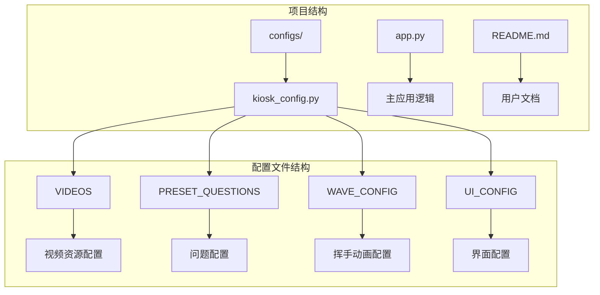
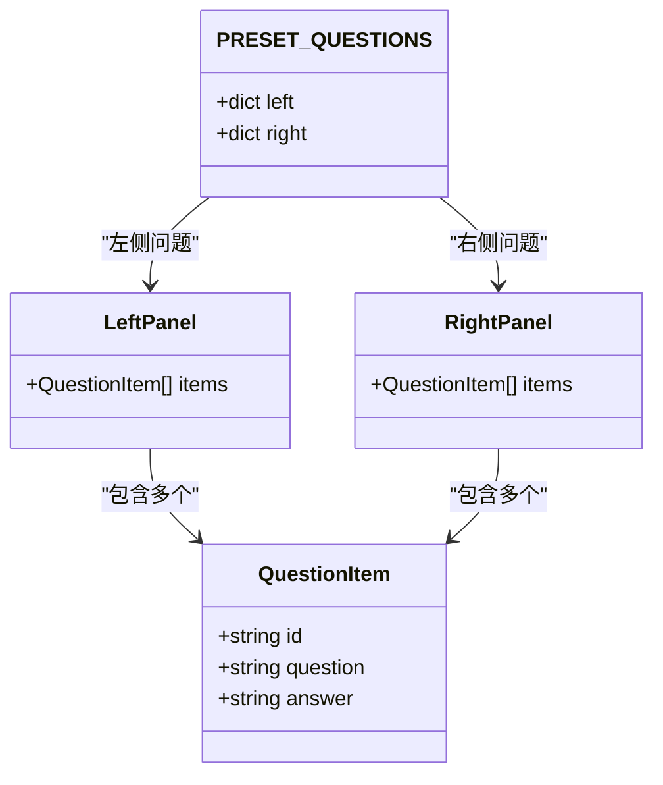
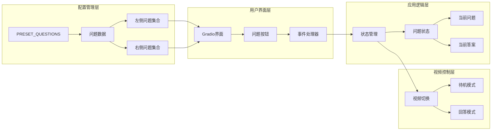
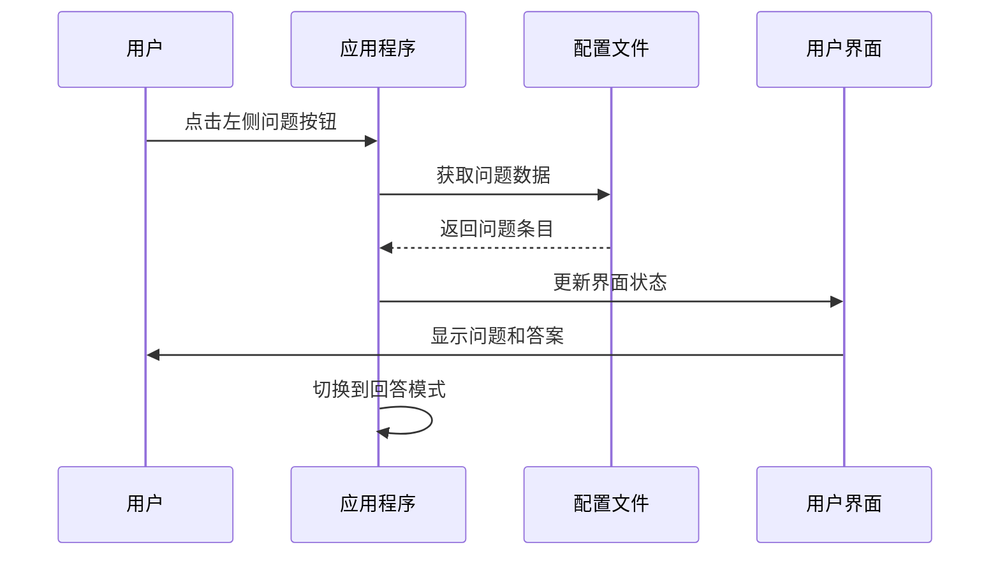
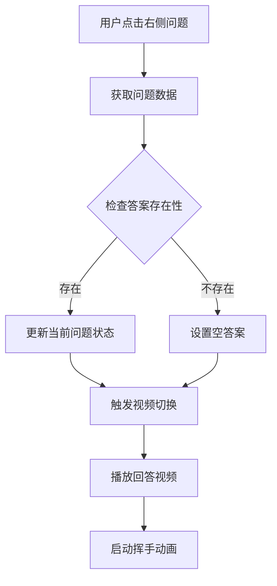
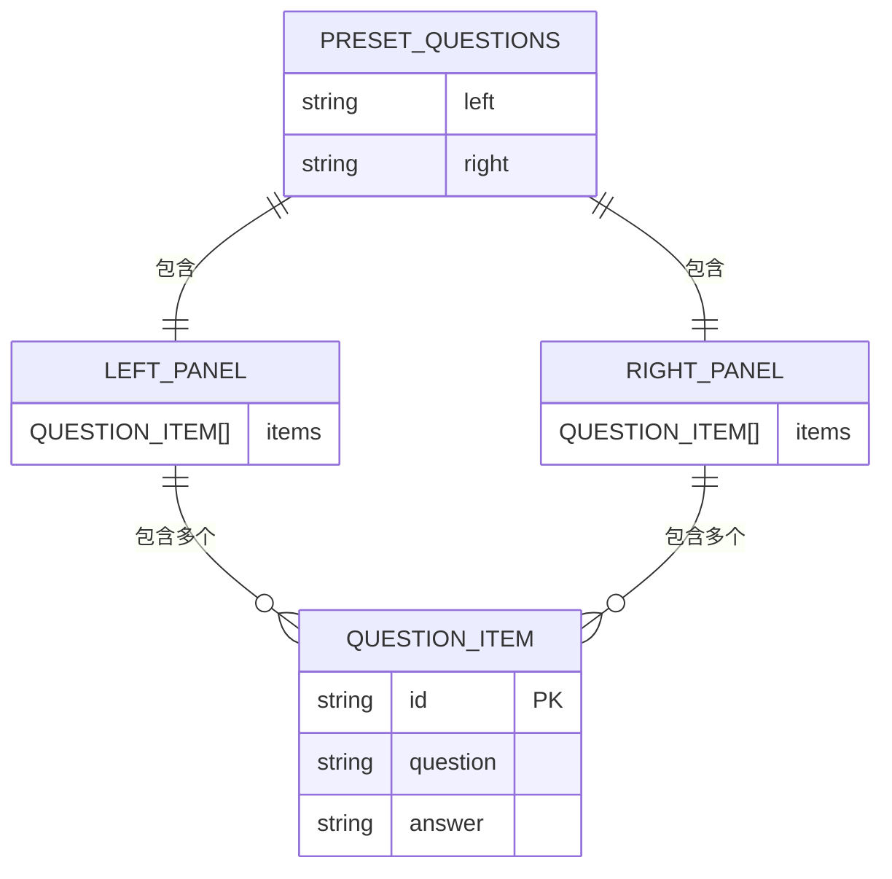
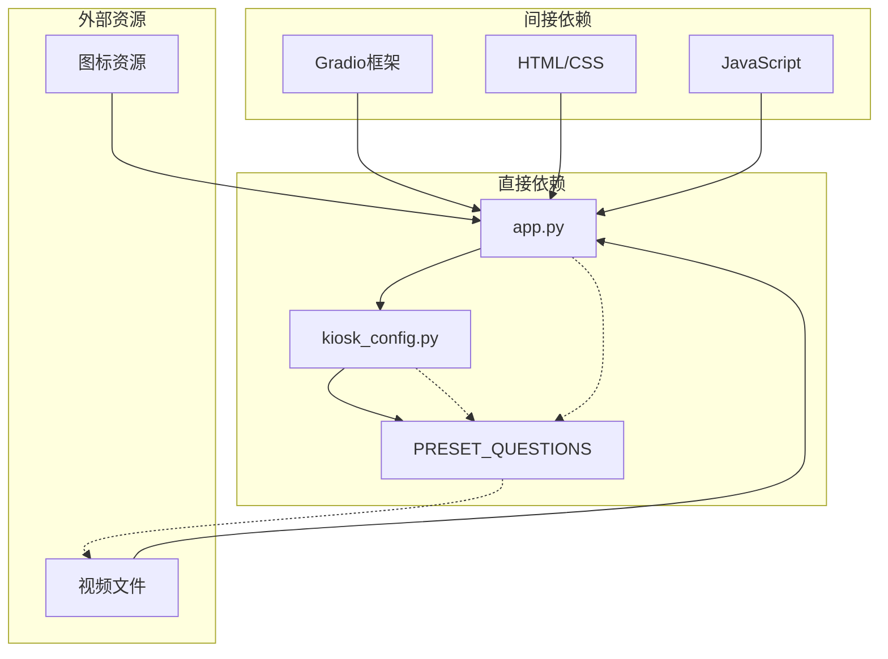

# 问题配置

<cite>
**本文档引用的文件**
- [kiosk_config.py](file://configs/kiosk_config.py)
- [app.py](file://app.py)
- [README.md](file://README.md)
</cite>

## 目录
1. [简介](#简介)
2. [项目结构](#项目结构)
3. [核心组件](#核心组件)
4. [架构概览](#架构概览)
5. [详细组件分析](#详细组件分析)
6. [依赖关系分析](#依赖关系分析)
7. [性能考虑](#性能考虑)
8. [故障排除指南](#故障排除指南)
9. [结论](#结论)

## 简介

数字人问答展示系统的"问题配置"模块是一个关键的配置管理组件，负责定义和管理预设问题集合。该模块采用简洁而高效的配置结构，支持左右两侧的问题布局，为用户提供丰富的交互体验。

系统通过配置文件集中管理所有问题数据，实现了高度的可定制性和可维护性。每个问题条目都包含标准化的字段结构，确保了数据的一致性和完整性。

## 项目结构

问题配置模块位于项目的配置目录中，采用模块化设计，便于维护和扩展：

**图表来源**
- [kiosk_config.py:1-113](file://configs/kiosk_config.py#L1-L113)
- [app.py:1-480](file://app.py#L1-L480)

**章节来源**
- [kiosk_config.py:1-113](file://configs/kiosk_config.py#L1-L113)
- [README.md:12-29](file://README.md#L12-L29)

## 核心组件

### PRESET_QUESTIONS 字典结构

问题配置的核心是 `PRESET_QUESTIONS` 字典，它采用分层组织结构，将问题分为左右两个区域：

**图表来源**
- [kiosk_config.py:31-76](file://configs/kiosk_config.py#L31-L76)

### 问题条目字段定义

每个问题条目都遵循统一的字段规范，确保数据结构的一致性：

| 字段名称 | 类型 | 必需 | 描述 | 示例值 |
|---------|------|------|------|--------|
| `id` | string | 是 | 问题唯一标识符 | `"q01"` |
| `question` | string | 是 | 问题文本内容 | `"你好，请介绍一下你自己"` |
| `answer` | string | 是 | 对应的答案文本 | `"您好！我是Linly智能数字人..."` |

**章节来源**
- [kiosk_config.py:31-76](file://configs/kiosk_config.py#L31-L76)

## 架构概览

问题配置模块在整个系统架构中扮演着数据层的角色，为上层的应用逻辑提供标准化的数据接口：

**图表来源**
- [app.py:345-456](file://app.py#L345-L456)
- [kiosk_config.py:31-76](file://configs/kiosk_config.py#L31-L76)

## 详细组件分析

### 左侧常见问题配置

左侧区域专门用于展示常见问题，采用友好的图标标识增强用户体验：

**图表来源**
- [app.py:368-396](file://app.py#L368-L396)
- [kiosk_config.py:32-53](file://configs/kiosk_config.py#L32-L53)

### 右侧热门问题配置

右侧区域专注于展示热门问题，通过不同的图标样式区分于左侧：

**图表来源**
- [app.py:422-447](file://app.py#L422-L447)
- [kiosk_config.py:54-75](file://configs/kiosk_config.py#L54-L75)

### 问题配置格式规范

问题配置采用严格的 JSON/YAML 兼容格式，确保配置文件的可读性和可维护性：

**图表来源**
- [kiosk_config.py:31-76](file://configs/kiosk_config.py#L31-L76)

**章节来源**
- [kiosk_config.py:31-76](file://configs/kiosk_config.py#L31-L76)
- [app.py:368-447](file://app.py#L368-L447)

## 依赖关系分析

问题配置模块与其他系统组件之间存在明确的依赖关系：

**图表来源**
- [app.py:5-8](file://app.py#L5-L8)
- [kiosk_config.py:1-113](file://configs/kiosk_config.py#L1-L113)

### 数据流分析

问题配置的数据流从配置文件流向应用程序，再传递给用户界面：

**图表来源**
- [app.py:373-388](file://app.py#L373-L388)
- [app.py:435-441](file://app.py#L435-L441)

**章节来源**
- [app.py:5-8](file://app.py#L5-L8)
- [kiosk_config.py:1-113](file://configs/kiosk_config.py#L1-L113)

## 性能考虑

### 内存优化策略

问题配置采用静态数据结构，避免了运行时的复杂计算，具有以下性能优势：

- **零运行时解析成本**：配置数据在导入时一次性解析
- **最小内存占用**：纯数据结构，无额外对象开销
- **快速访问性能**：数组索引访问 O(1) 时间复杂度

### 扩展性考虑

系统设计充分考虑了未来的扩展需求：

- **动态问题加载**：支持从数据库或其他数据源动态加载问题
- **多语言支持**：预留国际化接口，支持多语言问题内容
- **条件显示**：支持根据用户状态或环境条件动态显示问题

## 故障排除指南

### 常见配置错误

| 错误类型 | 症状 | 解决方案 |
|---------|------|----------|
| 缺少必需字段 | 应用启动时报错 | 确保每个问题条目包含 `id`、`question`、`answer` 字段 |
| ID重复 | 问题按钮点击无响应 | 为每个问题分配唯一的ID标识符 |
| 字符串格式错误 | 界面显示异常 | 使用正确的字符串格式，避免特殊字符 |
| 路径配置错误 | 视频无法播放 | 检查视频文件路径是否正确 |

### 调试技巧

1. **验证配置语法**：使用 Python 解释器测试配置文件导入
2. **检查数据完整性**：确认所有问题条目字段完整
3. **测试界面渲染**：验证问题按钮在界面上正常显示
4. **监控事件绑定**：确保点击事件正确绑定到问题处理函数

**章节来源**
- [README.md:61-76](file://README.md#L61-L76)

## 结论

问题配置模块通过其精心设计的结构和清晰的接口，为数字人问答系统提供了强大的内容管理能力。该模块不仅满足了当前的功能需求，还为未来的扩展和定制提供了坚实的基础。

模块的主要优势包括：

- **简洁的配置结构**：易于理解和维护
- **标准化的数据格式**：确保数据一致性和完整性
- **灵活的扩展机制**：支持动态添加和修改问题内容
- **良好的性能表现**：高效的内存使用和快速的访问速度

通过合理利用这个配置模块，开发者可以轻松地定制和扩展数字人的问答能力，为用户提供更加丰富和个性化的交互体验。