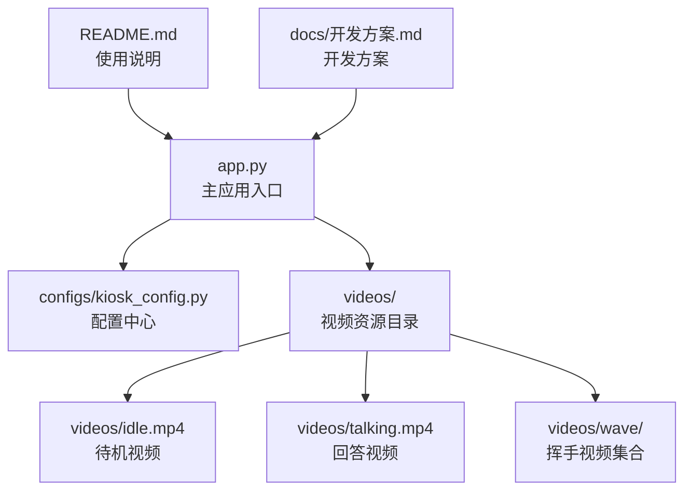
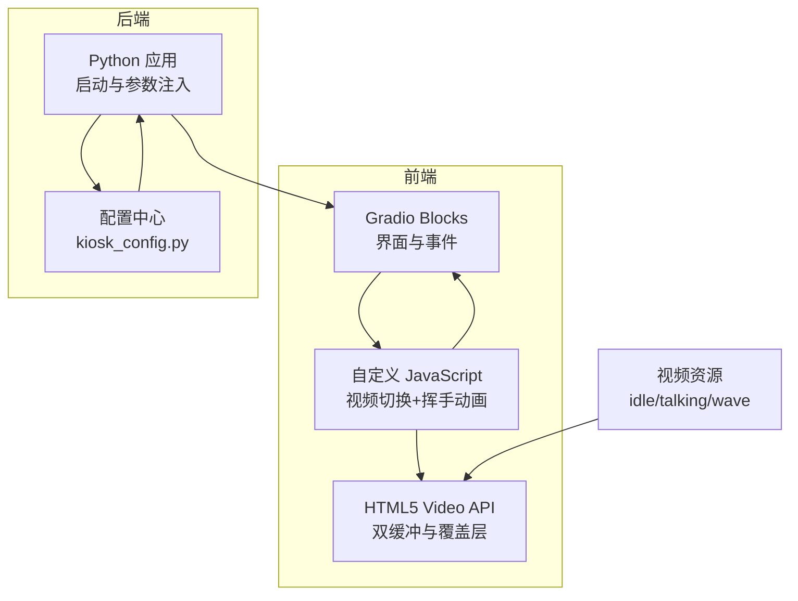
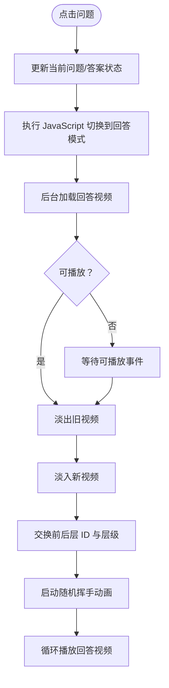
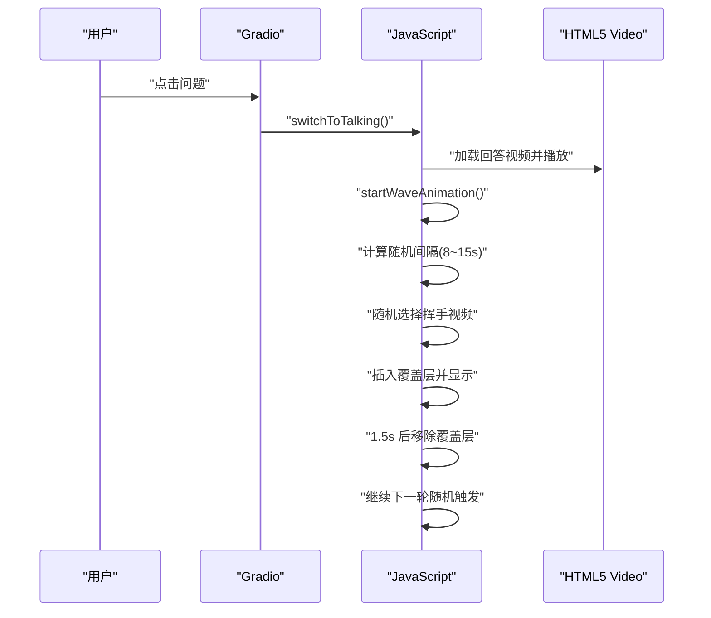
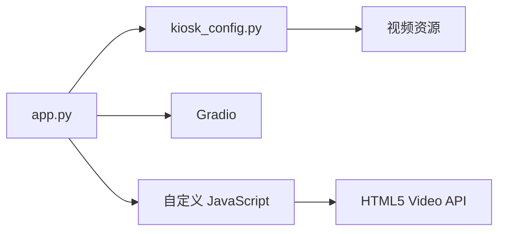

# 项目概述

<cite>
**本文引用的文件**
- [app.py](file://app.py)
- [kiosk_config.py](file://configs/kiosk_config.py)
- [README.md](file://README.md)
- [开发方案.md](file://docs/开发方案.md)
</cite>

## 目录
1. [简介](#简介)
2. [项目结构](#项目结构)
3. [核心组件](#核心组件)
4. [架构总览](#架构总览)
5. [详细组件分析](#详细组件分析)
6. [依赖关系分析](#依赖关系分析)
7. [性能考量](#性能考量)
8. [故障排查指南](#故障排查指南)
9. [结论](#结论)
10. [附录](#附录)

## 简介
本项目是一个面向高分辨率竖屏展示场景的“数字人问答展示系统”。其核心目标是通过点击预设问题，触发数字人视频从“待机”无缝切换至“回答”状态，并在回答过程中以随机频率叠加“挥手动画”，提升交互趣味性与沉浸感。系统采用 Gradio 构建前端界面，结合 HTML5 视频 API 和自定义 JavaScript 实现双缓冲视频切换与覆盖层动画，具备良好的可配置性与扩展性。

- 目标用户群体
  - 展厅、科技馆、企业展厅等需要数字人互动展示的场所
  - 教育机构、图书馆、公共服务中心等需要引导与讲解的场景
  - 对 AI 数字人演示感兴趣的研究者与开发者

- 应用场景
  - 2160×3840 竖屏设备（如一体机、交互屏）
  - 静态展示或引导型互动场景
  - 多语言、多主题的数字人形象演示

## 项目结构
项目采用“主程序 + 配置模块 + 资源目录”的简洁组织方式，便于维护与扩展。

图表来源
- [app.py:1-50](file://app.py#L1-L50)
- [kiosk_config.py:1-30](file://configs/kiosk_config.py#L1-L30)
- [README.md:12-29](file://README.md#L12-L29)

章节来源
- [app.py:1-50](file://app.py#L1-L50)
- [README.md:12-29](file://README.md#L12-L29)

## 核心组件
- Gradio 应用主体
  - 使用 Blocks 构建页面布局，包含顶部标题、左右问题面板、中间视频区域与底部信息。
  - 通过状态变量维护当前问题与答案，驱动视频信息栏实时更新。
- 视频资源与切换
  - 两路 HTML5 视频元素构成双缓冲层，通过 CSS 类控制透明度与层级，实现平滑切换。
  - 切换流程：后台加载新视频 → 淡入新视频 → 淡出旧视频 → 交换 ID 与层级 → 启动随机挥手动画。
- 随机挥手动画
  - 在回答模式下，按 8–15 秒随机间隔触发，随机选择挥手片段叠加于画面右下角，持续约 1.5 秒后自动移除。
- 配置中心
  - 统一管理视频路径、预设问题、UI 标题、服务器参数与屏幕布局比例，支持灵活定制。

章节来源
- [app.py:345-456](file://app.py#L345-L456)
- [app.py:225-338](file://app.py#L225-L338)
- [kiosk_config.py:9-25](file://configs/kiosk_config.py#L9-L25)
- [kiosk_config.py:31-76](file://configs/kiosk_config.py#L31-L76)
- [kiosk_config.py:82-88](file://configs/kiosk_config.py#L82-L88)
- [kiosk_config.py:94-98](file://configs/kiosk_config.py#L94-L98)
- [kiosk_config.py:104-112](file://configs/kiosk_config.py#L104-L112)

## 架构总览
系统采用“前端界面 + 配置中心 + 视频资源”的分层架构，Gradio 负责渲染与事件绑定，JavaScript 负责视频切换与动画控制，Python 负责应用启动与参数注入。

图表来源
- [app.py:345-456](file://app.py#L345-L456)
- [app.py:225-338](file://app.py#L225-L338)
- [kiosk_config.py:1-113](file://configs/kiosk_config.py#L1-L113)

## 详细组件分析

### Gradio 应用与界面布局
- 页面结构
  - 顶部标题区域：居中显示系统标题。
  - 左右问题面板：分别展示“常见问题”和“热门问题”，每个问题按钮绑定点击事件，更新状态并触发视频切换。
  - 中间视频区域：双缓冲视频层 + 挥手覆盖层 + 加载遮罩；视频信息栏实时显示当前问题与回答。
  - 底部信息：显示副标题与版权信息。
- 事件链路
  - 点击问题按钮 → 更新当前问题/答案状态 → 执行 JavaScript 切换到回答模式 → 显示加载遮罩 → 后台加载回答视频 → 淡入新视频并淡出旧视频 → 交换层级与 ID → 启动随机挥手动画。
- 样式与主题
  - 使用暗色主题与毛玻璃效果，渐变背景增强视觉层次；按钮悬停动画与过渡效果提升交互体验。

章节来源
- [app.py:345-456](file://app.py#L345-L456)
- [app.py:17-219](file://app.py#L17-L219)
- [kiosk_config.py:82-88](file://configs/kiosk_config.py#L82-L88)

### 双缓冲视频切换机制
- 设计要点
  - 两路视频元素（前后层）同时存在，通过 CSS 类控制透明度与层级，避免闪烁。
  - 切换时先加载新视频，等待可播放后再进行淡入淡出，确保无黑屏与卡顿。
  - 切换完成后交换两者的 ID 与层级，保证后续切换的正确性。
- 流程图

图表来源
- [app.py:225-291](file://app.py#L225-L291)

章节来源
- [app.py:225-291](file://app.py#L225-L291)

### 随机挥手动画实现
- 触发策略
  - 在回答模式下，按 8–15 秒随机间隔触发一次；每次触发随机选择一个挥手片段，叠加在画面右下角。
  - 挥手动画持续约 1.5 秒后自动移除，随后继续下一轮随机触发。
- 技术细节
  - 使用定时器记录当前模式，仅在回答模式下生效；停止模式时清理定时器并移除覆盖层。
  - 挥手视频通过内联脚本注入，避免额外网络请求。
- 动画序列图

图表来源
- [app.py:293-331](file://app.py#L293-L331)
- [kiosk_config.py:14-25](file://configs/kiosk_config.py#L14-L25)

章节来源
- [app.py:293-331](file://app.py#L293-L331)
- [kiosk_config.py:14-25](file://configs/kiosk_config.py#L14-L25)

### 配置中心与参数注入
- 视频资源
  - 待机视频与回答视频路径统一管理；挥手视频集合支持多片段随机选择。
- 预设问题
  - 左右两侧问题集合，支持自定义问题与答案；用于界面渲染与状态更新。
- UI 与服务器
  - 标题、副标题、左右面板标题；服务器监听地址、端口与共享参数；屏幕布局比例。
- 参数注入
  - JavaScript 代码通过字符串格式化注入视频路径与挥手配置，确保运行时动态更新。

章节来源
- [kiosk_config.py:9-12](file://configs/kiosk_config.py#L9-L12)
- [kiosk_config.py:14-25](file://configs/kiosk_config.py#L14-L25)
- [kiosk_config.py:31-76](file://configs/kiosk_config.py#L31-L76)
- [kiosk_config.py:82-88](file://configs/kiosk_config.py#L82-L88)
- [kiosk_config.py:94-98](file://configs/kiosk_config.py#L94-L98)
- [kiosk_config.py:104-112](file://configs/kiosk_config.py#L104-L112)
- [app.py:332-338](file://app.py#L332-L338)

## 依赖关系分析
- 组件耦合
  - app.py 与 kiosk_config.py 强耦合：所有视频路径、问题与配置均来自配置模块。
  - JavaScript 与配置耦合：通过字符串格式化注入配置值，降低硬编码风险。
  - 视频资源与前端渲染弱耦合：HTML5 Video API 提供跨平台兼容性。
- 外部依赖
  - Gradio：构建界面与事件绑定。
  - HTML5 Video API：实现视频播放、加载与切换。
  - 浏览器：支持自动播放、覆盖层与 CSS 过渡效果。

图表来源
- [app.py:5-7](file://app.py#L5-L7)
- [app.py:332-338](file://app.py#L332-L338)
- [kiosk_config.py:1-113](file://configs/kiosk_config.py#L1-L113)

章节来源
- [app.py:5-7](file://app.py#L5-L7)
- [app.py:332-338](file://app.py#L332-L338)
- [kiosk_config.py:1-113](file://configs/kiosk_config.py#L1-L113)

## 性能考量
- 视频加载与切换
  - 后台加载新视频，等待可播放事件再进行切换，避免首帧黑屏与卡顿。
  - 双缓冲与透明度过渡配合，确保视觉连续性。
- 动画与资源
  - 挥手动画采用覆盖层与定时器，避免频繁 DOM 操作；持续时间短、触发间隔随机，降低 CPU 占用。
- 资源体积与格式
  - 建议使用 MP4/H.264 编码，控制单个视频在 10MB 以内，兼顾加载速度与画质。
- 浏览器与设备
  - 推荐使用支持自动播放与覆盖层的现代浏览器；竖屏高分辨率设备需注意 GPU 加载能力。

## 故障排查指南
- 视频无法播放
  - 检查视频路径是否正确且文件存在；确认浏览器允许自动播放与静音播放。
  - 确认视频格式为 MP4/H.264，分辨率与比例合理。
- 切换不流畅
  - 确认回答视频已提前加载完成（可播放事件）；避免同时加载过多资源。
  - 检查 CSS 过渡时长与层级交换逻辑。
- 挥手动画不触发
  - 确认当前处于回答模式；检查随机间隔与挥手视频列表是否配置正确。
  - 若覆盖层未显示，检查样式类 active 的添加与移除逻辑。
- 端口占用或无法访问
  - 修改 SERVER_CONFIG 中的端口；确认防火墙与网络设置允许访问。

章节来源
- [README.md:105-111](file://README.md#L105-L111)
- [README.md:93-103](file://README.md#L93-L103)
- [kiosk_config.py:94-98](file://configs/kiosk_config.py#L94-L98)

## 结论
本项目以简洁高效的架构实现了数字人问答展示的核心功能：双缓冲视频无缝切换与随机挥手动画叠加。通过 Gradio 与 HTML5 Video API 的组合，系统在高分辨率竖屏环境下提供了流畅、美观且可扩展的交互体验。配置中心的设计使得问题、视频与界面参数均可灵活定制，适合在多种展示场景中快速部署与迭代。

## 附录
- 快速启动
  - 安装依赖：pip install gradio
  - 启动应用：python app.py
  - 访问地址：http://localhost:6006
- 视频资源准备
  - videos/idle.mp4（待机）
  - videos/talking.mp4（回答）
  - videos/wave/wave_*.mp4（至少 1 个）

章节来源
- [README.md:45-59](file://README.md#L45-L59)
- [README.md:31-44](file://README.md#L31-L44)